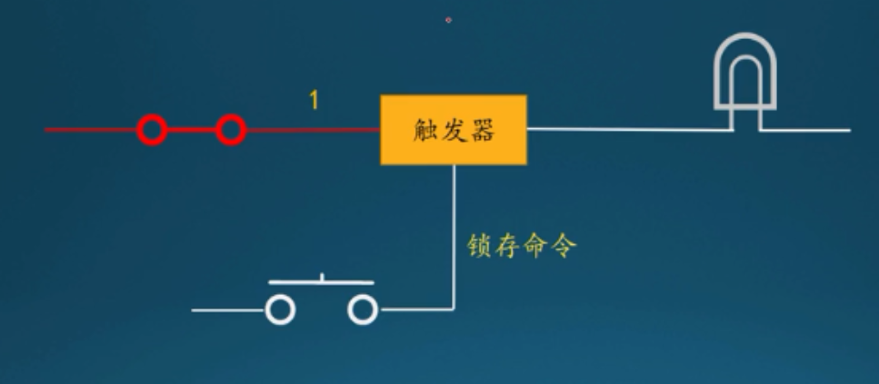
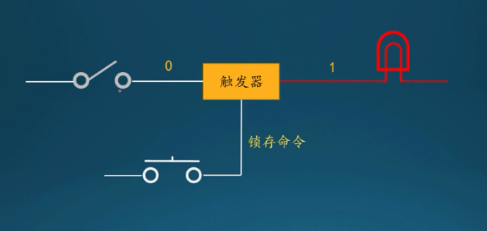
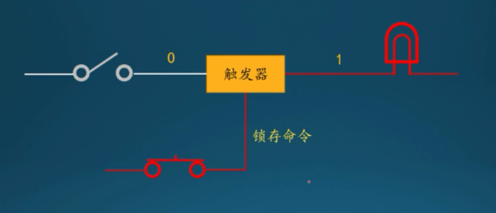

# 触发器、锁

触发器（触发器的输出是锁存的内容）可以将输入保存起来，这个动作叫做锁存，什么时候锁存，可以控制，通过按键开关控制

按下控制开关，发送锁存命令，当前锁存的内容是1，灯泡亮

锁存后，无论输入发生什么变化，都不会影响锁存内容，除非再次按下锁存开关，发送锁存命令，重新锁存

再次按下开关

锁存内容更新

一个触发器，只能保存一个比特，为了保存更多个二进制数，采用若干触发器，他们组合在一起，组成一个新的器件：寄存器（锁存器）

下面开关，向所有，组成寄存器的触发器发送锁存命令

寄存器可以随时保存新的数字，任何数字都是临时保存在寄存器中，属于临时性的寄存，所以称为寄存器。