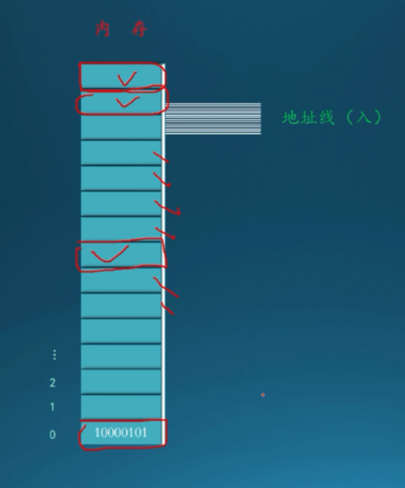
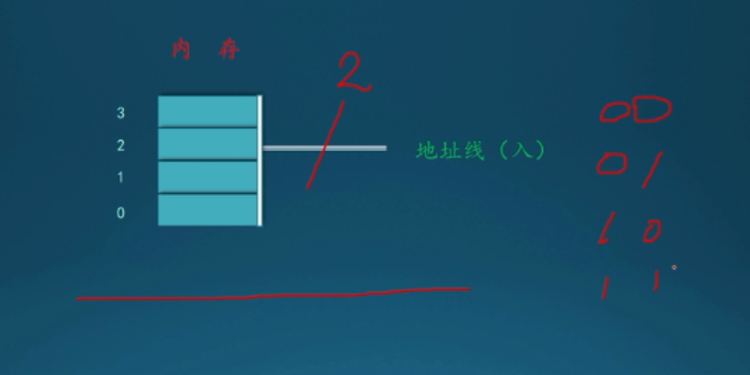
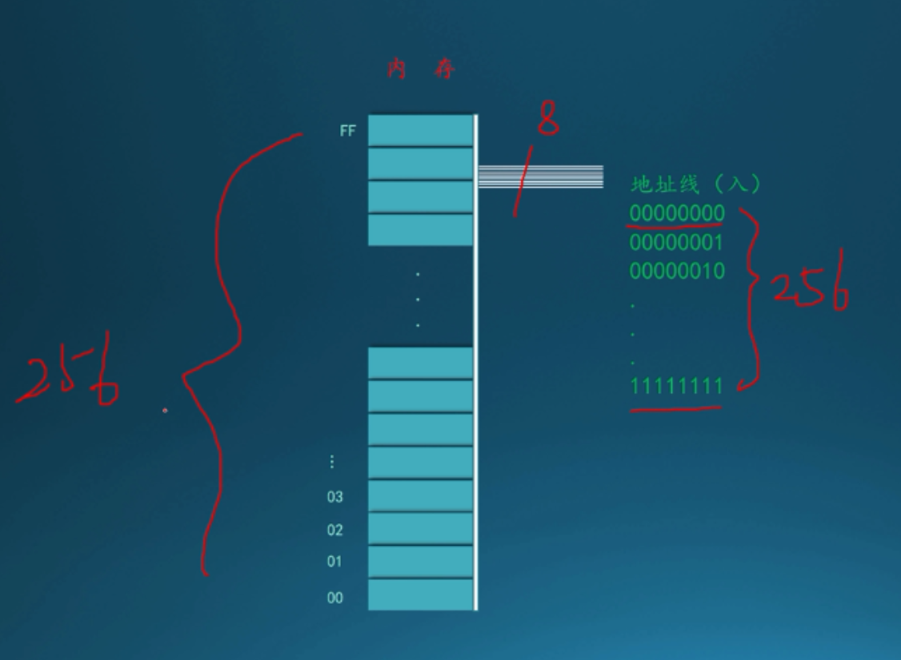
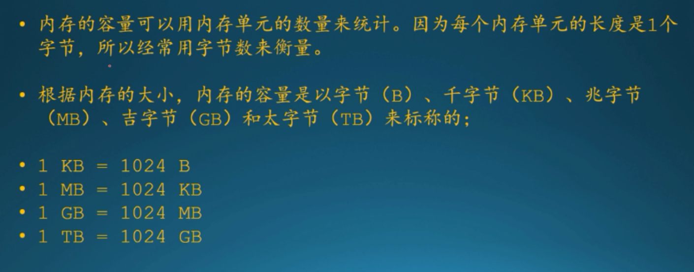
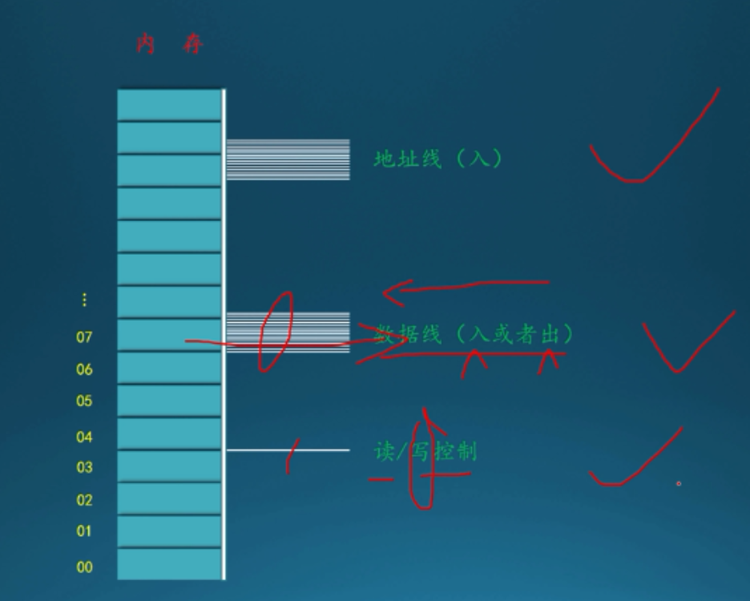
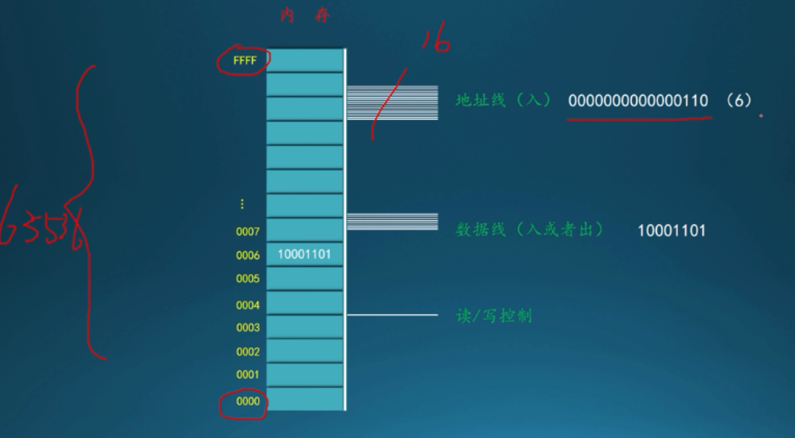

# 内存

主流计算机里，每个内存单元的长度是8个比特，也就是8位，可以保存一个8位二进制数，每个内存单元都有一个唯一的编号，类似数组，第一个内存单元编号是0，第二个内存单元编号是1...，内存单元编号又被称为内存单元的地址。

如何制定读写的是哪个单元？

内存使用一排电线（地址线）制定单元的编号，访问某个单元是，通过地址线来输入单元的编号，选中某个单元，地址线的数量，决定最多能访问几个单元

途中有两个地址线，能组合出四个二进制数

0 0

0 1

1 0

1 1

四个二进制数，代表四个地址，只能访问到四个单元，四个单元的编号是0,1,2,3

8根地址线，能访问到256个内存单元

单元地址是16进制，标注在左侧0x00(0) - 0xff(255)

推论：

假如地址线数量为n，那么可以访问的地址数量为2^n个内存单元

一个内存单元是8位(bit)，即一个字节(byte)

2根地址线，能访问4个内存单元即4byte

8根地址线，能访问到256个内存单元即256byte

byte 字节

Kilobyte 千字节

Megabit 兆位

GigaByte 千兆字节

1、KB——Kbytes，千字节（Kbytes），计算机存储容量单位，也常用KB来表示。1KB=1024字节。

2、MB——Megabytes，计算机存储容量的单位，也常用MB来表示。1MB=1024*1024Bytes。

3、GB——GigaByte，又称千兆字节，是计算机存储容量单位。它英文名为GigaByte，简称GB，是兆字节(MB)的1024倍，即 1024MB。

4、TB——Terabyte，一般指太字节。计算机存储容量单位，也常用TB来表示。1TB=1024GB=2^40字节。

电脑内存（RAM）有8G即8 * 1024 * 1024 * 1024=8589934592byte，即8589934592个内存单元，需要（Math.log2(8589934592)）33个地址线

某内存有16根地址线，它的容量有多大？每个内存单元长度是多少？

16根地址线，代表能访问到2^16=65536个内存单元，一个内存单元是1byte，所以它的容量是65536byte = 64kb(64千字节 Kilobyte)

每个内存单元长度是一个字节(1byte)(8bit位)

内存是用来保存和读出数据，需要数据线（读护着写，入或者出）

数据线是双向的入或者出，对内存进行读写访问，还需要一个读写控制线，用来指明是读操作还是写操作

写入流程：

1.先在地址线上给出一个地址，要往哪个单元写入

2.在数据线上给出一个要写入的数字

3.通过读写控制线，发出写命令

4.内存就会把指定的数字写入给定的地址处（指定的内存单元）

读取流程：

1.先在地址线上给出一个地址，指定要读哪个单元

2.通过读写控制线，发出读命令

3.数据就会从指定地址读出，并传送到数据线上

例子：

写：

1.向地址线，指定操作地址为0000000000000110(0x6)

2.选中内存地址为6(0x6)的单元

3.从数据线（8根）传入值10001101(141)，并且读写控制线传入写入

4.内存地址为6(0x6)的单元就会被写入值10001101(141)

读：

1.向地址线，指定操作地址为0000000000000110(0x6)

2.选中内存地址为6(0x6)的单元

3.读写控制线传入读

4.内存地址为6(0x6)的单元的值10001101(141)就会传送到数据线上，送出来