# 可以自动取指令，并执行的运算机器

为了跟踪每一条需要执行的指令，增加了一个指令指针寄存器，其中保存着指令的地址，刚开始时，存储的内容是第一条要执行的指令的内存地址，内存将改地址的内容放到数据线上，通过数据线进入运算器，根据指令进行操作，然后指令指针寄存器自动修改，修改为下一个指令的地址，根据当前正在执行的指令地址和长度，来计算下一条指令的地址，指令都是按顺序紧挨着存放的，所以，只要知道正在执行的指令的地址和长度，就能算出下一条指令的地址，当前指令完成后，重复以上过程。

例子：

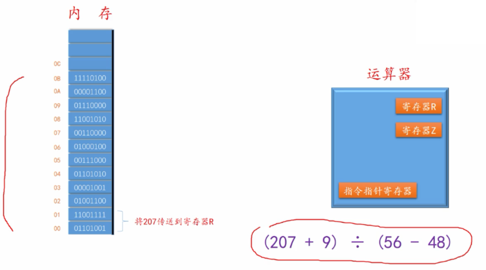

这些指令完成了计算这个数学题的步骤，称之为程序

第一条指令有两个字节，占两个字节的内存空间

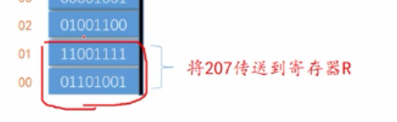

操作码

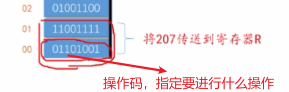

此时这个操作码表示，将操作码后面的数字（0b11001111(207)），传送到寄存器R

这条指令中，被操作的数（操作数），是直接包含在指令中的，为指令的组成部分，因此这样的操作数，被称为立即数，表示这个数直接包含在指令中，可以立即从指令中得到。

第二条指令

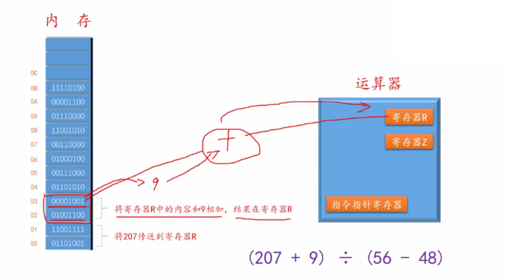

第三条指令

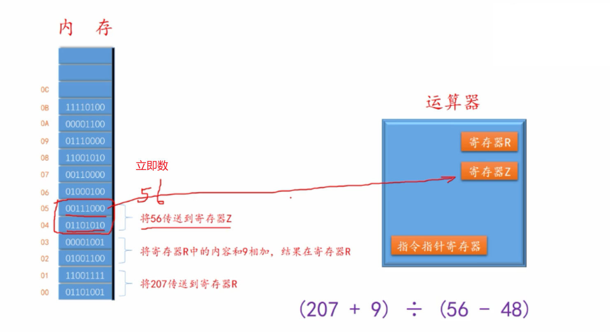

第四条指令

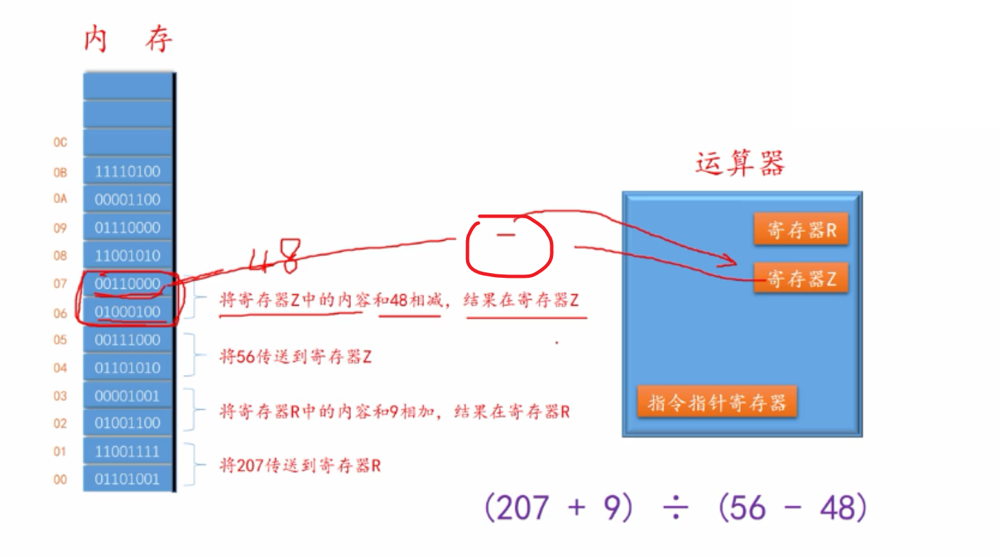

第五条指令

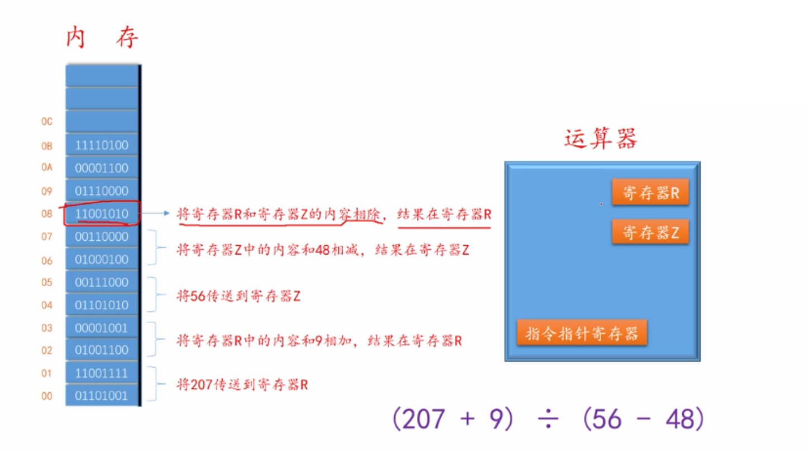

第六条指令

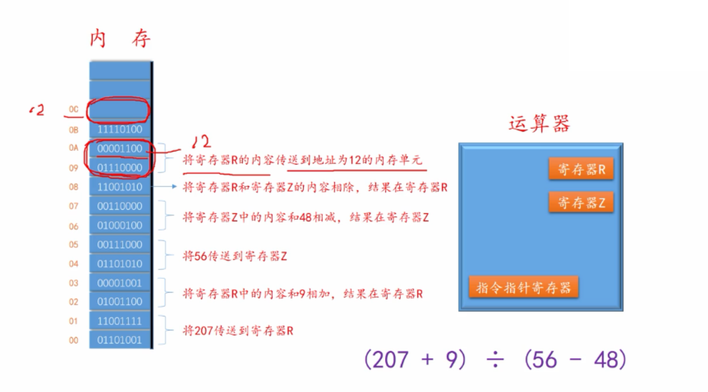

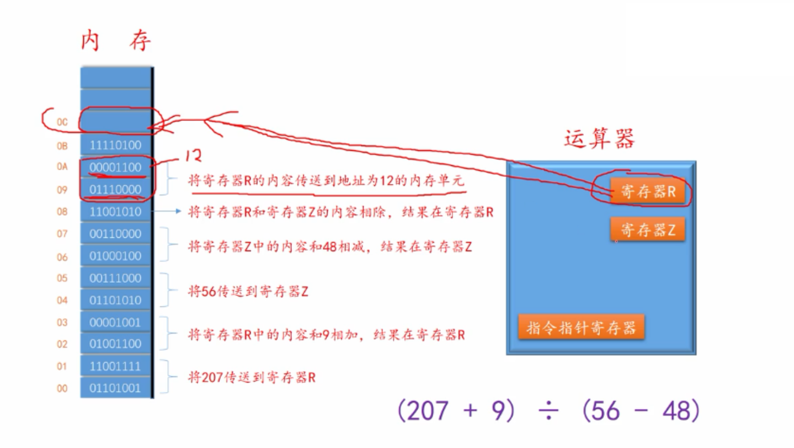

第七条指令

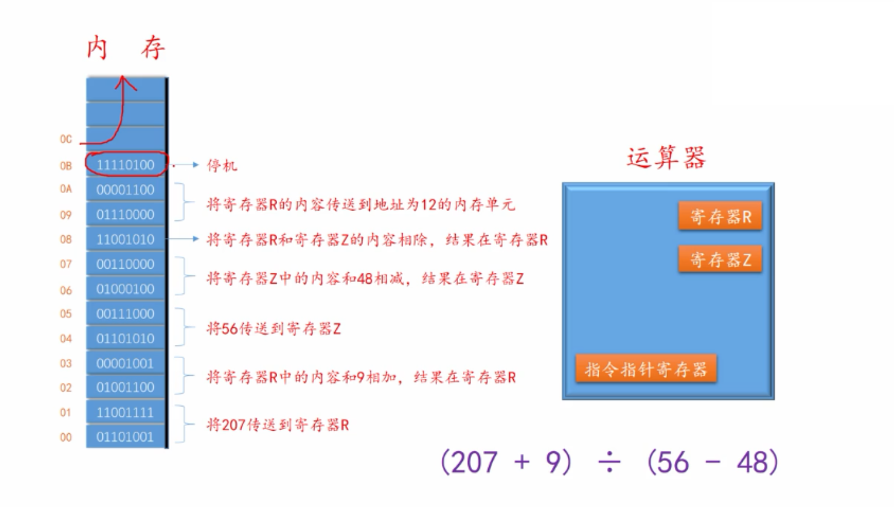

整体运行

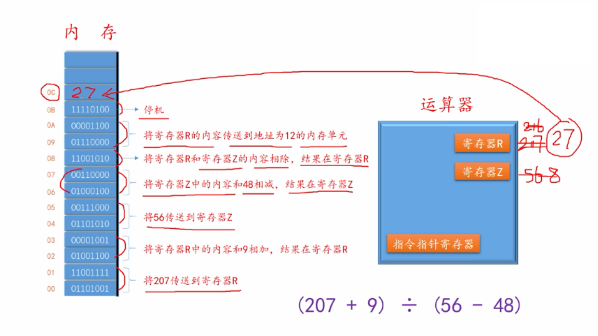

