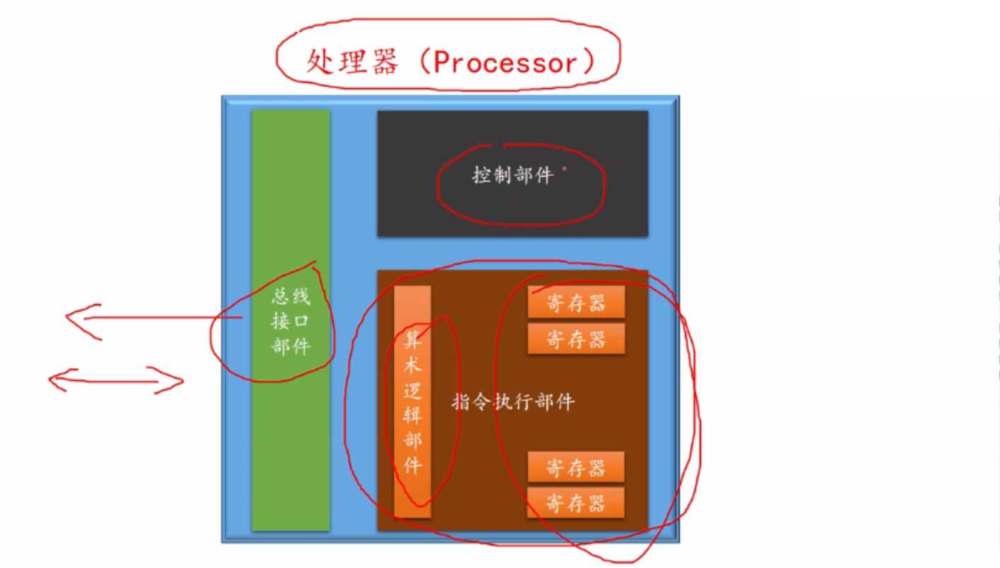

加法机 => 全自动运算器(功能有限) => 经过改进之后变成如今的处理器(Processor)

处理器的工作是，自动取指令并执行指令

处理器可以识别哪些指令，在设计和制造时就已经决定了

指令集：处理器可以识别的指令的集合，早前指令集很小，只有十几种或者几十种，技术的发展，处理器的技术大大增强，指令集扩展了，如今的指令集可以包含几百甚至上千指令。

所有指令包含以下几种：

1.算数运算指令，逻辑运算指令

2.数据传送指令 处理器的寄存器之间，处理器和内存之间，处理器和外围设备（显示设备、存储设备、打印机、鼠标、键盘等）之间

3.处理器状态控制指令（控制处理器内部的工作模式和运行状态，比如电源管理，程序的权限管理等）

