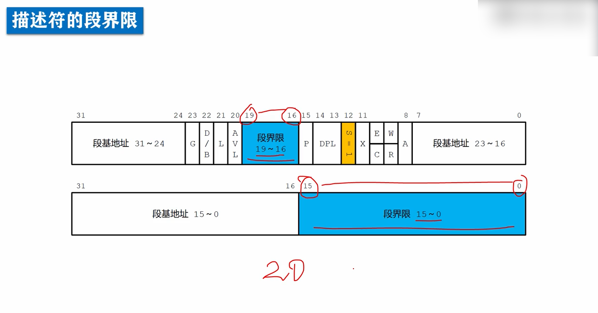
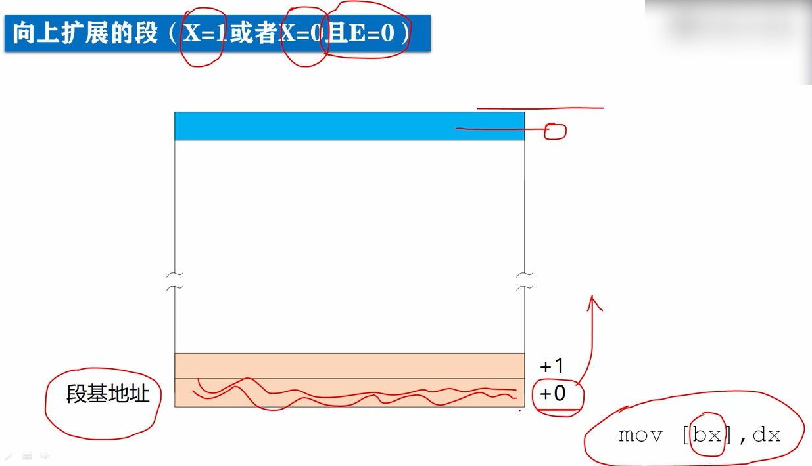
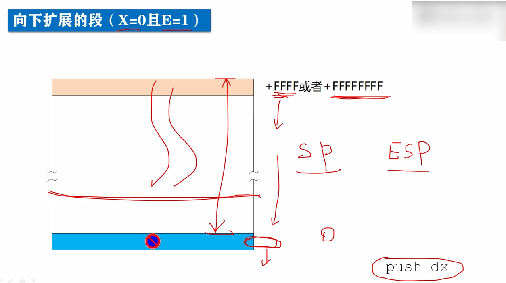
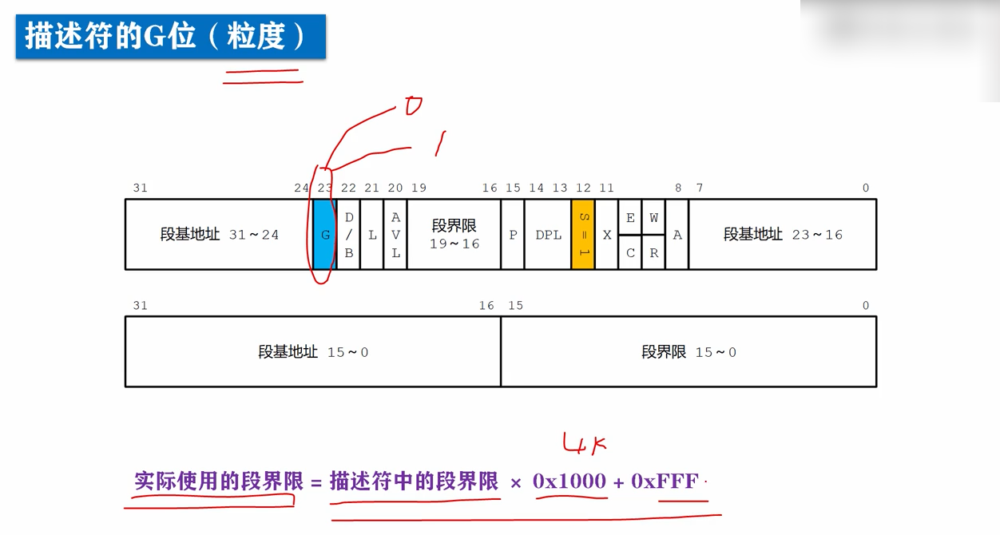
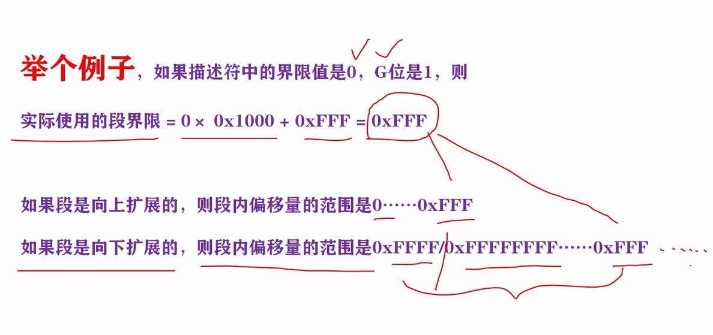
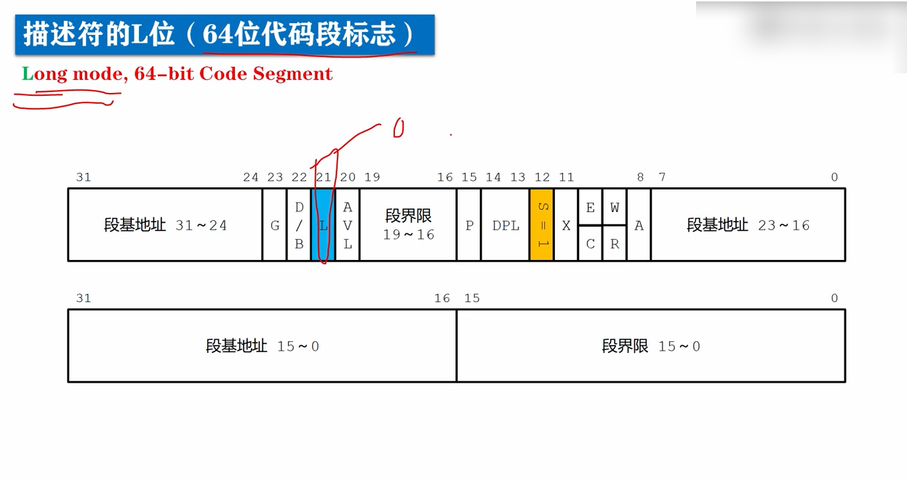
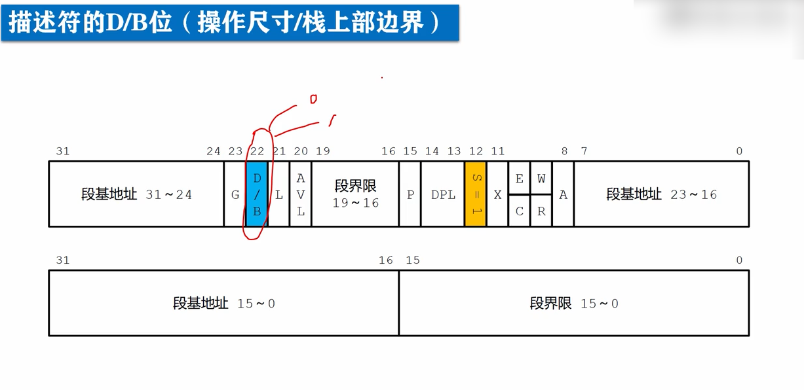
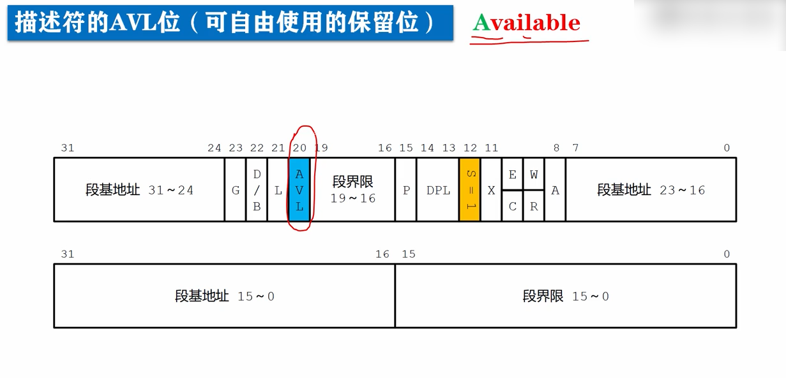

# 存储器的段描述符-段界限及访问控制位

除了段基地址，在存储器 的段描述符中，还指定了20位的段边界，或者段界限，段界限也不是连续存储的，被分成两段。

段界限用来限制短的范围，反映了段的大小，或者说段的尺寸。

自始至终，我们都是用，段基地址加上段内偏移量来访问内存，对于代码段和一般的数据段来说，偏移量都是从0开始，逐渐增大的。

如果x位为1的话，表示是代码段。

如果x位为0并且e位为0表示是数据段，并且向上扩展。

对于向上扩展的段，段界限是允许的最大偏移量，超过这个最大偏移量就会被处理器阻止，并触发异常中断。

> 例子：
>
> mov [bx],dx
>
> 如果bx的值大于段界限，执行这条指令时，会被处理器阻止，并引发异常中断。

显然对于**向上扩展的段**来说，**段界限加1就是段的大小**，因为偏移量是从0开始的，另外如果指定的**段界限时0**的话，并不意味着段的大小是0，因为0是最小偏移量，起码有一个为0的偏移量，所以段界限时0，则**段的长度是1**。

在描述符中如果x位为0，且e位为1则表示数据段且向下扩展。

向下扩展的段，不一定用做栈段，但是通常，用做栈段，为了便于分析理解，我们假定向下扩展的段用做栈段。

访问栈段可以使用栈指针寄存器sp，或者esp。

栈是向下推进的

如果使用sp，栈指针的最大值是0XFFFF。

如果使用esp，栈指针的最大值是0XFFFFFFFF。

此时段界限，指栈指针所不允许的最小值，如果等于或小于这个值，处理器就会阻止这样的访问，并触发异常中断。

> 例子：
>
> push dx
>
> 指令执行时，是将sp或者esp减2，在写入dx中的数据，如果减2的值小于或等于段界限，就会出问题，就会被处理器阻止，并触发异常中断。

显然对于向下扩展的段来说，**段的大小使用0xffff或者0xffffffff，减去段界限**。

另外指定的段界限是0的话，并不意味着短的大小是0，相反段在此时，是最大的。

在存储器的段描述符(s=1)中，**高双字的位23，这一位是g位，又叫粒度位**，粒度位用来结束段界限的单位。

g:

g位为0，段界限是以字节为单位。

g位为1，段界限是以4k(4千字节)为单位的：

> 段界限是以4k(4千字节)为单位的计算公式：
>
> **实际使用的段界限 = 描述符中的段界限 * 0x1000 + 0xfff。**
>
> 例子：
>
> 

**高双字的位15，是p位**，段存在位，segement Present，用以**指示描述符所对应的段是否存在**，段是一段连续的内存空间，这段空间在物理上始终是存在的，但是**这段空间以及空间中的数据，是不是为当前这个描述符准备的，是不是已经可以立即通过描述符来访问，这就是段的存在性**。

> 一般来说，描述符所指示的段，都是存在的，但是当内存空间紧张时，有可能只是建立了描述符，对应的段并没有安排，别认为是不存在的，这时就应当把描述符的p位清0，表示段并不存在。
>
> 另外同样是在内存空间紧张的情况下，会把很少用的段换储到硬盘中，腾出空间，给当前急需内存的程序使用，此时同样要把，段描述符的p位清0，当再次轮到它执行时，再装入内存，然后将p位置1。
>
> p位是由处理器负责检查的，每当通过描述符访问内存中的段时，如果p位是0，处理器就会产生一个，异常中断，通常该中断处理过程是由操作系统提供的，该处理过程的任务书负责，将该段从硬盘换回内存，并将p位置1。
>
> 在多用户，多任务的系统中，这是一种常用的虚拟内存调度策略，当内存很小，运行的程序很多时，如果计算机的运行速度变慢，并伴随着频繁的硬盘操作时，说明这种情况正在发生。

L:

> 在高双字的位21，是L位，是long的意思，Long mode，64-bit Code Segement，64位处理器的模式叫Long mode。
>
> L位是64位代码段标志，保留此位是给64位处理器使用的，用以指示64位的代码段，目前我们将此位置0即可。

d/b:

> 在存储器描述符中，高双字的位22，是d位或者b位，笼统的说，这一位是指示段按照16位进行操作，还是按32位进行操作。
>
> 如果是0，那么段是按照16位进行操作，如果是1，段按照32位进行操作。
>
> 比如说，对于向下扩展的段来说，它决定了段界限的最大值，是0xffff还是0xffffffff，是使用sp进行操作，还是使用esp进行操作。

avl:

在存储器描述符中，高双字的位20，这一位是avl位，Avaliable，可用的。

avl位通常是由操作系统来用，处理器并不使用，这一位是保留的，处理器没有用它，是保留给软件使用的。

