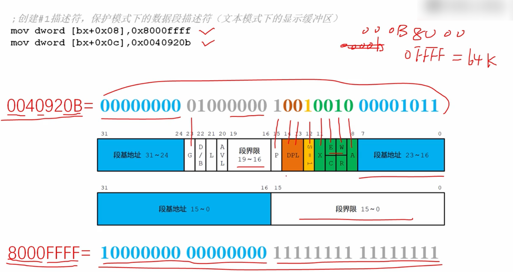
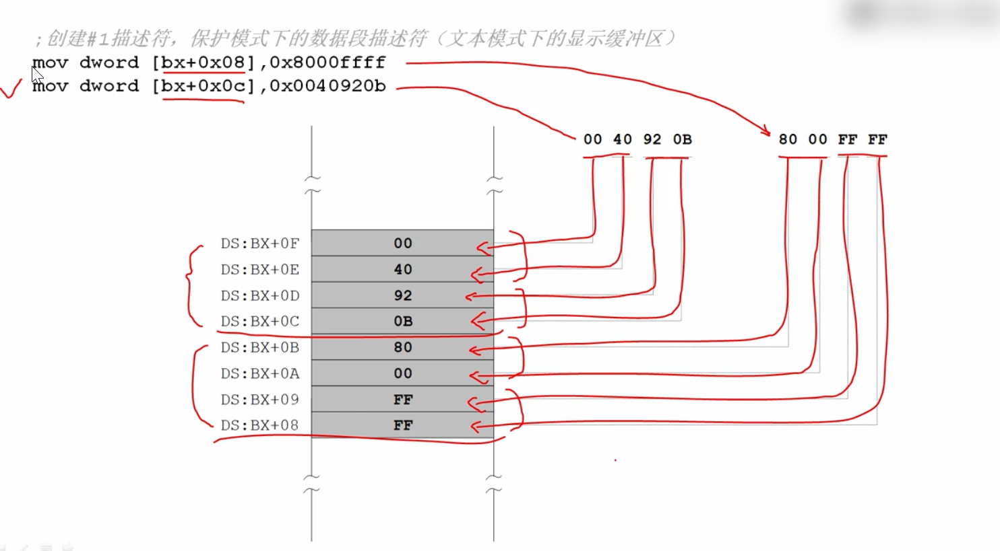
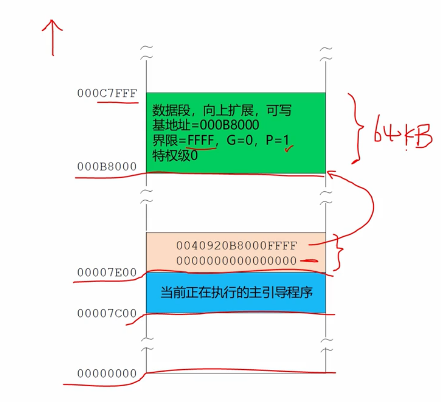

# 在全局描述符表GDT中安装存储器的段描述符

处理器规定第一个描述符必须是空描述符！！

或者叫哑描述符！！

```
         ;描述符8个字节
         ;创建0#描述符，它是空描述符，这是处理器的要求
         mov dword [bx+0x00],0x00 ;双字 4个字节
         mov dword [bx+0x04],0x00 ;双字 4个字节 
```



这两行表示安装一个段的描述符。

为了明白含义，需要将低双字和高双字转换成二进制形式：

0x0040920b=>高双字：00000000 01000000 10010010 00001011

0x800001ff => 低双字：10000000 00000000 00000001 11111111

```
         ;创建#1描述符，保护模式下的代码段描述符 (文本模式下的显示缓冲区)
         mov dword [bx+0x08],0x800001ff     
         mov dword [bx+0x0c],0x0040920b
```

看16机制得出 

=> 段基地址是000b8000

=> 段界限是0x0ffff

=> g位是0，粒度是0，说明段界限是以字节为单位的

=> 这个段是64kb字节

=> 偏移量从0到0x0ffff

=> p位是1，表示这个段是存在的

=> 特权级DPL是0

=> s位是1，说明这个段是存储器的段

=> x位是0，说明这个段是数据段

=> e位是0，表示这个段是向上扩展的

=> w位是1，表示这个段是可写的

=> a位初始化位0

上面两行命令执行之后，内存如图：

定义好全部描述符表之后，内存布局：



