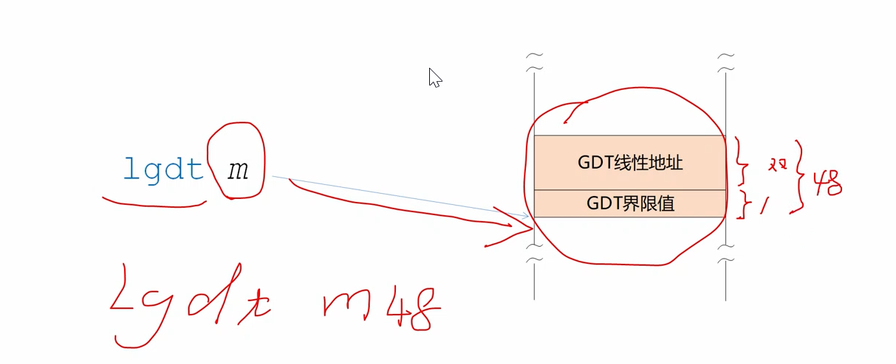

# 加载全局描述符表寄存器GDTR

将全局描述符表GDT的基地址和界限值加载到全局描述符表寄存器GDTR。

目前程序中有两个描述符：

一个空描述符

一个数据段描述符，执行文本模式下的缓存

现在这两个描述符都安装完毕，全局描述符表是由处理器使用的，程序员的工作只是负责创建这个表。

处理器通过全局描述附表寄存器GDTR来使用这个表。

但是**处理器必须知道这个表的位置和大小**才能使用。

GDTR位于处理器内部


GDTR是48位的寄存器，

全局描述符表的边界，表内最后一个字节相对于这个表起始处的偏移量，在数值上等于标的大小减1，或者总字节数减1。


完成个任务，我们需要一个新的指令lgdt

不影响任何标志位

lgdt m ;在m处必须为一个48位的操作数

lgdt m48 ;m48不是表示48位的地址，而是表示这个地址处有48位的操作数

48位的操作数分为两个部分，第一部分是GDT的界限值，长度是一个字，后面紧跟着GDT的线性基地址，是一个双字，加起来一共是48位，6个字节。



```
         ;代码清单11-1
         ;文件名：c11_mbr.asm
         ;文件说明：硬盘主引导扇区代码 
         ;创建日期：2011-5-16 19:54
         ;功能：计算机启动之后，BIOS加载此程序到物理地址0x7c00处后，就开始执行，程序执行时，从实模式进入保护模式，然后在屏幕上显示一行文本。

         ;按照处理器要求，进入保护模式之前，必须先创建全局描述符表GDT
         ;把表放在那里呢？为了灵活性，允许程序员自由决定把GDT放在那里！
         ;为此我们在程序的尾部定义了一个双字32位
         ;计算GDT所在的逻辑段地址 
         mov ax,[cs:gdt_base+0x7c00]        ;低16位 
         mov dx,[cs:gdt_base+0x7c00+0x02]   ;高16位
         ;得到32位的GDT地址
         mov bx,16        
         div bx ;除以16得到段地址和偏移地址 商在ax余数在dx。段地址在寄存器ax中
         mov ds,ax                          ;令DS指向该段以进行操作
         mov bx,dx                          ;段内起始偏移地址 
         ;描述符8个字节
         ;创建0#描述符，它是空描述符，这是处理器的要求
         mov dword [bx+0x00],0x00 ;双字 4个字节
         mov dword [bx+0x04],0x00 ;双字 4个字节 

         ;创建#1描述符，保护模式下的代码段描述符 (文本模式下的显示缓冲区)
         mov dword [bx+0x08],0x800001ff     
         mov dword [bx+0x0c],0x0040920b     

         ;初始化描述符表寄存器GDTR
         mov word [cs: gdt_size+0x7c00],15  ;描述符表的界限（总字节数减一） 15是手动算出来的，一共有两个描述符，一个描述符是8位，两个描述符就是16位，然后减1  
                                             
         lgdt [cs: gdt_size+0x7c00] ;从内存中加载6个字节的数据，到GDTR
      
         in al,0x92                         ;南桥芯片内的端口 
         or al,0000_0010B
         out 0x92,al                        ;打开A20

         cli                                ;保护模式下中断机制尚未建立，应 
                                            ;禁止中断 
         mov eax,cr0
         or eax,1
         mov cr0,eax                        ;设置PE位
      
         ;以下进入保护模式... ...
         jmp dword 0x0008:flush             ;16位的描述符选择子：32位偏移
                                            ;清流水线并串行化处理器 
         [bits 32] 

    flush:
         mov cx,00000000000_10_000B         ;加载数据段选择子(0x10)
         mov ds,cx

         ;以下在屏幕上显示"Protect mode OK." 
         mov byte [0x00],'P'  
         mov byte [0x02],'r'
         mov byte [0x04],'o'
         mov byte [0x06],'t'
         mov byte [0x08],'e'
         mov byte [0x0a],'c'
         mov byte [0x0c],'t'
         mov byte [0x0e],' '
         mov byte [0x10],'m'
         mov byte [0x12],'o'
         mov byte [0x14],'d'
         mov byte [0x16],'e'
         mov byte [0x18],' '
         mov byte [0x1a],'O'
         mov byte [0x1c],'K'

         ;以下用简单的示例来帮助阐述32位保护模式下的堆栈操作 
         mov cx,00000000000_11_000B         ;加载堆栈段选择子
         mov ss,cx
         mov esp,0x7c00

         mov ebp,esp                        ;保存堆栈指针 
         push byte '.'                      ;压入立即数（字节）
         
         sub ebp,4
         cmp ebp,esp                        ;判断压入立即数时，ESP是否减4 
         jnz ghalt                          
         pop eax
         mov [0x1e],al                      ;显示句点 
      
  ghalt:     
         hlt                                ;已经禁止中断，将不会被唤醒 

;-------------------------------------------------------------------------------
     
         gdt_size         dw 0
         gdt_base         dd 0x00007e00     ;GDT的物理地址 定义了一个双字 用来指定GDT的起始地址 这里给出的是0x00007e00，当然，你可以改变这个地址，也可以将GDT放在别的地方。
         ;这个地址只能是1Mb以下的地址(1Mb以内)(低端字节序) 这个地址是32位地址！因为我们用的是32位处理器
         times 510-($-$$) db 0
                          db 0x55,0xaa

```

