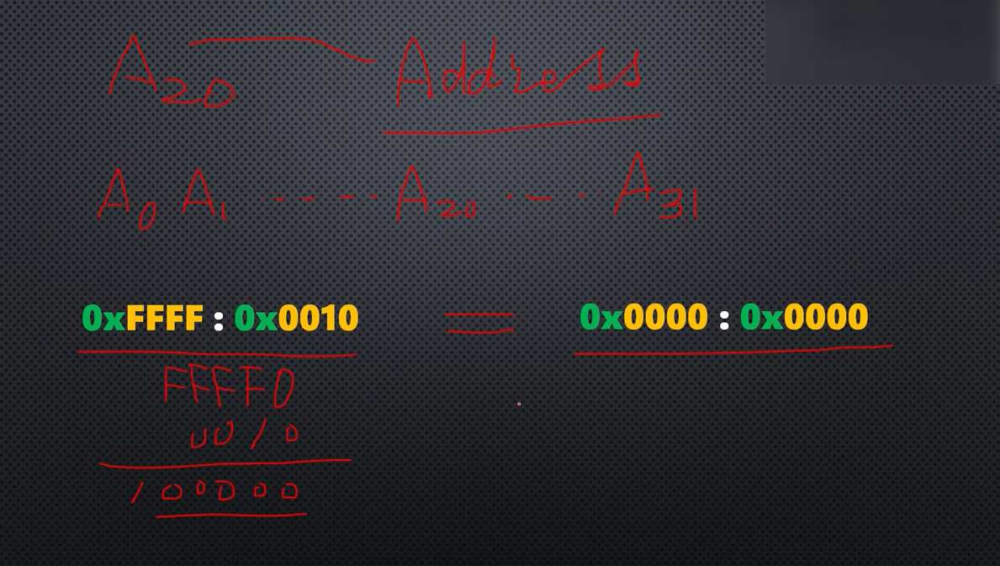
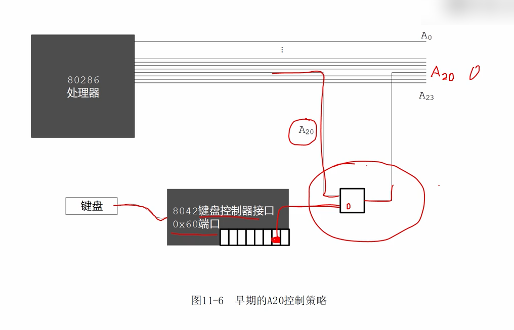
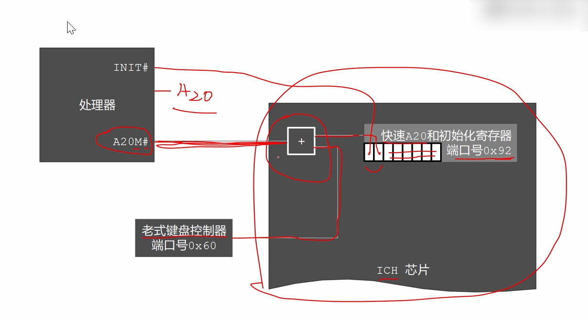

# 开启处理器的第21根地址线A20



处理器第21根地址线A20

其中A是Address的缩写。

地址线编号如下：

> 处理器第一根地址线编号是A0，
>
> 处理器第二根地址线编号是A1，
>
> ...
>
> 处理器第21根地址线编号是A20，
>
> ...
>
> 处理器第32根地址线编号是A31，

8086处理器只有20根地址线，没有A20，编号是A0 - A19，同时8086处理器使用的是逻辑地址，是分段的，逻辑地址包括段地址和偏移地址，在寻址时是将段地址左移4位，加上段内偏移地址行成20位物理地址。

例子：

逻辑地址：0xffff:0x0010 => 物理地址 0xffff0 + 0x0010 = 0x100000(21位物理地址)，问题是8086只有20根地址线，所以最左边的进位1就丢失了，只有0x00000是有效的，地址又绕回到最低端的0x00000了。

在8086中0xffff:0x0010与0x0000:0x0000是等效的，物理地址是一样的，都是0，内存的最低端，在8086时代，有很多程序在围绕这个地址回绕特性工作，这一点是不能忽视的。

到了**80286时代，处理器有24根地址线**，这时候，**地址回绕不灵了**，因为**在地址上产生的进位不会被丢弃**，本身这不是个问题，但是**有很多8086程序是围绕地址回绕特性工作，如果地址不能回绕，它们将不能正常工作！！！**

这是一个不能忽视的现实问题，由于**商业方面的考虑**，**需要让8086程序运行在80286上，不会因为地址线产生问题**，他们决定在主板上动一动手脚。

其实**问题的解决方法很简单，只需要强制第21根地址线一直为0就可以了**，这样从前面20位地址线上产生的进位就会被强制忽略，等于是没有进位。



如图所示，IBM公司使用一个**与门来控制第21根地址线A20**，***与门，只有两个输入都是1的情况下，输出才是1，只要有一个输出是0，那么输出就是0***。

这个与门的第一个输入来自第21根地址线A20，与门的第二个输入来自于8042键盘控制器，与门的输出，还是A20，A20经过了一个开关进行控制。

键盘控制器，是一个芯片，这个芯片位于电脑的主板上，他用来控制键盘工作，键盘控制器是可编程的，程序员可以通过键盘控制里的端口来获取字符，并设置键盘控制器的状态。

在键盘控制器内部有好几个端口，**其中一个端口的位1，链接这个与门，这个端口就是0x60号端口，**向这个端口写入数据时，如果这一位是1的话，那么键盘控制器通向与门的输出就是1，此时与门的输出，完全取决于A20是0还是1，如果A20是0的话，那么输出就是0，如果A20是1，那么输出就是1。

相反的，如果0x60号端口的位1是0，那么这根线就是0，这时候，无论A20是0还是1，那么这根线都是0。

**以上就是通过键盘控制器，来控制A20的原理！！！**

不过这样的做法非常繁琐，因为要访问键盘控制器，所以需要先判断状态，要等待键盘控制器不忙，这需要很多步骤，要编写很多指令，是不太容易做的。

这种方法持续的若干年，一直到80486推出之后，才有了更好的方法。



相信在这段时期，因特尔和IBM应该听到了很多抱怨，为什么进入保护模式这么麻烦？？？希望他们一定要改一改。

从80486处理器开始，处理器本身就有了，A20M#引脚，这引脚的意思是A20屏蔽A20 Mask，#(sharp)的意思是低电平有效。

因为设置了这个引脚，所以原来这个与门就取消了，不需要了，A20这根线就是完整的通过来了。

**通过这个引脚就可以完整的控制，从处理器内部，控制A20的有效与否，是0还是1，而不是在外部控制！！！**

ICH芯片，输入输出集中控制芯片，在这个芯片的处理器接口部分，有一个用于兼容老式设备的端口，0x92，这是一个8位端口，它的位0，是连接在处理器的INIT#引脚上，位0用于初始化处理器，用于复位处理器，当这一位从0变成1，那么处理器就会复位，即将导致计算机重新启动。

这个端口的位1是连接在一个或门上，只要两个输入有一个是1，那么输出就是1，如果两个输入都是0，输出才为0，因此只要这两根线有一个是1，输出就是1，就可以打开第21根地址线A20，这个或门的另外一个输入还是连接在老式的键盘控制器上，这一点没有变化，和以前不同的是通过0X92号端口，打开A20非常迅速，非常方便，因此称之为fastA20，快速A20，0x92号端口一共是8个bit，位2到位7是保留的。

实际上在现代计算机在启动时第21根地址线是自动启用的，不过我们在程序中还是做了一个代开A20的动作，完全是为了例行公事。

```
         ;端口0x92是可读写的，一下三条指令用来打开A20，即第21条地址线
         in al,0x92 ;用in指令读出该端口，原来的数据                         ;南桥芯片内的端口 
         or al,0000_0010B ;用or指令将位1，置1,其中0000_0010B是一二进制形式的数据，二机制数必须以字母b结尾，以指示这是二进制形式的数据，在二进制数形式中比特与比特之间可以用下划线来分隔，下划线指示一个分隔符，可以改善可读性，对数字的大小没有影响
         out 0x92,al ;修改数据后，用out指令写入该端口，这样就打开的A20 
```


