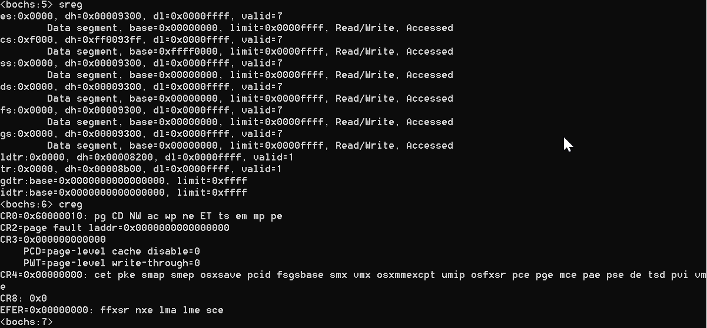
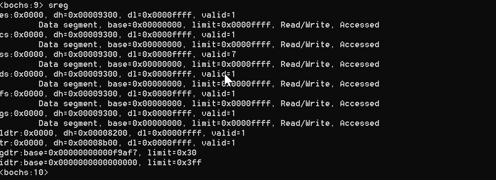
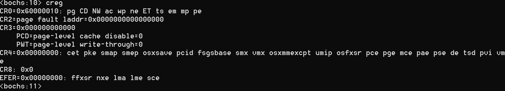

# 通过设置寄存器的CR0的PE位进入保护模式

通过设置寄存器的CR0的PE位进入保护模式，并在调试器中观察gdtr和cr0这两个寄存器。

**现在已经到达实模式和保护模式的分界线！！！**

**控制这两种模式的开关在一个叫cr0的寄存器器中！！！**

cr0是处理器内部的控制寄存器，Control Register:CR

之所以后编号0，是因为处理器中还有cr1、cr2、等以cr开头的寄存器。

cr0是一个32位的寄存器，比特编号从0-31，里面包含了很多位，包含了一系列用于控制处理器，操作模式，以及运行状态的标志位，它的**第一位，位0是保护模式允许位PE，Protect mode Enable:PE。**

**这一位是开启保护模式的门把手：**

**如果把这一位置1，那么处理器就进入了保护模式，按保护模式的规则，开始运行。**

```
         cli                                ;保护模式下中断机制尚未建立，应 
                                            ;禁止处理器响应中断，保护模式下的中断机制和实模式不同，原有的中断向量表不再适用，在保护模式下，需要建立一套完全不同的中断处理机制，我们目前没有做这个工作，因此当中断发生时肯定会出问题！！！所以关闭中断！！！在保护模式中，bios中断也不能再用了，因为在这些中断访问内存时，依然采用的是逻辑地址。
         mov eax,cr0 ;将cr0原有内容传送到eax，准备修改它
         or eax,1 ;用or指令将位0置1
         mov cr0,eax ;将修改后的内容，重新写入cr0，这直接会导致处理器运行变成保护模式 
```

bochs调试命令

查看gdtr，使用命令sreg

查看cr0，使用命令creg bochs用缩写表示每一位的状态，小写意味着这一位是0，大写意味着这一位是1。



进入主引导扇区执行时，查看gdtr



gdtr已经被改变，起始这个值说明已经创建了一个全局描述符表了，这个表不是我们建立的，是bios建立的，我们知道，bios在启动的时候，要对硬件进行初始化和检测，这个检测就包括对内存的检测，为了检测1m内存以上的内存空间，必须进入保护模式，而为了进入保护模式，必须创建全局保护符表，所以这个表是为了检测内存而创建的。

查看cr0



这个时候cr0是没有变化的，保护模式允许位还是0。

