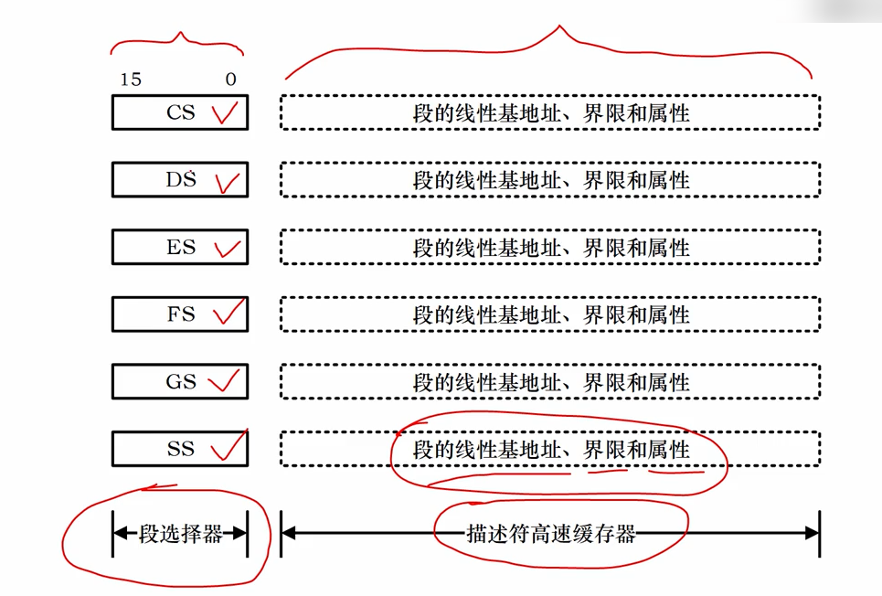
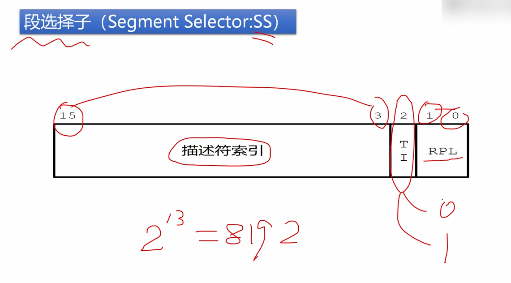
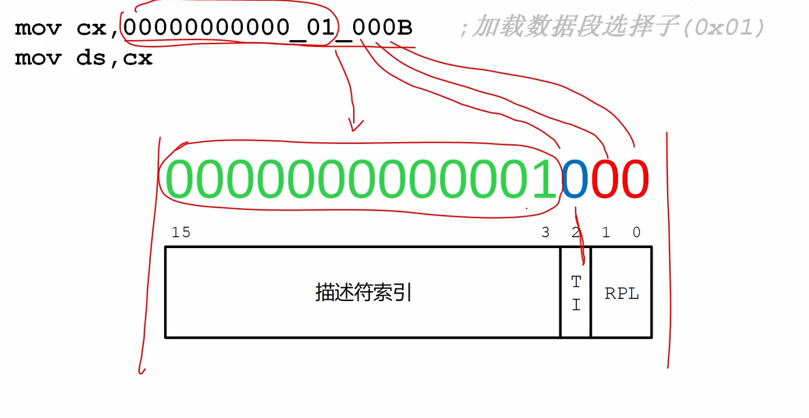
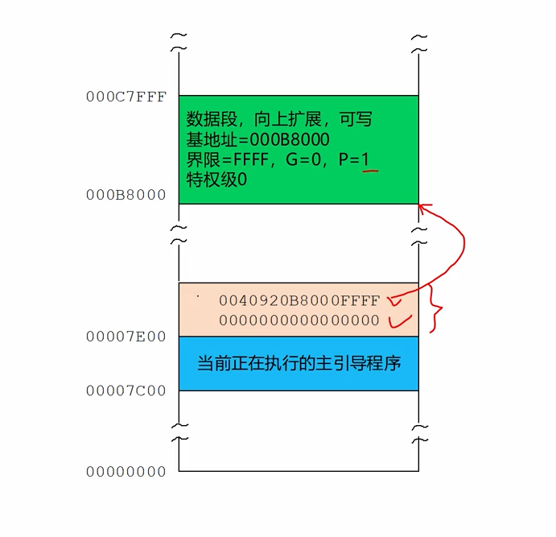
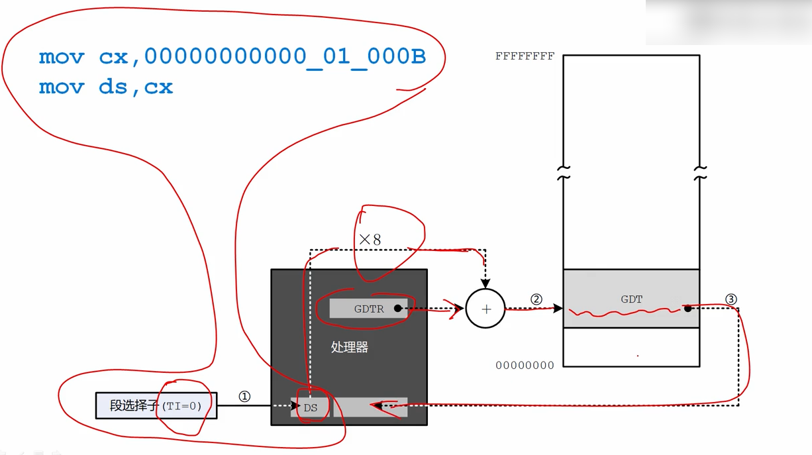
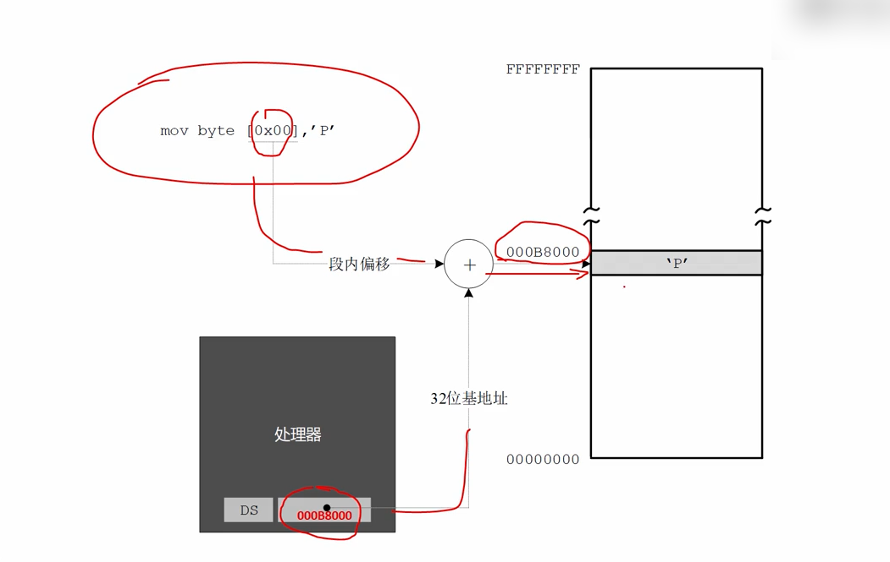

# 描述符高速缓存器和保护模式下的内存访问

保护是如何访问内存呢？

从内存构造说起：

> 在8086中段寄存器是16位的，一共有4个，分别是ds、es、cs、ss。
>
> 在32位处理器内部，在原先的基础上又增加了两个段寄存器，fs、gs。
>
> 8086处理器访问内存的方式是将段寄存器的内容左移4位，加上段内偏移地址，得到20位逻辑地址。
>
> 在32位处理器上，如果在实模式下，这一点没有改变，所以8086的处理器可以继续在32位处理器上运行。



在32位处理器上这6个寄存器做了**扩展，各自增加了一个不可见的部分**，叫做**描述符高速缓存器**，用来存放**段的线性基地址，段的界限以及相关属性访问控制属性**。

所谓**不可见是无法在程序中使用，我们没有任何办法来访问这一部分**，它是由处理器内部使用的。

**传统的段寄存器不再叫段寄存器，而是叫段选择器**，在**实模式下，段选择器的内容是逻辑段地址**，在**保护模式下， 段选择器的内容是段描述符的选择子，简称选择子**。



段选择子（Segement Selector:SS）

段选择子由三部分组成：

第一部分是**描述符的索引号**，用来在**描述符表中选择一个描述符**，占据了段选择子的位3-15一共是13个bit，这里的**索引号是从0开始的**，**即1表示是第二个描述符**。

第二部分是**TI位**，Table Indicator表指示器，是描述符表的指示器，当TI位**等于0时**，表示要选择的描述符在**全局描述符表GDT中**，TI位**为1**表示要选择的描述符在**LDT中**。

第三部分是RPL请求特权级，位0-1，RPL是提供这个选择子的程序的特权级，正是这个程序要求访问这个内存段。


为了访问一个段，我们需要让**段选择字传送到段选择器**，一旦我们让**段选择子，改变了段选择器**，处理器就**立刻用这个段选择子，到指定的描述符表中取出描述符，然后将它的内容传送到描述符高速缓存器中**，从此以后，处理器就用，**描述符高速缓存器里面的，线性基地址，加上段内偏移来访问内存**，而**不是使用段选择器**。

```
         mov cx,00000000000_01_000B         ;加载数据段选择子(0x01)
         mov ds,cx ;在实模式下，传送到实模式下的是逻辑段地址，在保护模式下，传送到ds的内容并不是逻辑段地址是选择子
```



上图标表示，选择子00000000000_01_000B是全局描述符表中的第二个描述符。



回顾一下，我们创建的**全局描述符表**，其中有**两个描述符**，**第一个是描述符是空描述符，这是处理器的要求**，**第二个描述符是一个段描述符，对应于一个数据段**，即显存，这个段是向上扩展的，可写，**基地址是0xb8000，界限值是0xffff**，粒度是字节，这个段是存在的。

在程序中，我们是选择了这一个数据段描述符 。

后续处理：



第一步是将段选择字，传送到段选择器。

```
mov cx,00000000000_01_000B
mov ds,cx
```

第二步是 一旦**将段选择子传送到段选择器ds**，处理器**立即执行一个内部过程**，此时因为一个描述符占8个字节(byte)，处理器要将描述符**选择子中的，索引号乘以8**，来得到它在**描述表中的偏移量**。

同时**因为选择子的TI位是0**，处理器就知道要选择的**描述符在全局描述符表GDT中**，于是从全局描述符表寄存器**GDTR中取出全局描述符表的线性基地址**。

最后将全局描述符表的**线性基地址，和乘以8之后的偏移量相加**，就得到了**目标描述符的线性地址**。

处理器**用这个线性地址访问内存**，取出描述符，将这个**描述的内容传送到描述符高速缓存器中**。

```
mov cx,00000000000_01_000B
mov ds,cx
```

这两行执行之后，每当有访问内存的指令时，就不在访问GDT中的描述符，也不再使用ds中的段选择子，而是直接用ds描述符高速缓存器中的基地址加上指令中提供的偏移量来访问内存，现在描述符高速缓存区里保存的基地址是0xb8000这个可读可写，后续向这个字段内写字符。



