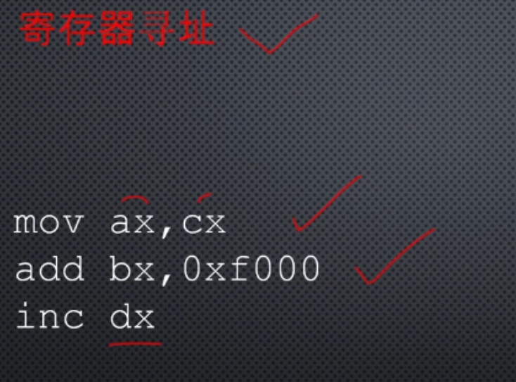
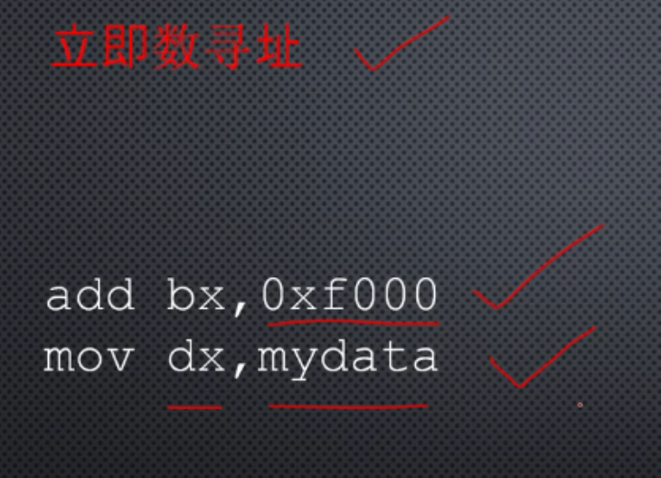
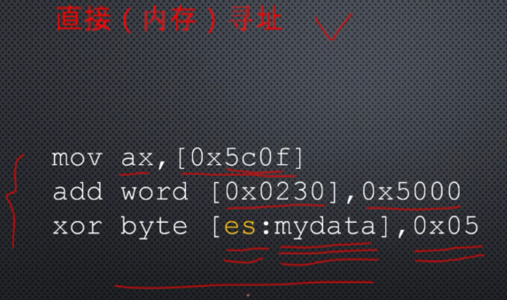
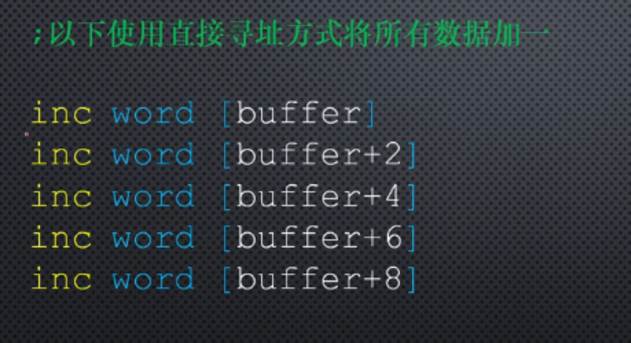
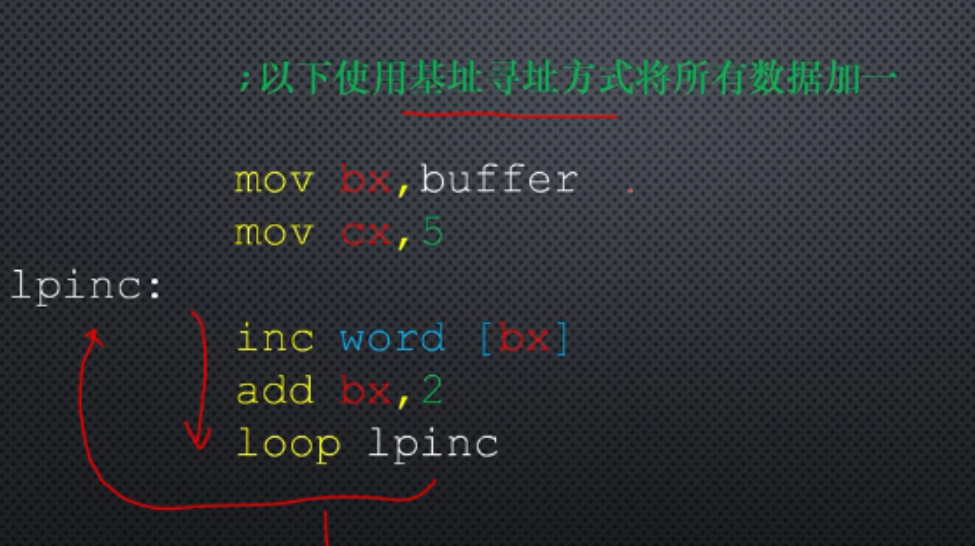
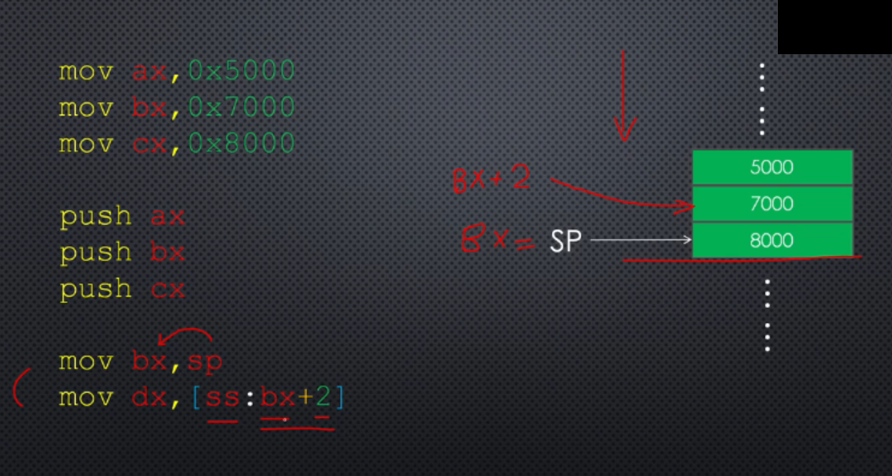
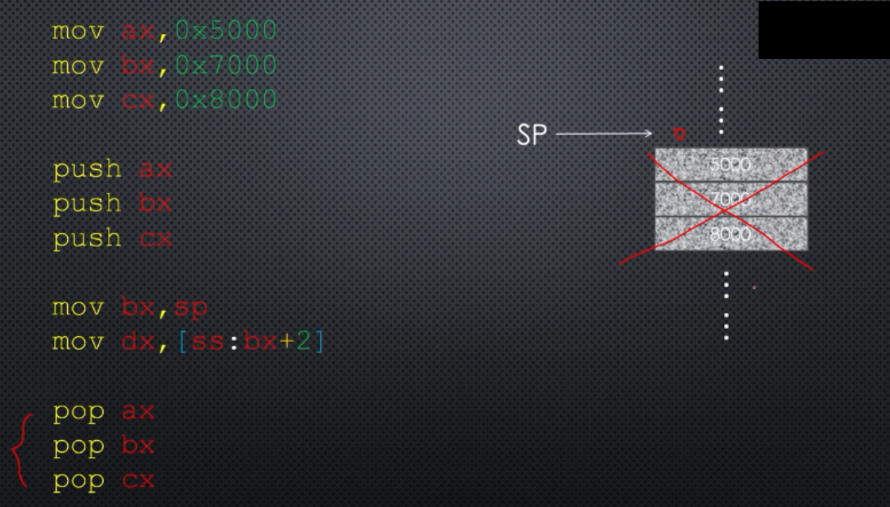
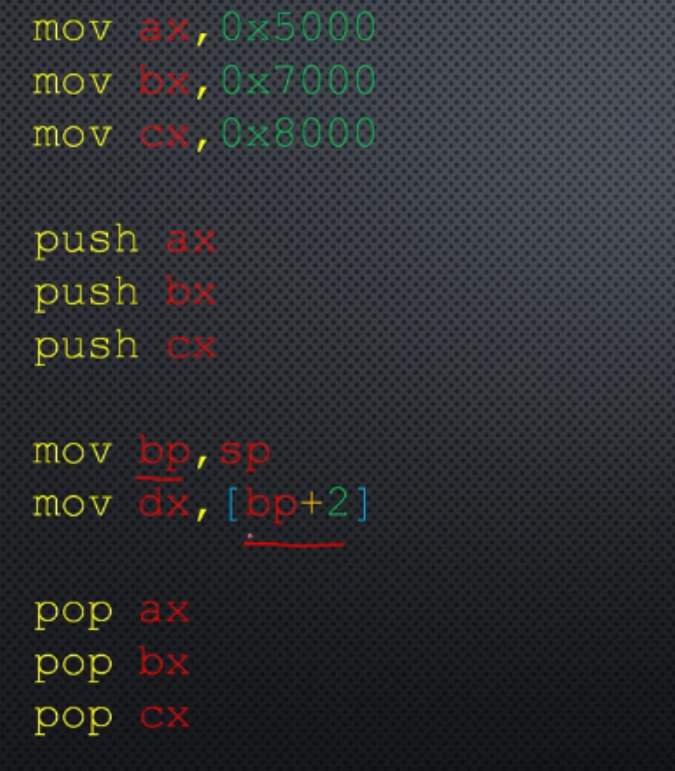

# 寻址方式

什么是寻址方式？

如何找到要操作的数据，以及如何找到存放操作结果的地方。

## 总结

### 寄存器寻址

操作的数位于寄存器中，

mov ax,bx ;左操作数，右操作数，都是寄存器寻址

### 立即数寻址

操作数是指令中给出，不需要去内存中去取得，可以立即取得，被称为立即数。

标号代表汇编地址，本质上是数字，在程序编译阶段，标号会转换成一个立即数。

### 内存寻址

如果操作数在内存中，需要访问内存才能找到它，为此处理器提供了很多种方法，从内存中寻找操作数，这些方法统称为内存寻址。

在8086处理器中，访问内存时，采用段地址左移4位，加上段内偏移地址，得到20位物理地址，采用这样的方式来寻找指令和操作数。

段地址是由四个段寄存器之一来提供，CS DS ES SS，偏移地址必须由指令来提供，因此内存寻址就是寻找偏移地址，通过偏移地址来寻找操作数，

### 直接（内存）寻址

如果在指令中直接给出了数据的偏移地址，那么叫做直接寻址/直接内存寻址，操作数中表示内存地址都需要用[]括起来，

### 基址寻址

使用基址寄存器bx或者bp提供操作数的偏移地址，偏移地址也称为有效地址，

定义5个字

基址寻址示例

偷看栈中值

如果使用基址寄存器bx来提供有效地址，那么默认使用段寄存器ds，而bp来提供有效地址，那么默认使用的就是ss段寄存器，不用使用段超越前缀。

等效写法如下 

