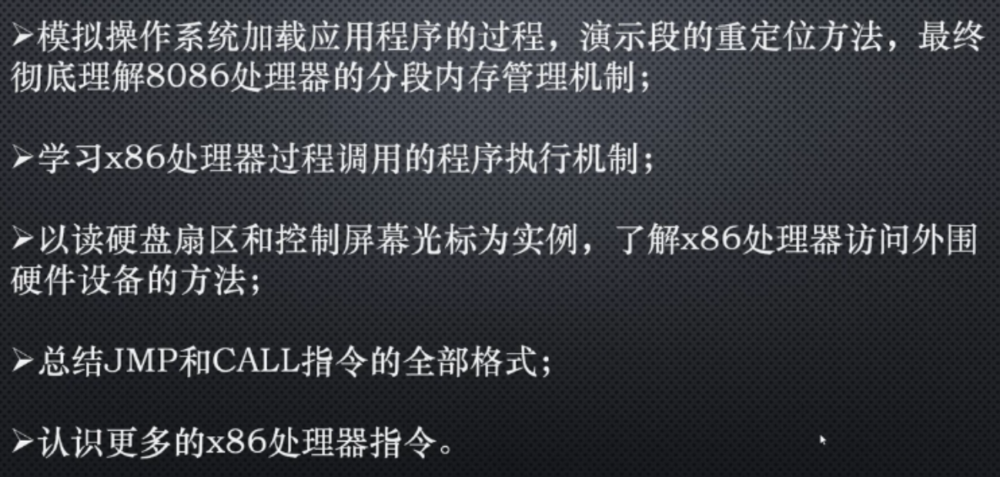
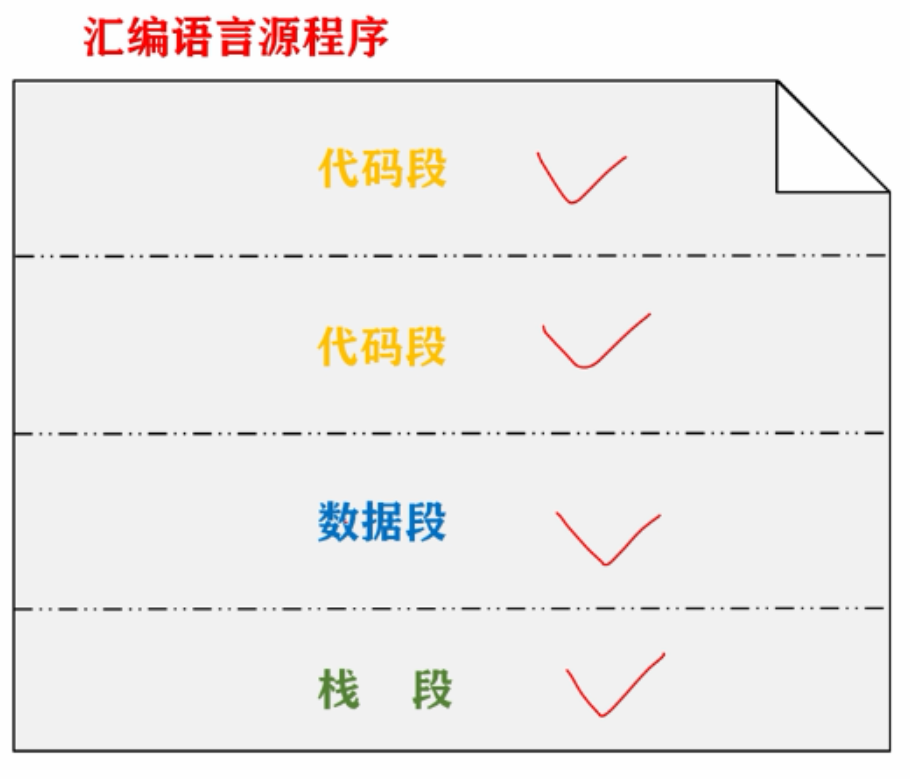
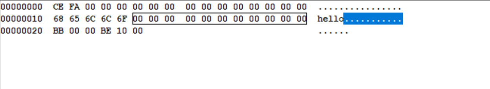
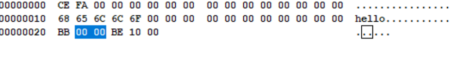
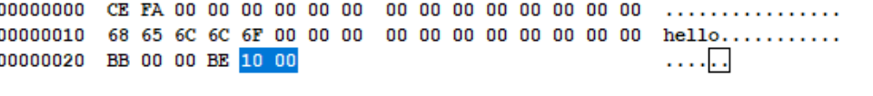
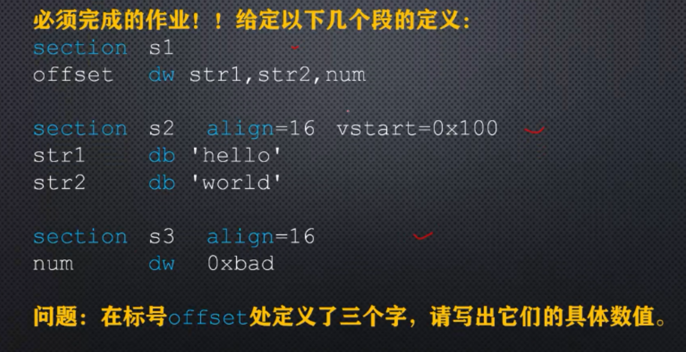
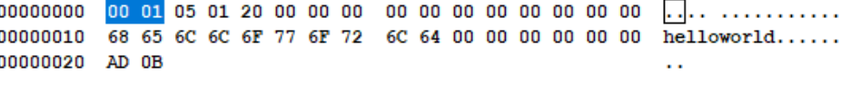
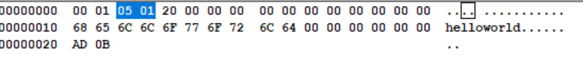
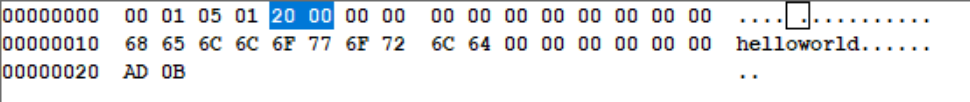

# 硬盘与显卡的访问与控制



 

分段位置加上 align语句来设置段的对齐方式

在8086中段是按照16字节对齐的

```
SECTION data1 align=16
mydata dw 0xface

section data2 align=16
string db 'hello'

section code align=16
        mov bx,mydata
        mov si,string
```



## 如何控制段内元素的汇编地址

段的偏移量默认是相对于程序开头的偏移量来计算的。

证明

```
SECTION data1 align=16
mydata dw 0xface

section data2 align=16
string db 'hello'

section code align=16
        mov bx,mydata ;这一条语句中的右操作数，mydata在图1中高亮部分，值为0000
        mov si,string ;这一条语句中的右操作数string在图2中高亮部分，值为0010
```



图1



图2

显然段内元素的汇编地址都是相对于程序开头的，而不管位于哪个段中。

这种做法有时需要，但是大多数情况下不满足要求。


vstart表示虚拟的汇编地址，一旦指定了这个语句，这个段内所有的汇编地址，都从这个指定的数值开始计算。

```
SECTION data1 align=16 vstart=0
mydata dw 0xface

section data2 align=16 vstart=0
string db 'hello'

section code align=16 vstart=0
        mov bx,mydata
        mov si,string
```

作业



三个标号的汇编地址是多少？

str1：0x0100



str2：0x0105



num：0x0020



