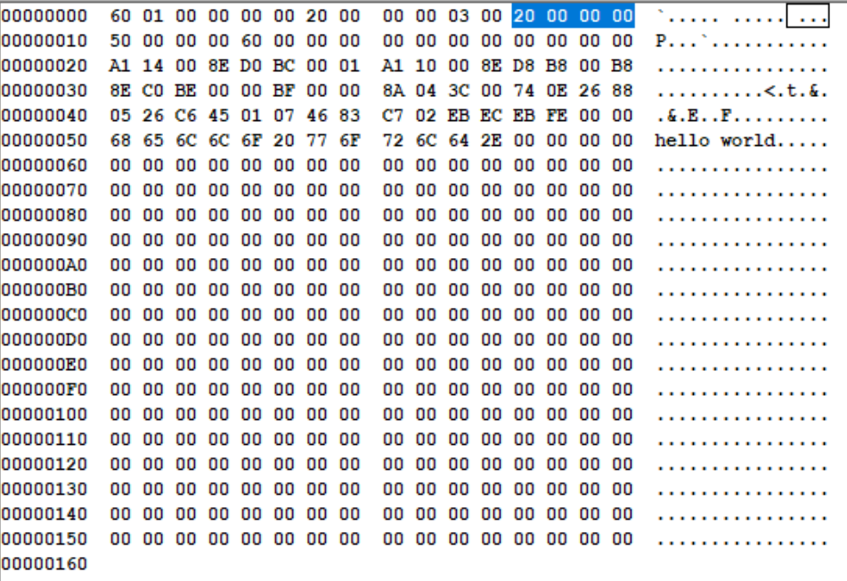

# 加载器

主引导扇区太小了，只有512个字节。

容纳不了多少数据和指令，一般用作跳板加载和引导操作系统。

用户程序和加载器


例子


计算一个段的段地址

表达式，用来计算段的汇编地址

section.段名字.start

这个段距离整个程序开头的字节数或者相对于程序开头处的偏移量

```
;包含代码段、数据段、栈段的用户程序
;===============================================================================
SECTION header vstart=0                     ;定义用户程序头部段
    ;伪指令dd声明和初始化一个双字，一个32位的数据
    ;16位数据不足以表示65535以上的数值，所以使用双字记录
    program_length  dd program_end          ;程序总长度[0x00]

    ;用户程序入口点
    code_entry      dw start                ;偏移地址[0x04]
                    dd section.code.start ;段地址[0x06]

    realloc_tbl_len dw (segtbl_end-segtbl_begin)/4
                                            ;段重定位表项个数[0x0a]
                                            ;dd双字,每个表项为4个字节

    ;段重定位表
    segtbl_begin:
    code_segment  dd section.code.start ;[0x0c]
    data_segment  dd section.data.start ;[0x10]
    stack_segment   dd section.stack.start  ;[0x14]
    segtbl_end:

;===============================================================================
SECTION code align=16 vstart=0         ;定义代码段1（16字节对齐）
  start:
         ;初始执行时，DS和ES指向用户程序头部段
         mov ax,[stack_segment]           ;设置到用户程序自己的堆栈
         mov ss,ax
         mov sp,stack_pointer

         mov ax,[data_segment]          ;设置到用户程序自己的数据段
         mov ds,ax

         mov ax,0xb800
         mov es,ax

         mov si,message
         mov di,0
  next:
         mov al,[si]
         cmp al,0
         je exit
         mov byte [es:di],al
         mov byte [es:di+1],0x07
         inc si
         add di,2
         jmp next
  exit:
         jmp $
         
;===============================================================================
SECTION data align=16 vstart=0
message:
        db 'hello world.',0
;===============================================================================
SECTION stack align=16 vstart=0
        resb 256
stack_pointer:

;===============================================================================
SECTION trail align=16
;没有vstart语句，
;所以标号program_end的汇编地址是从整个程序的开头计算的
;program_end长度为整个程序的长度
program_end:

```

程序头部段


program_length 程序总长度是 0x00000160


code_entry 入口点段内偏移 0x0000


code_entry入口点汇编地址0x00000020


realloc_tbl_len 重定位表项数0x0003


code_segment 0x00000020



data_segment  0x00000050


stack_segment 0x00000060


