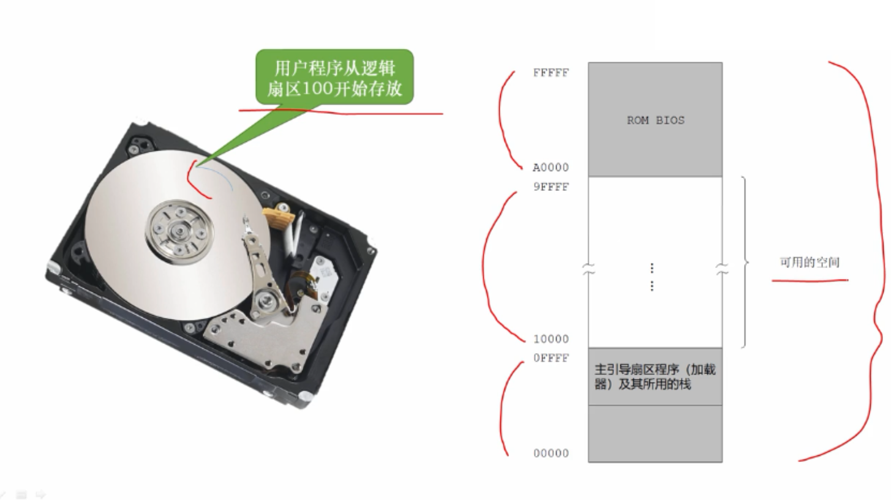
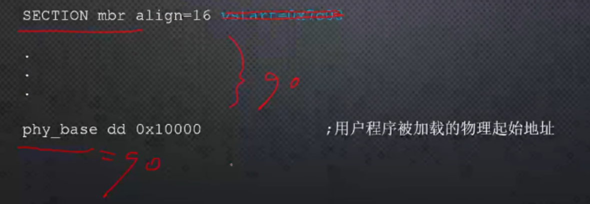
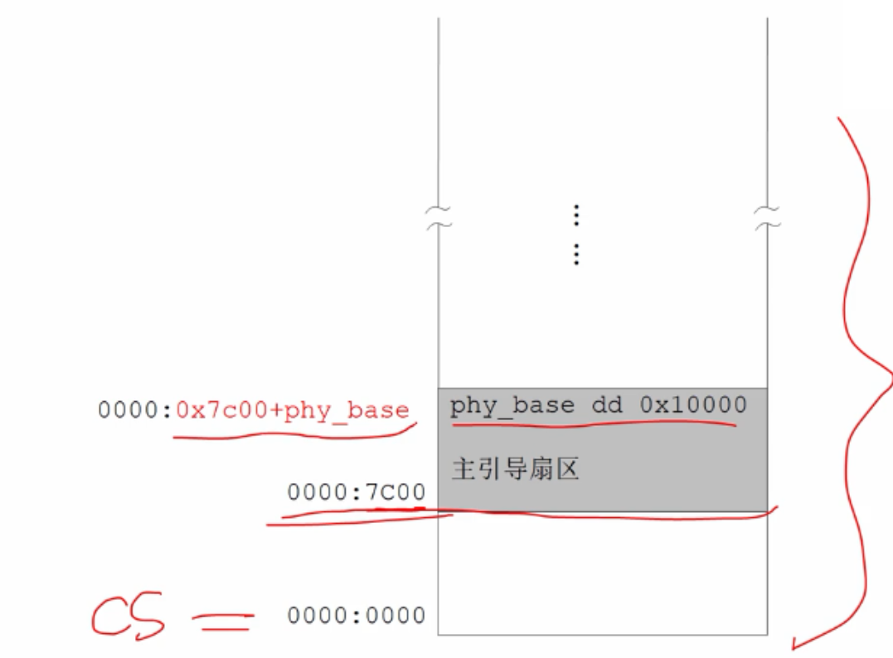
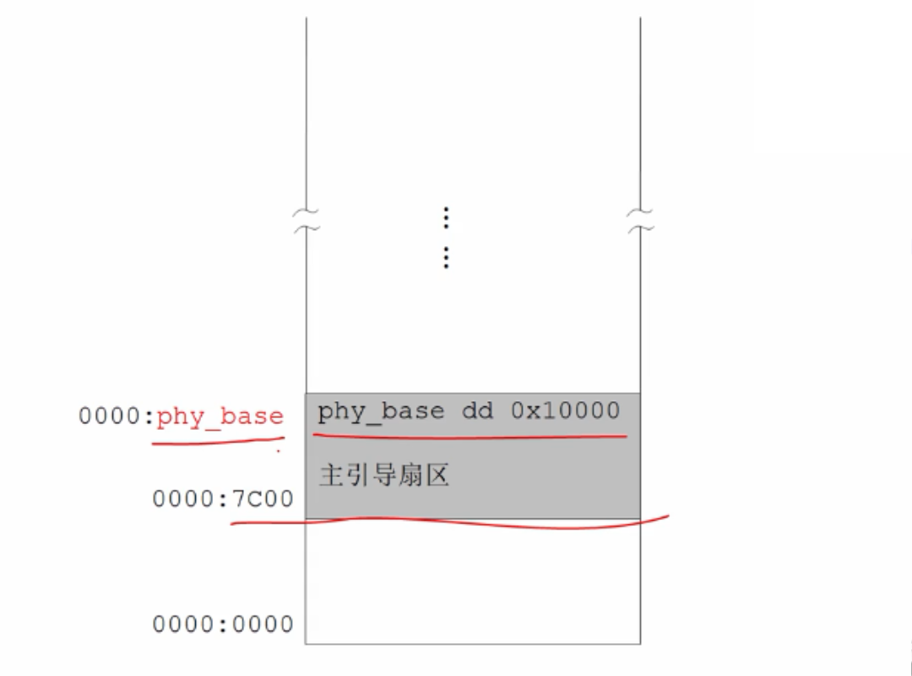
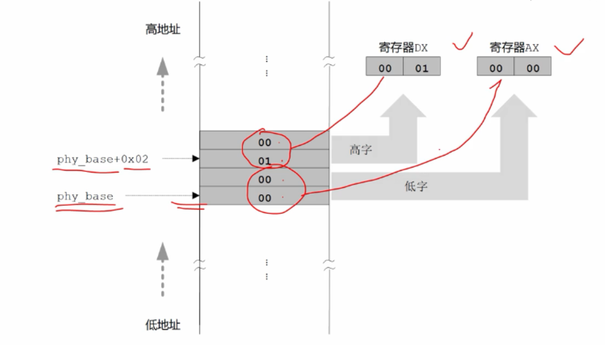

# 加载器的工作流程和常数声明

工作流程：


要做两件事：

1.看看内存中哪些地方是空闲的，把用户程序加载到内存中什么位置。

2.用户程序在硬盘的什么位置，它的起始逻辑扇区号是多少。

我们规定用户程序在硬盘的位置，必须从逻辑扇区号100开始，加载器也从这个位置，加载用户程序。

常数(在程序运行期间，不变的数)用伪指令equ来声明。

```
app_lba_start equ 100
```

标号app_lba_start等同于数字100。

使用equ声明的常数不会占用任何汇编地址，也不会在程序中占用任何空间。



目前是把用户程序加载到0x100000物理开始地址，当然你也可以加载到可用空间的其他地方，只要是可用空闲的，当然物理起始地址必须是16字节对齐的(也就是说能被16整除 0x100000 / 0x10 = 65536 => 1048576 / 16 = 65536)，将来才会行成一个有效的段地址。

即使不定义段，那么编译器也会把程序看成一个段。


```
         ;代码清单8-1
         ;文件名：c08_mbr.asm
         ;文件说明：硬盘主引导扇区代码（加载程序） 
         ;创建日期：2011-5-5 18:17
         
         app_lba_start equ 100           ;声明常数（用户程序起始逻辑扇区号）
                                         ;常数的声明不会占用汇编地址
                                    
SECTION mbr align=16 vstart=0x7c00                                     

         ;设置堆栈段和栈指针 
         mov ax,0      
         mov ss,ax
         mov sp,ax
         ;初始化后，栈段和代码段是同一个段，段地址都是0，段的长度都是64kb => 64千字节
         
         ;读取用户程序，代码 ，并写入内存
         mov ax,[cs:phy_base] ;将phy_base偏移地址的20位值存放到寄存器中;ax中存放低16位            ;计算用于加载用户程序的逻辑段地址 
         mov dx,[cs:phy_base+0x02] ;dx中存放高16位
         mov bx,16 ;用20位地址，除以16来计算段地址        
         div bx ;做除法来计算，段地址，商在ax中，(16位的段地址)            
         mov ds,ax ;将段地址传送到数据段寄存器ds                       ;令DS和ES指向该段以进行操作
         mov es,ax ;将段地址传送到额外段寄存器es                       
         ;一旦准备好了段，就可以读用户程序，把它加载到，ds或者es所指向的段中。
         ;以下读取程序的起始部分 
         xor di,di
         mov si,app_lba_start            ;程序在硬盘上的起始逻辑扇区号 
         xor bx,bx                       ;加载到DS:0x0000处 
         call read_hard_disk_0
      
         ;以下判断整个程序有多大
         mov dx,[2]                      ;曾经把dx写成了ds，花了二十分钟排错 
         mov ax,[0]
         mov bx,512                      ;512字节每扇区
         div bx
         cmp dx,0
         jnz @1                          ;未除尽，因此结果比实际扇区数少1 
         dec ax                          ;已经读了一个扇区，扇区总数减1 
   @1:
         cmp ax,0                        ;考虑实际长度小于等于512个字节的情况 
         jz direct
         
         ;读取剩余的扇区
         push ds                         ;以下要用到并改变DS寄存器 

         mov cx,ax                       ;循环次数（剩余扇区数）
   @2:
         mov ax,ds
         add ax,0x20                     ;得到下一个以512字节为边界的段地址
         mov ds,ax  
                              
         xor bx,bx                       ;每次读时，偏移地址始终为0x0000 
         inc si                          ;下一个逻辑扇区 
         call read_hard_disk_0
         loop @2                         ;循环读，直到读完整个功能程序 

         pop ds                          ;恢复数据段基址到用户程序头部段 
      
         ;计算入口点代码段基址 
   direct:
         mov dx,[0x08]
         mov ax,[0x06]
         call calc_segment_base
         mov [0x06],ax                   ;回填修正后的入口点代码段基址 
      
         ;开始处理段重定位表
         mov cx,[0x0a]                   ;需要重定位的项目数量
         mov bx,0x0c                     ;重定位表首地址
          
 realloc:
         mov dx,[bx+0x02]                ;32位地址的高16位 
         mov ax,[bx]
         call calc_segment_base
         mov [bx],ax                     ;回填段的基址
         add bx,4                        ;下一个重定位项（每项占4个字节） 
         loop realloc 
      
         jmp far [0x04]                  ;转移到用户程序  
 
;-------------------------------------------------------------------------------
read_hard_disk_0:                        ;从硬盘读取一个逻辑扇区
                                         ;输入：DI:SI=起始逻辑扇区号
                                         ;      DS:BX=目标缓冲区地址
         push ax
         push bx
         push cx
         push dx
      
         mov dx,0x1f2
         mov al,1
         out dx,al                       ;读取的扇区数

         inc dx                          ;0x1f3
         mov ax,si
         out dx,al                       ;LBA地址7~0

         inc dx                          ;0x1f4
         mov al,ah
         out dx,al                       ;LBA地址15~8

         inc dx                          ;0x1f5
         mov ax,di
         out dx,al                       ;LBA地址23~16

         inc dx                          ;0x1f6
         mov al,0xe0                     ;LBA28模式，主盘
         or al,ah                        ;LBA地址27~24
         out dx,al

         inc dx                          ;0x1f7
         mov al,0x20                     ;读命令
         out dx,al

  .waits:
         in al,dx
         and al,0x88
         cmp al,0x08
         jnz .waits                      ;不忙，且硬盘已准备好数据传输 

         mov cx,256                      ;总共要读取的字数
         mov dx,0x1f0
  .readw:
         in ax,dx
         mov [bx],ax
         add bx,2
         loop .readw

         pop dx
         pop cx
         pop bx
         pop ax
      
         ret

;-------------------------------------------------------------------------------
calc_segment_base:                       ;计算16位段地址
                                         ;输入：DX:AX=32位物理地址
                                         ;返回：AX=16位段基地址 
         push dx                          
         
         add ax,[cs:phy_base]
         adc dx,[cs:phy_base+0x02]
         shr ax,4
         ror dx,4
         and dx,0xf000
         or ax,dx
         
         pop dx
         
         ret

;-------------------------------------------------------------------------------
         phy_base dd 0x10000 ;伪指令dd开辟了一个32位空间(双字)存放这个地址0x10000(20位)             ;用户程序被加载的物理起始地址
         
 times 510-($-$$) db 0
                  db 0x55,0xaa
```

如果没有vstart虚拟地址

此时phy_base只是表示标号距离段(SECTION)起始处的字节数/偏移量。

**灰色区域的高**是phy_base，即偏移量，要计算phy_base真正的以0000为段基地址(在代码段中的偏移地址)的偏移地址就需要加上0x7c00了。

```
SECTION mbr align=16
```





如果有vstart虚拟地址，段内元素的汇编地址，都是从虚拟地址开始计算的。

这种情况，标号phy_base为距离段起始位置的字节数加上0x7c00。

```
SECTION mbr align=16 vstart=0x7c00  
```




存放phy_base



