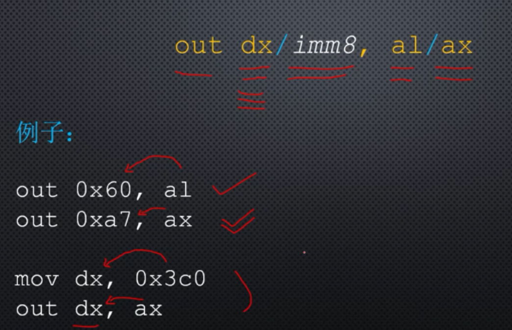

# 输入输出端口的访问方法

## I/O接口处也有寄存器，称之为端口

端口是处理器和外围设备通过I/O接口交流的窗口。

每个I/O接口可能有好几个端口，分别用于不同的目的。

每个端口都一个端口号，是一个数字，按需分配，常用的设备都有固定的端口号。

有些设备比较简单，只有一个端口，有的复杂有很多端口。

因特尔处理器系统中，0-65535 共有65536个端口，端口是独立于内存编址的，端口的访问不能使用类似于mov这样的指令，而是使用in、out指令

## in

从端口处读数据到处理器。

in指令的目的操作数必须是al、ax。

使用哪个取决于端口的数据宽度，当宽度为8位时使用al，当宽度为16位时使用ax。

源操作数是端口号，一般来书，端口号存放在dx寄存器中。

**in指令不影响任何标志位**

在in指令中，端口号小于256(0xff)，端口号不一定放在寄存器dx，可以使用立即数。

 ## out

向外围设备发送数据。

与in指令相反。

**out指令也不影响任何标志位。**

