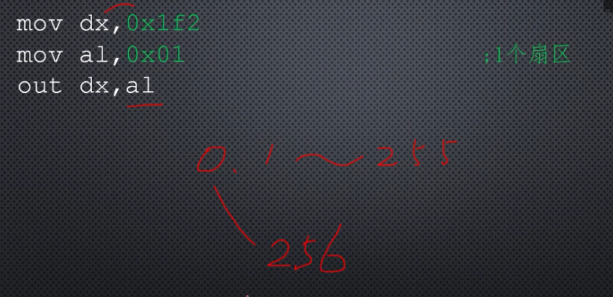
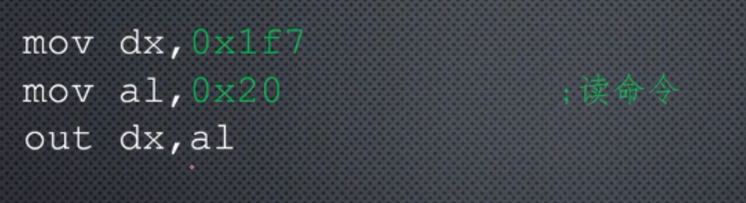
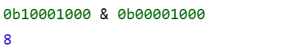
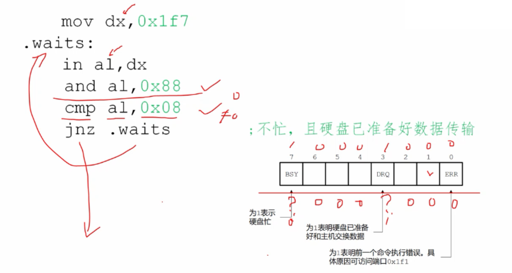
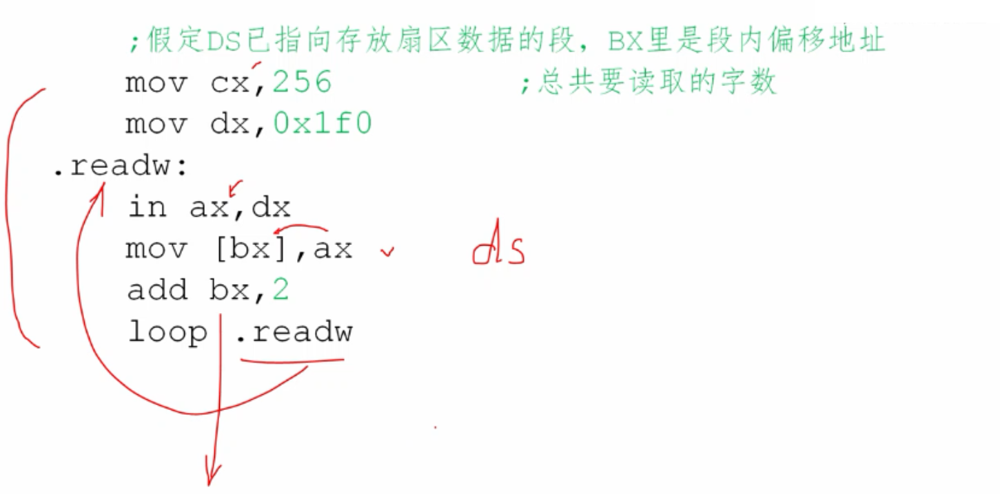

# 通过硬盘控制器端口，读取扇区数据

硬盘读取数据的基本单位是扇区，读最少读一个扇区，写至少写一个扇区。

不可能只读写一个扇区中的几个字节等。

主机与硬盘间的数据交换是成块的。

硬盘是典型的块设备。

(CHS模式)柱面-磁头-扇区

(LBA模式)逻辑块寻址方式

最早逻辑扇区编址方式是LBA28，使用28个bit来进行编号。

后续我们使用LBA28来访问硬盘。

在我们的计算机上主硬盘控制器，被分配了8个端口，端口号从0x1f0 - 0x1f7。

假设读取硬盘逻辑扇区则需要这几步：

1.1.设置要读取的扇区数量。

1.2.这个数值要写入0x1f2端口。

其中值得注意的是，数量为0时，表示256个扇区，1-255表示1-255个扇区。

2.1.设置起始的LBA扇区号，扇区的读写是连续的，因此只需要给出第一个扇区的编号就可以了。

假定我们读写的起始逻辑扇区是2使用LBA28表示为：

扇区号：0000 00000000 00000000 00000010

其中最右边8位(00000010)写入0X1f3

8位(00000000)写入0x1f4

8位(00000000)写入0x1f5

4位(0000)写入0x1f6 的低4位

高4位，有特殊作用。

3.1.向端口0x1f7写入0x20(读命令),请求硬盘读。

0x1f7端口是8位端口，所以使用al寄存器来传送。

4.1.等待读写操作完成，端口0x1f7即是命令端口，又是状态端口。

在发送读写命令之后，还需要判断硬盘是否已经准备好读写了。

5.1.连续的取出数据。

0x1f0是硬盘接口的数据端口，一旦硬盘空闲并且数据准备就绪，就可以从这个端口写入或者读取数据，0x1f0端口的数据是16位的，每次传输一个字，硬盘读写的基本单位是扇区，一个扇区512个字节，折合256个字，前面已经指定读取1个扇区，所以读取0x1f0至少256次，

