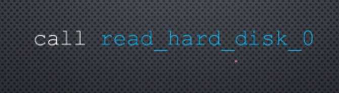
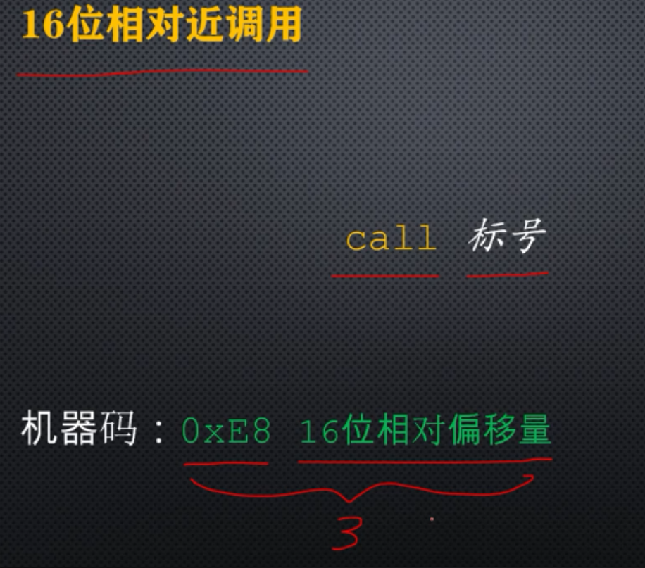
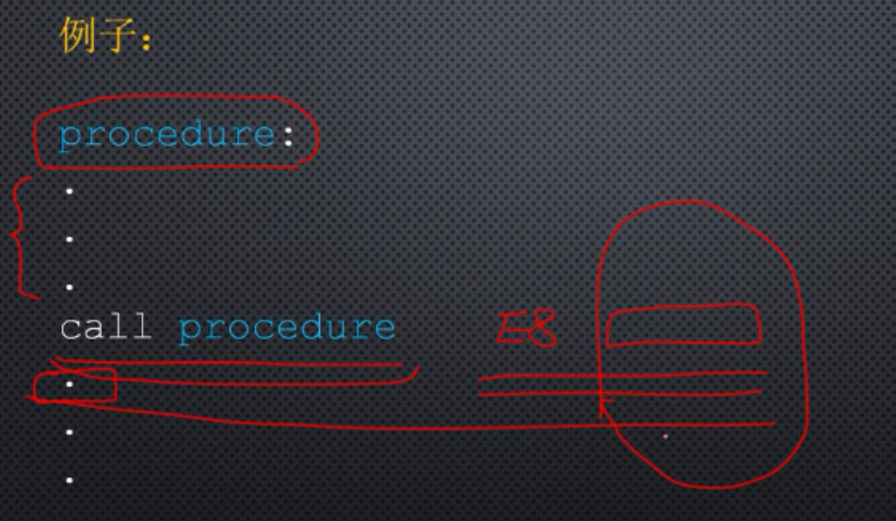
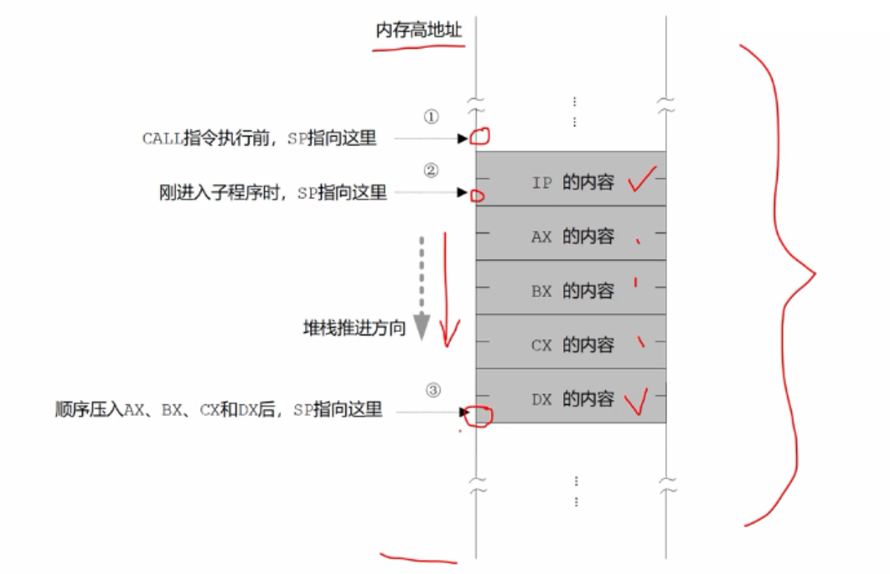
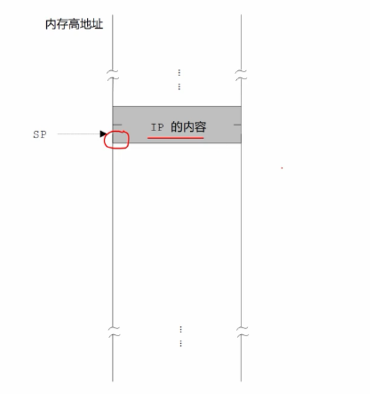

# 过程调用以及过程返回的基本原理

指令形式：



标号是子程序的名字也是子程序的入口。


16位相对近调用。

近调用意思是，在当前代码段内，而不是另一代码段。

16位相对偏移量计算方式：



用目标位置（标号的汇编地址） -  call指令下一条指令的汇编地址 保留16位的结果作为指令中的操作数。

例子：



当call指令执行时（过程调用时），处理器用指令指针寄存器IP的当前内容加上call指令中16位的相对偏移量，就得到了子程序的偏移地址，然后到这个偏移地址处去执行。


当处理器取出一条指令，并准备开始执行时，会将指令指针寄存器的内容修改为下一条指令执行的偏移地址。

**进入子程序后，会返回的**，为了返回处理器必须将返回点的偏移地址压栈，以便将来利用这个点来返回，因此处理器在进入子程序之前，会将指令指针寄存器IP的当前的内容压栈，IP的内容是指向call指令的下一条指令。

注意：call指令是16位的相对近调用，只能调用当前段内的过程，不能调用另一个段内的过程，在调用前后代码段寄存器CS的内容始终是不变的，所以不需要将CS的内容压栈。

将IP的内容压栈之后，处理器开始计算子过程的偏移地址，用IP的当前内容，加上指令中的16位相对偏移量，就得到了子程序的偏移地址，同时处理器用这个偏移地址取代IP的原有内容，当处理器下次取指令执行指令时，取的就是子程序的第一条指令，即开始进入子程序内部执行。


call指令执行过程栈段内容：



在子程序返回前顺序弹出了

```
         pop dx
         pop cx
         pop bx
         pop ax
```

栈段内容：



处理器执行过程返回指令ret

```
ret
```

执行时，从栈里弹出一个字（16位）到指令指针寄存器IP，实际上改变了IP的内容，弹出的字，恰好就是当初调用子程序时IP的值，这个值，指向call指令的下一条指令。

