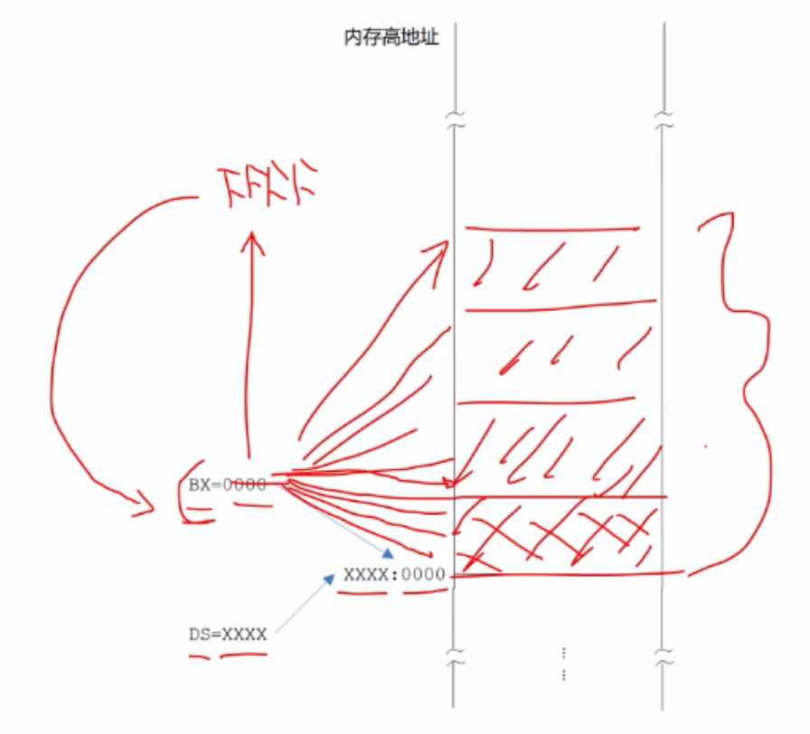
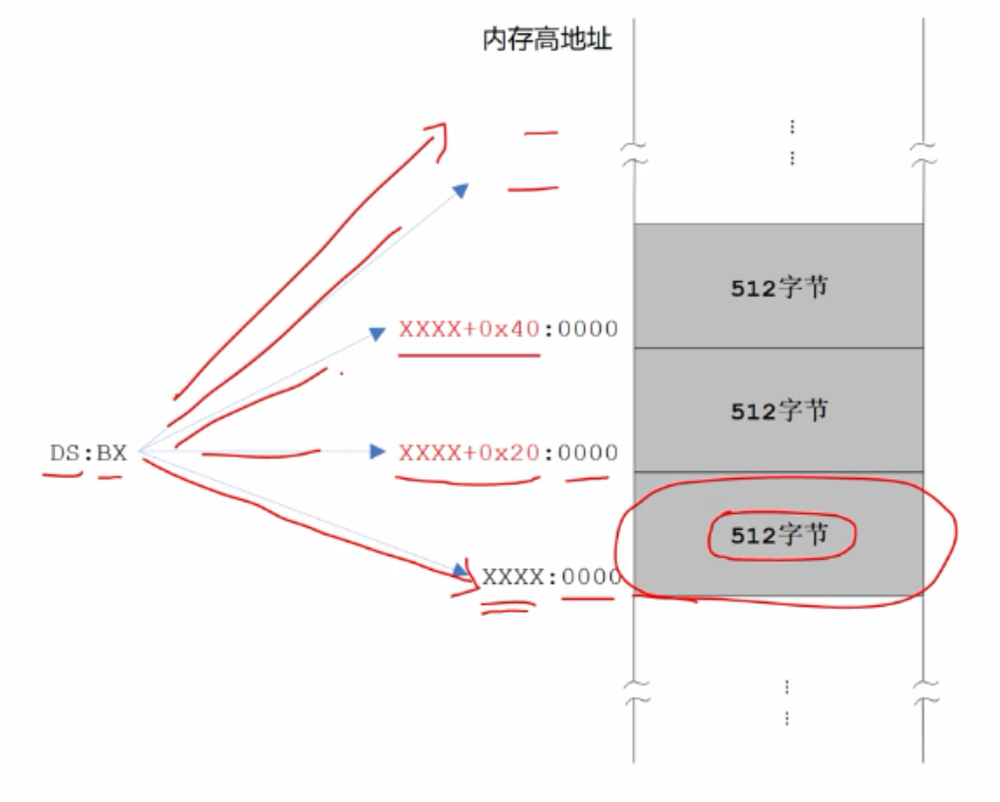

# 从硬盘上加载用户程序

一个逻辑段最大64kb(千字节)，当用户程序特别大时，比如超过了64kb，则一个段容纳不下，如果超过段内偏移地址0XFFFF就会绕回0x0000，会把最开始的内容覆盖掉。



为了解决这个问题，每次加载数据之前，都会在前面数据尾部，构建一个新的逻辑段，并将要读取的数据，加载到这个新的段内。



程序中是如何实现的，段地址的改变是临时的，是为了，读取硬盘，开始时会将ds压栈保存，后续会出栈，用以知道读取的数据保存到哪个开始段地址。

```
         ;代码清单8-1
         ;文件名：c08_mbr.asm
         ;文件说明：硬盘主引导扇区代码（加载程序） 
         ;创建日期：2011-5-5 18:17
         
         app_lba_start equ 100           ;声明常数（用户程序起始逻辑扇区号）
                                         ;常数的声明不会占用汇编地址
                                    
SECTION mbr align=16 vstart=0x7c00                                     

         ;设置堆栈段和栈指针 
         mov ax,0      
         mov ss,ax
         mov sp,ax
         ;初始化后，栈段和代码段是同一个段，段地址都是0，段的长度都是64kb => 64千字节
         
         ;读取用户程序，代码 ，并写入内存
         mov ax,[cs:phy_base] ;将phy_base偏移地址的20位值存放到寄存器中;ax中存放低16位            ;计算用于加载用户程序的逻辑段地址 
         mov dx,[cs:phy_base+0x02] ;dx中存放高16位
         mov bx,16 ;用20位地址，除以16来计算段地址        
         div bx ;做除法来计算，段地址，商在ax中，(16位的段地址)            
         mov ds,ax ;将段地址传送到数据段寄存器ds                       ;令DS和ES指向该段以进行操作
         mov es,ax ;将段地址传送到额外段寄存器es                       
         ;一旦准备好了段，就可以读用户程序，把它加载到，ds或者es所指向的段中。

         ;以下读取程序的起始部分
         ;先读用户程序第一个扇区
         ;该扇区包含了用户程序头部，用户程序头部包含了该程序的大小、入口点、段重定位表。、
         ;通过分析头部就知道，还需要读几个扇区，才能够完全加载用户程序。
         xor di,di
         ;将100变成32位2进制数00000000 00000000 00000000 01100100
         ;高16位放在di中，低16位放在si中，di肯定是0，所以干脆直接di异或为0得了
         ;将100放到si中
         mov si,app_lba_start ;目前我们规定的            ;程序在硬盘上的起始逻辑扇区号 
         xor bx,bx                       ;加载到DS:0x0000处 
         call read_hard_disk_0 ;发起了过程调用
      
         ;以下判断整个程序有多大
         mov dx,[2] ;0x0002将用户程序总长度高16位取出放到dx                      ;曾经把dx写成了ds，花了二十分钟排错 
         mov ax,[0] ;0x0000将用户程序总长度低16位取出放到ax
         mov bx,512                      ;512字节每扇区
         div bx ;程序总长度，除以每个扇区的长度512字节，商在ax中
         cmp dx,0 ;判断余数是否为0
         jnz @1                          ;未除尽，因此结果比实际扇区数少1 
         dec ax                          ;已经读了一个扇区，扇区总数减1 
   @1:
         cmp ax,0                        ;考虑实际长度小于等于512个字节的情况 
         jz direct
         
         ;读取剩余的扇区
         push ds                         ;以下要用到并改变DS寄存器 

         mov cx,ax                       ;循环次数（剩余扇区数）
   @2:
         mov ax,ds
         add ax,0x20                     ;得到下一个以512字节为边界的段地址
         mov ds,ax  
                              
         xor bx,bx                       ;每次读时，偏移地址始终为0x0000 
         inc si                          ;下一个逻辑扇区 
         call read_hard_disk_0
         loop @2                         ;循环读，直到读完整个功能程序 

         pop ds                          ;恢复数据段基址到用户程序头部段 
      
         ;计算入口点代码段基址 
   direct:
         mov dx,[0x08]
         mov ax,[0x06]
         call calc_segment_base
         mov [0x06],ax                   ;回填修正后的入口点代码段基址 
      
         ;开始处理段重定位表
         mov cx,[0x0a]                   ;需要重定位的项目数量
         mov bx,0x0c                     ;重定位表首地址
          
 realloc:
         mov dx,[bx+0x02]                ;32位地址的高16位 
         mov ax,[bx]
         call calc_segment_base
         mov [bx],ax                     ;回填段的基址
         add bx,4                        ;下一个重定位项（每项占4个字节） 
         loop realloc 
      
         jmp far [0x04]                  ;转移到用户程序  
 
;-------------------------------------------------------------------------------
;读第一个硬盘控制器的主盘 标号是过程的名字，简称过程名
read_hard_disk_0:                        ;从硬盘读取一个逻辑扇区
                                         ;输入：DI:SI=起始逻辑扇区号
                                         ;      DS:BX=目标缓冲区地址
         ;将用到的寄存器临时压栈
         push ax
         push bx
         push cx
         push dx
      
         mov dx,0x1f2 ;向0x1f2写入要读取的扇区数
         mov al,1
         out dx,al                       ;读取的扇区数
         
         ;向硬盘接口，写入起始逻辑扇区号的低24位
         inc dx                          ;0x1f3
         ;起始的逻辑扇区号低16位在si中，作为参数传递进来
         ;高12位在di中
         mov ax,si
         out dx,al                       ;LBA地址7~0

         inc dx                          ;0x1f4
         mov al,ah
         out dx,al                       ;LBA地址15~8

         inc dx                          ;0x1f5
         mov ax,di
         out dx,al                       ;LBA地址23~16

         inc dx                          ;0x1f6
         mov al,0xe0                     ;LBA28模式，主盘
         ;ah中的低4位是位27-24，高4位是全0
         ;例子：
         ;al 1110 0000
         ;ah 0000 0001
         ;or 1110 0001
         ;结果是取al的高4位(控制参数)和ah的低4位(LBA地址位27-24)  
         or al,ah                        ;LBA地址27~24
         out dx,al

         inc dx                          ;0x1f7
         mov al,0x20                     ;读命令
         out dx,al

  ;等待硬盘控制器准备好
  .waits:
         in al,dx
         and al,0x88
         cmp al,0x08
         jnz .waits                      ;不忙，且硬盘已准备好数据传输 

         mov cx,256                      ;总共要读取的字数
         mov dx,0x1f0
  .readw:
         in ax,dx
         mov [bx],ax ;将数据放到逻辑地址ds:[bx]处
         add bx,2 ;由于读取的是一个字(2个字节)，所以段内偏移地址bx每次循环都要+2(2个字节)
         loop .readw
         
         ;为了保证程序的连续性，回到调用点时，出栈恢复寄存器
         pop dx
         pop cx
         pop bx
         pop ax
         
         ;return指令，使处理器离开过程，从哪里来回哪里去。
         ret

;-------------------------------------------------------------------------------
calc_segment_base:                       ;计算16位段地址
                                         ;输入：DX:AX=32位物理地址
                                         ;返回：AX=16位段基地址 
         push dx                          
         
         add ax,[cs:phy_base]
         adc dx,[cs:phy_base+0x02]
         shr ax,4
         ror dx,4
         and dx,0xf000
         or ax,dx
         
         pop dx
         
         ret

;-------------------------------------------------------------------------------
         phy_base dd 0x10000 ;伪指令dd开辟了一个32位空间(双字)存放这个地址0x10000(20位)             ;用户程序被加载的物理起始地址
         
 times 510-($-$$) db 0
                  db 0x55,0xaa

```


