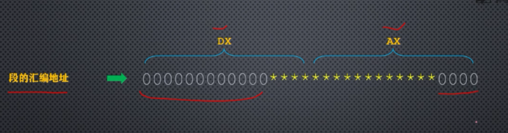
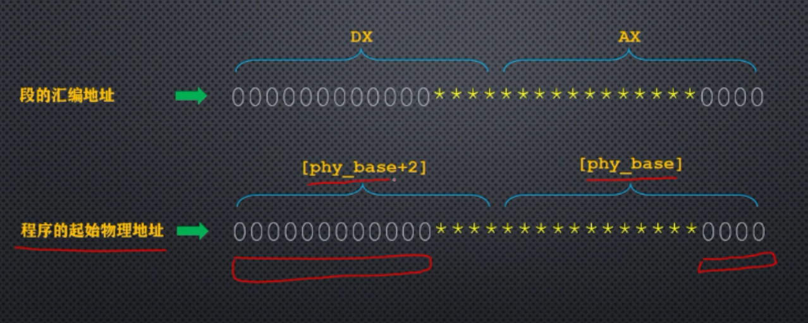
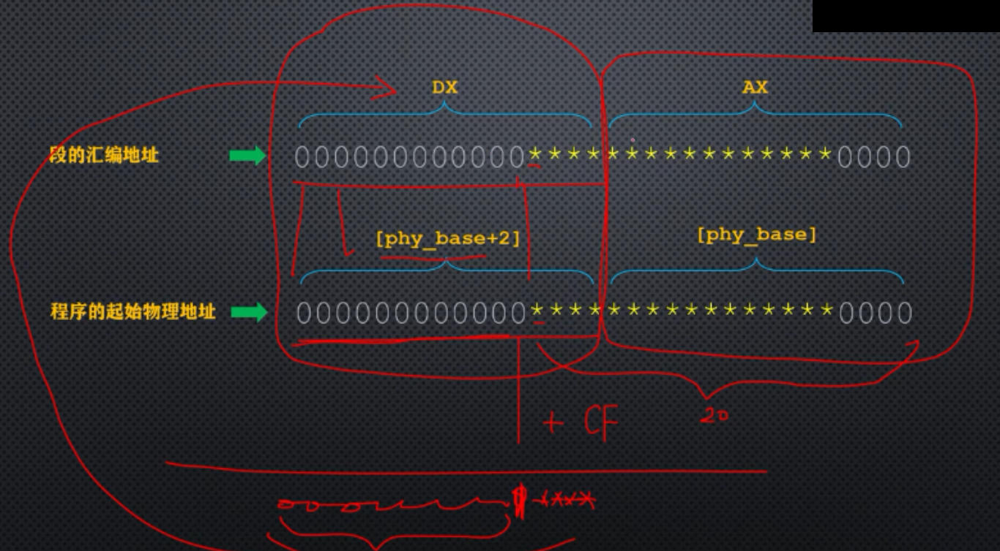
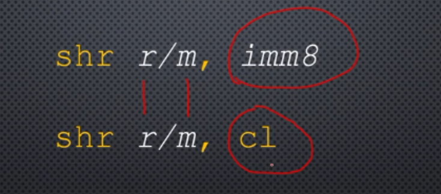
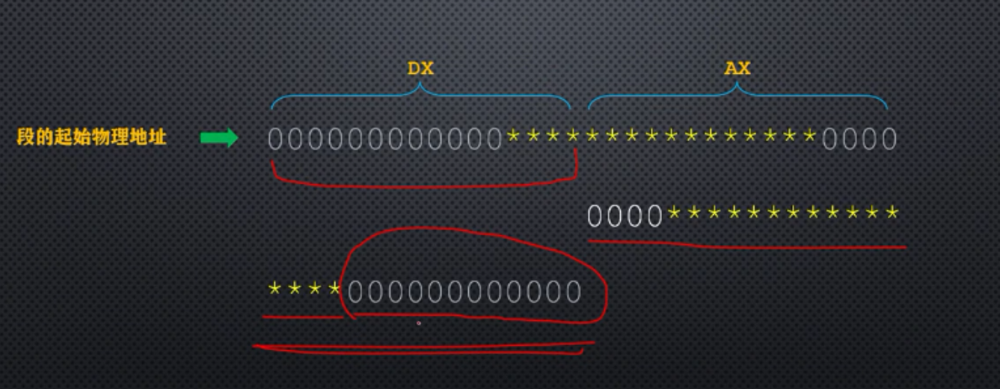
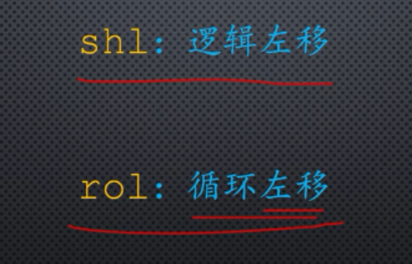

# 比特位的移动指令

### 这段中使用到了以下知识点

```
calc_segment_base:                       ;计算16位段地址
                                         ;输入：DX:AX=32位物理地址
                                         ;返回：AX=16位段基地址 
         push dx                          
         
         add ax,[cs:phy_base]
         adc dx,[cs:phy_base+0x02]
         shr ax,4
         ror dx,4
         and dx,0xf000
         or ax,dx
         
         pop dx
         
         ret

;-------------------------------------------------------------------------------
         phy_base dd 0x10000 ;伪指令dd开辟了一个32位空间(双字)存放这个地址0x10000(20位)             ;用户程序被加载的物理起始地址
```








## 位右移



## 循环右移指令






