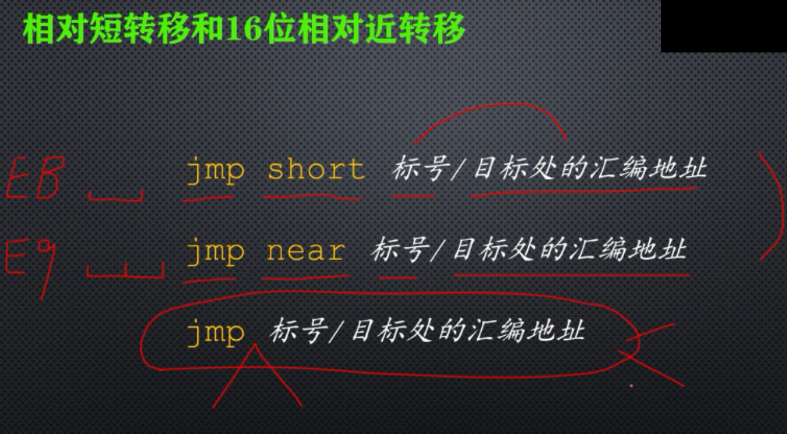
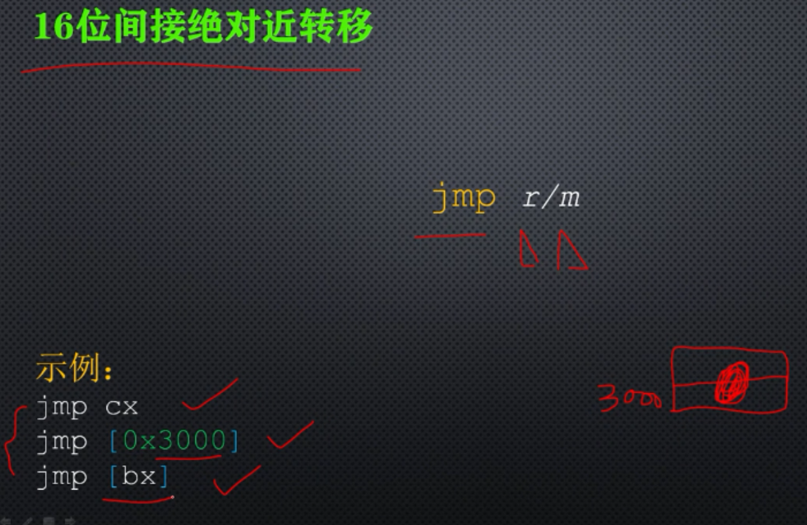
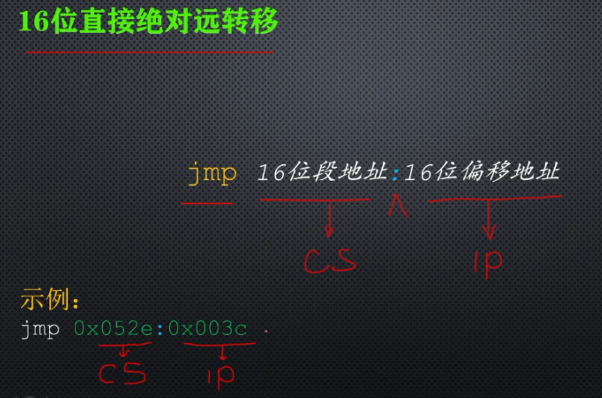
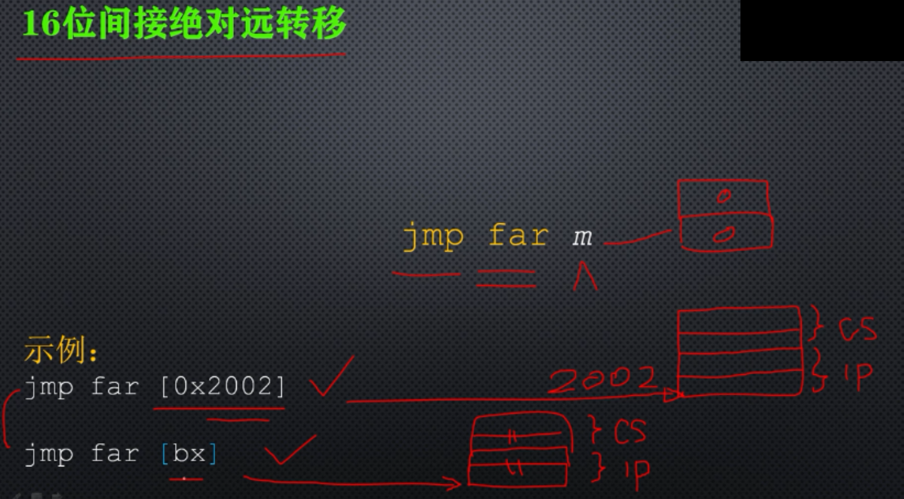

# 无条件转移指令

## 1、相对短转移和16位相对近转移

jmp short 标号/目标处的汇编地址 操作码EB 后面跟1个字节的相对偏移量只能跳到，-128 - 127个字节的地方 **段内转移指令**。

jmp near 表号/目标处的汇编地址 操作码E9 后面跟2个字节的相对偏移量只能跳到，-32768 - 32767个字节的地方 **段内转移指令**。

**以上指令执行时，是指令指针寄存器IP的值加上指令中的相对偏移量来得到目标位置的偏移地址，来修改IP，从而转移到目标位置处执行。**

jmp 标号/目标处的汇编地址 这个指令，编译器会根据目标位置的远近，来决定是编译成段转移还是近转移。

## 2、16位间接绝对近转移

jmp cx ;目标位置的偏移地址，存放在cx中，直接把cx的内容替换IP的内容即可，从而转移到目标位置处执行。

jmp [0x3000] 目标位置的偏移地址存放在内存里，需要访问内存取得，在当前数据段相对地址为3000的地方，存放了一个字(2个字节)，这个字的内容就是目标位置的偏移地址。最后是通过逻辑地址计算出物理地址，取得一个字，替换IP的内容，从而转移到目标位置处执行。

jmp [bx] 基质寻址方式，目标位置的偏移地址，存放在内存里，

通过访问内存取得，在当前数据段内，以bx的内容为偏移地址的地方，放了一个字，这个字就是目标位置的偏移地址，因此当这条指令执行时，通过bx的内容，和ds寄存器中的段地址，计算出逻辑地址，取得目标位置的偏移地址，替换IP的 内容，从而转移到目标位置处执行。

**只要指令中存在[xx]则表示无论xx为内存地址还是寄存器，都会去xx取内容，当做段内偏移地址，和段地址组成逻辑地址，计算出物理地址，去物理地址中去取值，然后进行后续操作**

## 3、16位直接绝对远转移

## 4、16位间接绝对远转移

