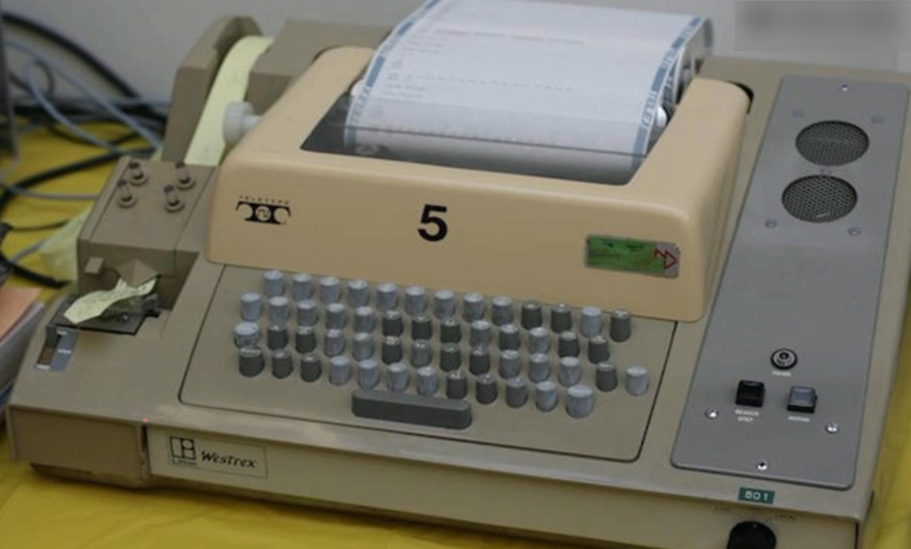
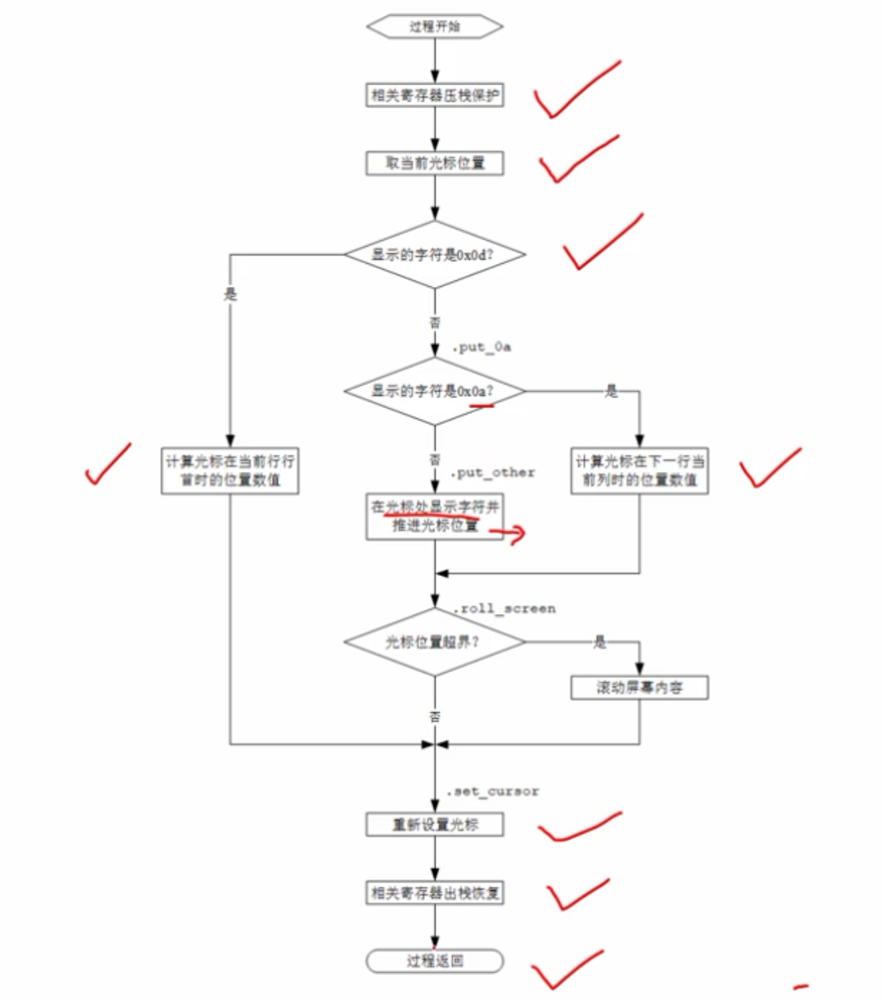

# 文本显示回车换行与光标控制

机械打字机：

电传打字机：

通过电传打字机向大型主机传送命令，或者自动将主机发送的字符打印出来，电传打印机工作时，也需要一些动作，比如响铃，还有换页(换一张纸)电传打印机安装的是一个整体的纸，一卷纸，当接到换页符时，就换页，连续走纸，走一页纸，还有回车换行。

CL/LF 即回车又换行。

回车：是指将光标移动到当前行的行首。

换行：是将光标移动到下一行的当前位置(下一行的当前列)。

在ascii字符集中，控制终端回车的字符是0x0d。

换行分配的编码是0x0a。

随着技术发展很多控制字符已经不用了，但是有一些会保留，比如回车符和换行符，但是控制字符起作用的方式也不一样了。

## 光标

光标保存在显卡的两个光标寄存器中，每个寄存器是8位的，合起来是16位数值，这个数值决定了光标在屏幕上的位置，光标寄存器是可读可写的，可以从寄存器中读出光标的位置，可以设置光标的位置，显卡只是显示这个光标，其他事情不管，具体在那个位置，需要自己设置。

设置回车换行的流程图：

