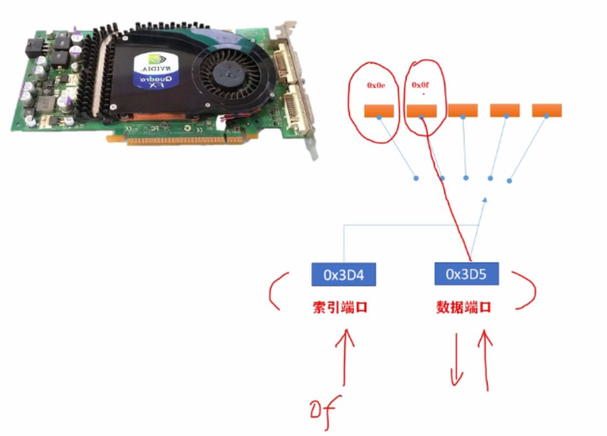
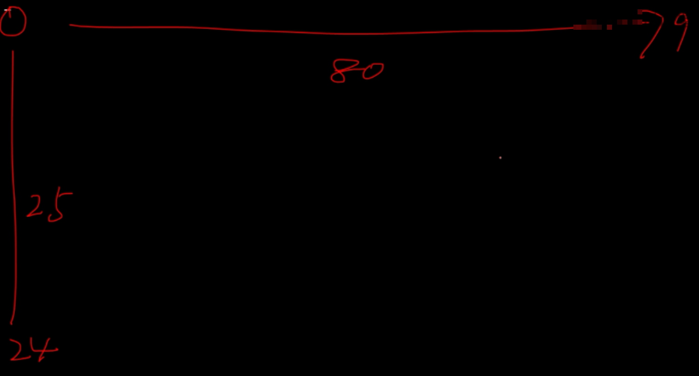
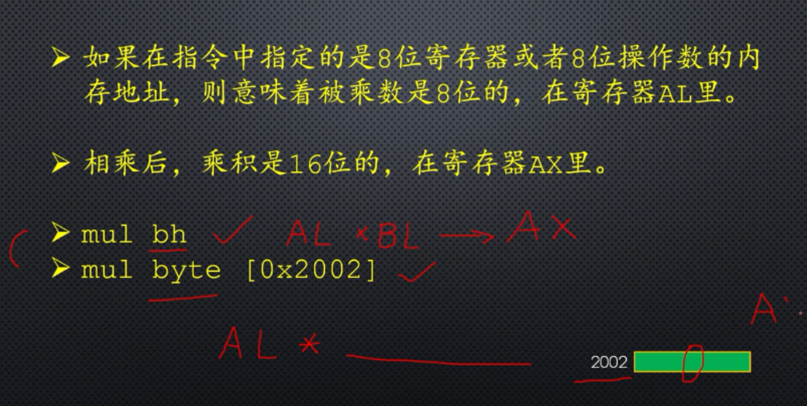
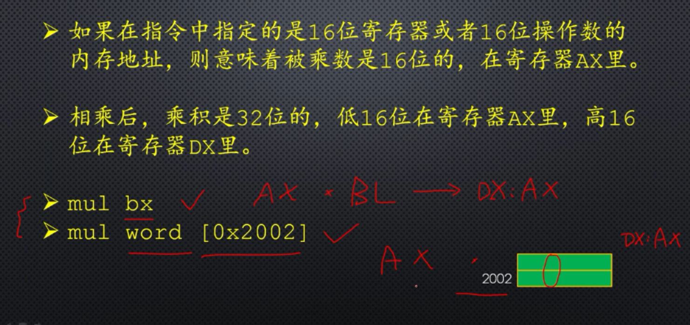
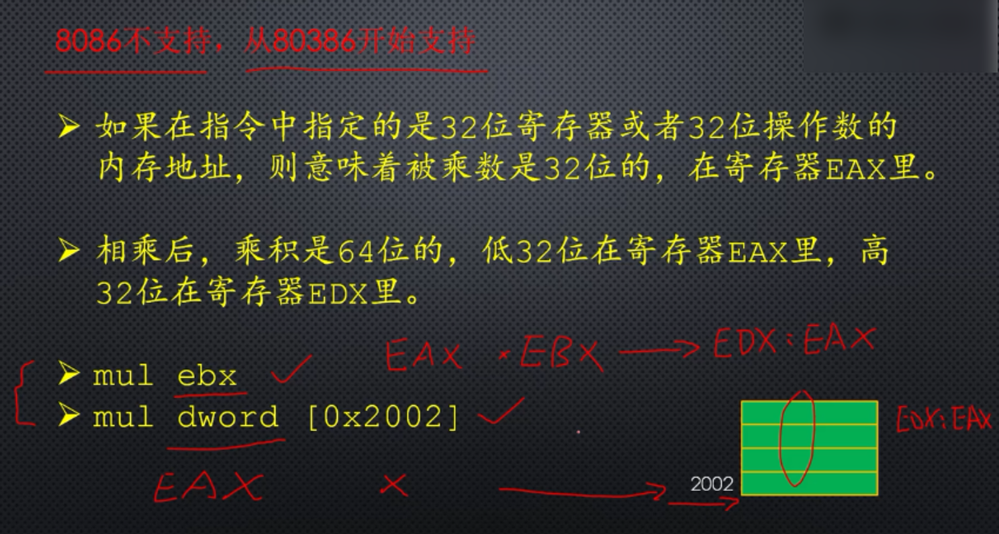
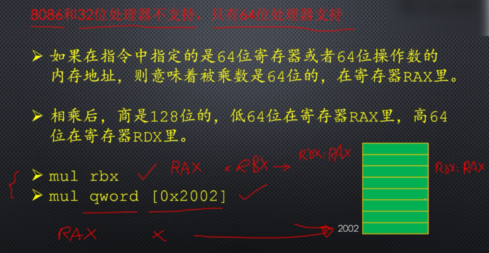

# 光标处理和乘法指令

显卡操作非常复杂，内部的寄存器多，为了不过多的占用主机的端口号空间，很多寄存器只能通过索引寄存器和数据寄存器间接访问，索引寄存器和数据寄存器是显卡暴露给外部的两个端口，又被称为索引端口和数据端口，端口号分别为0x3d4与0x3d5。

显卡的内部的寄存器都有一个编号，比如两个光标寄存器的的索引值就是0x0e与0x0f，分别提供光标位置的高8位与低8位。

索引端口用来选择显卡内部的寄存器，向他提供一个寄存器的编号，显卡就会将数据端口和提供的寄存器接通，来读写数据。

在标准VGA文本模式下，每屏幕有25行，每行80列，80个字符。

## mul

无符号数的乘法指令。

# 有符号整数乘法

