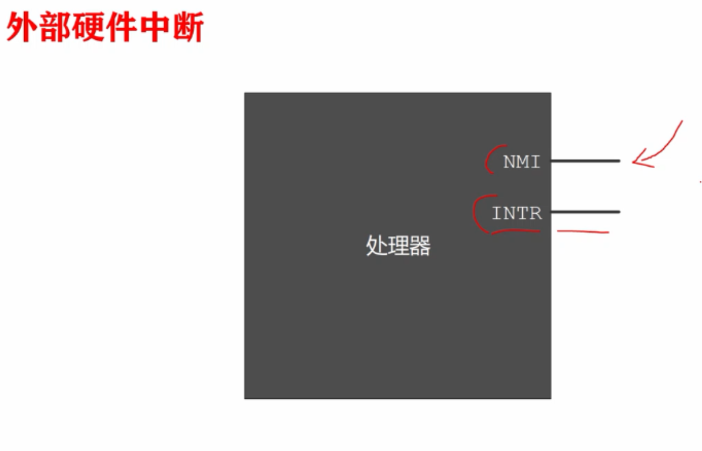

# 中断和动态时钟显示

什么是中断？

程序的运行，通常是按照指令的出现和编排的顺序进行的，但是我们的生活并不是这样平铺直序的，处理器执行指令时也不是像一条线一样从头到尾，他随时会因为别的事件，导致当前执行流程的中断，中断就是**打断处理器当前的执行流程**，去执行另外一些和当前工作不相关的指令，执行完了之后，还可以返回原来的程序流程继续执行。好比你正在用手机听歌，突然来电话了，你就要中断歌曲的播放，来处理接电话这件更为重要的事情，当电话接完之后，你可以继续听歌。与此类似，当处理器正在执行一个程序时，也会被别的事件打断，此时处理器必须离开当前程序的执行流程，转到另一个地方，执行另一段指令(代码)，执行 完之后，再返回原来的地方接着执行。自从中断这种工作机制产生之后，它就是各种处理器必须具备的机制。

中断是怎么发生的？

处理器是怎么处理中断的？

在这个过程中，我们能做些什么？

下面会讲到。

## 中断

中断是一个信号，用来**引起处理器的注意**，中断信号的一个重要来源是外部设备，即外部硬件中断，从处理器外面来的中断信号，当外部设备发生错误，或者处理器交给外部设备的事情，外部设备已经干完了，比如说打印机已经打印完成，这时候它们会拍一下处理器的“肩膀”，告诉处理器应当把手头上的事情放一放，来临时处理一下。

外部硬件中断是通过两个信号线引入处理器内部的，一个是NMI一个是INTR，从很早时，这两根线就被叫做这个名称。

来自外部设备的中断很多，也不是每一个中断都是必须处理的，有些中断在任何时候，都必须处理，因为事关整个系统的安全性，比如在使用不间断电源的系统中，当电池电量很低的时候，不间断电源系统会发出一个中断，通知处理器块掉电了，快保存东西。或者内存访问电路，发现了一个校验错误，这意味着从内存中读取的数据，一定是错误的，处理器再努力工作也是没有意义的，在所有上面的情况下，处理器必须针对中断，采取必要的措施，隐瞒真相，必然对用户造成不可挽回的损失，除此之外，更多的中断是可以被忽略或者延迟处理的，早一会儿，晚一会儿，不要紧，为了明确区分不同性质的中断，所以处理器的设计者，设计了两个引脚，所有**严重事件，必须无条件的加以处理**，这种类型的中断不会被阻断或者屏蔽的，叫做非屏蔽中断(NMI)，非屏蔽中断需要通过引脚NMI输入，中断信号的来源或者产生中断的设备称为中断源，非屏蔽中断的中断源很少，大多都是可以被屏蔽的，通过INTR引脚输入，可以根据需要是否允许，它发送中断给处理器。

