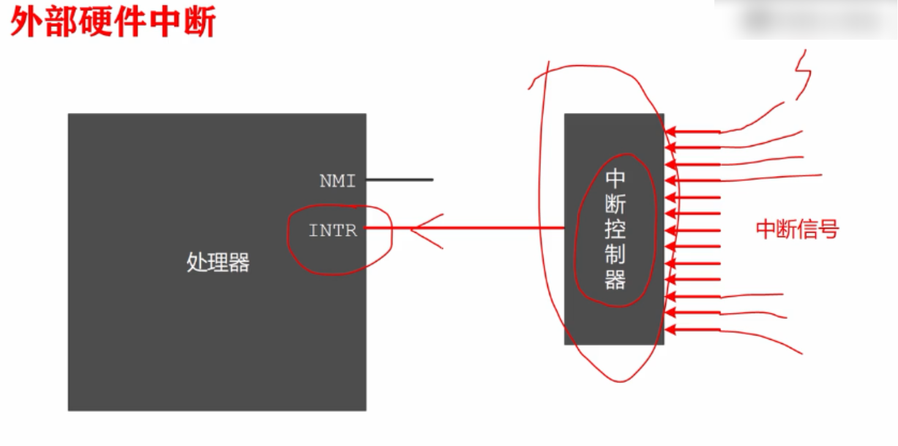
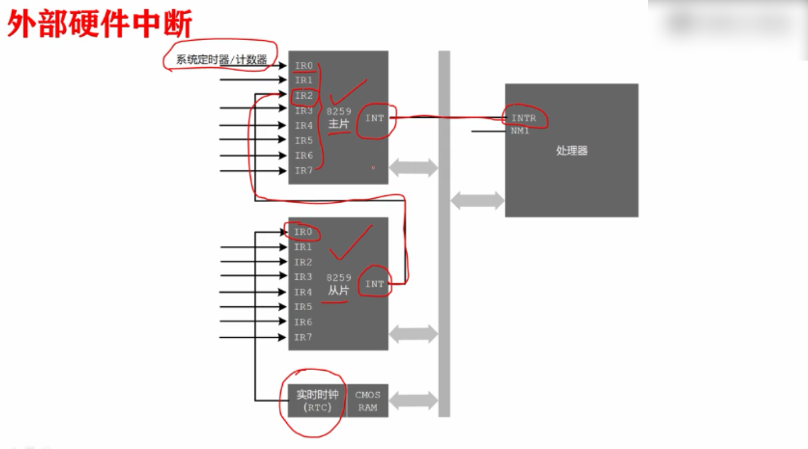
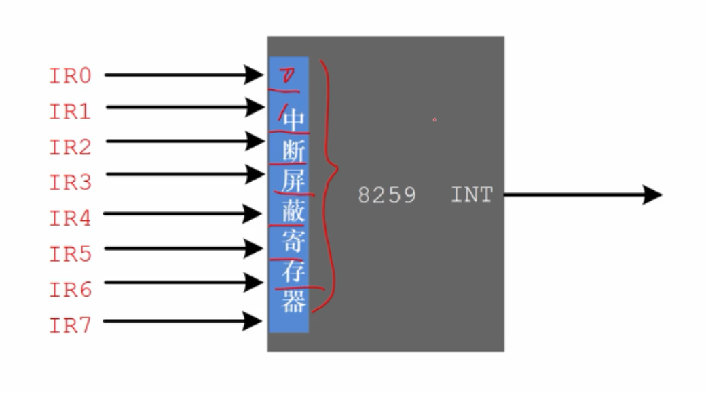
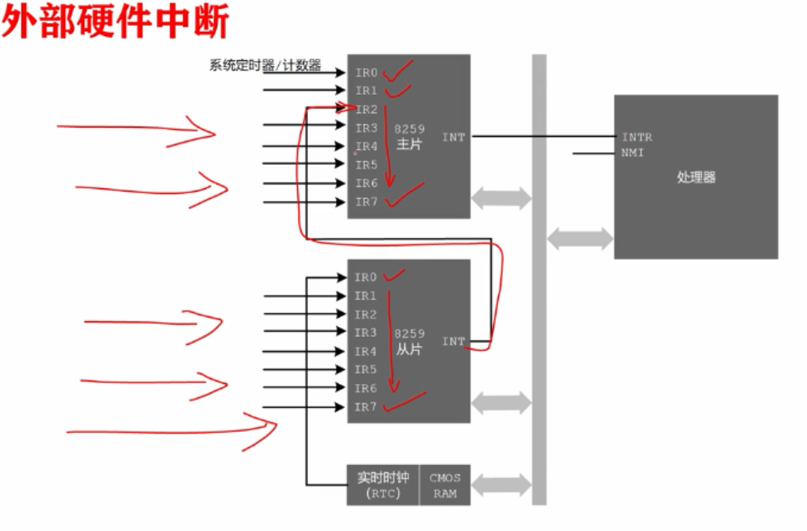

# 什么是中断控制器并介绍8259A中断控制器芯片

可屏蔽中断是通过INTR引脚，进入处理器内部的，但是产生中断设备的很多，一个引脚不够用，因此我们用一个代理，来接受外部中断发出的信号，**这个代理实际上是一块芯片**，称之为**中断控制器**，如果单个设备发出中断信号，那么中断控制器就会输入到INTR，然后由INTR输入到处理器，而如果，多个设备同时发出中断，那么就需要中断控制器进行仲裁，决定哪一个，优先向处理器提出服务请求。

在个人计算机中，用的最多的中断控制器是8259A芯片，如今在绝大多数单处理器的计算机中，他也提供这种服务，。

因特尔处理器允许256个中断，8259A芯片负责提供其中15个，该中断控制器芯片有自己的端口号，就像访问其他外部设备一样，用in/out指令，来设置工作状态，比如设置某些中断信号的优先级，甚至屏蔽某些信号，因为可以通过编程来设置芯片的状态，因此又被称为可编程中断控制器。

每片8259A只有8个中断输入引脚，从IR0到IR7，在个人计算机上使用8259A需要两块。

两片8259A的连接结构：

IR0 - IR7中共有8个比特，如果值为0则表示可以传送到处理器，而值为1，则表示会被阻断。

外部来的中断能否被处理，除了看8259A中的中断屏蔽寄存器之外，最终的决定权在处理器手中。

在标志寄存器中，位9是中断标志IF，当这一位是0时，所有从INTR引脚来的中断信号都会被忽略， 当值为1时，可以接受和响应中断，IF中断标志可以通过cli和sti来改变，使用方法及结果：

cli，会把IF置为0

sti，会把IF置为1

在计算机内部中断发生的 非常频繁，当一个中断正在处理时，其他中断也会陆续到来，甚至有多个中断同时发生的情况，这些都是无法预料的，这是有办法解决的，8259A会记住它们，并用一定策略，来决定优先为谁服务，整体上来说，中断的优先级和中断控制器的引脚相关，主片的 IR0引脚优先级最高，然后使IR1引脚，依次降低，IR7引脚的优先级最低，从片也是如此，先处理优先级高的中断信号，然后处理优先级低的中断信号，因为从片是级联在主片的IR2引脚上，这意味着从片按照优先级规则选出一个中断信号之后，还要送到主片，参与主片优先级仲裁，最后当一个中断事件正在处理时，如果来了一个优先级更高的中断事件时，允许暂时终止当前的中断处理，先为优先级较高的中断事件服务，这称为是中断嵌套。

