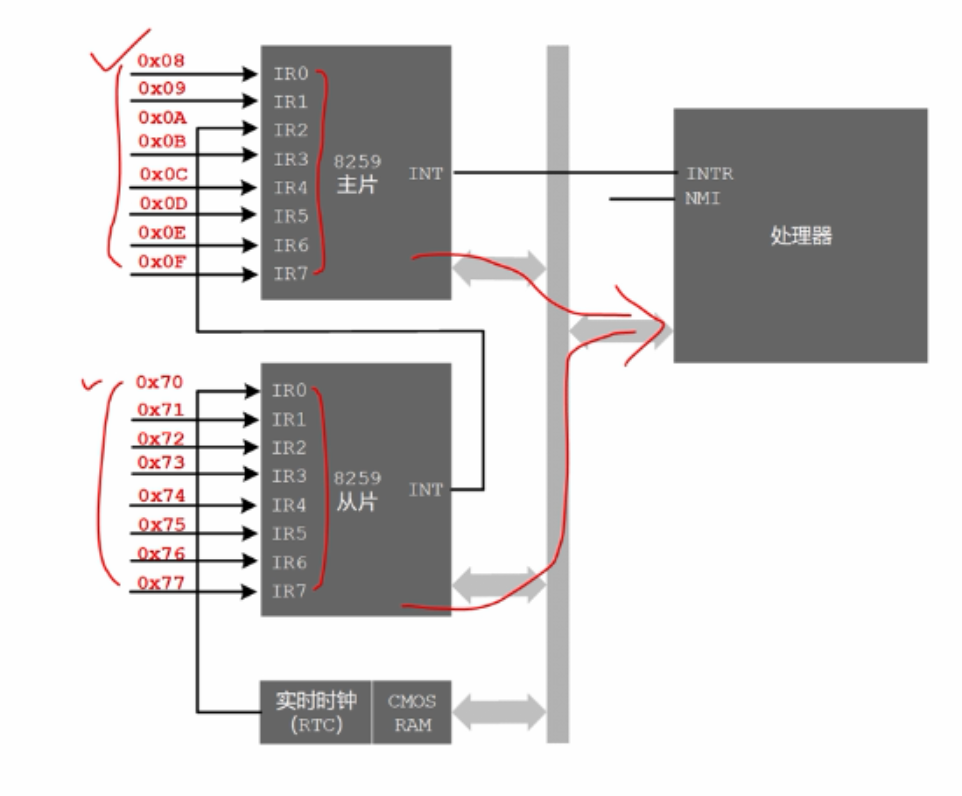
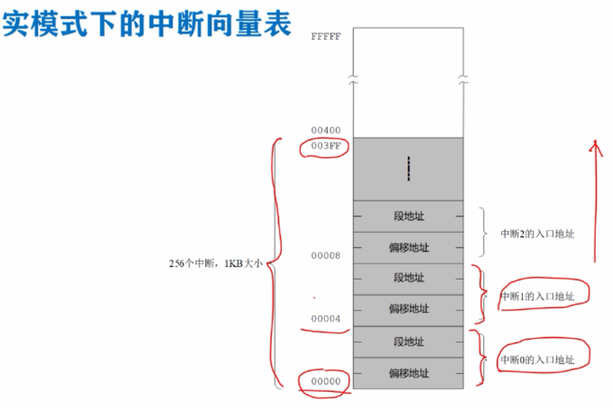
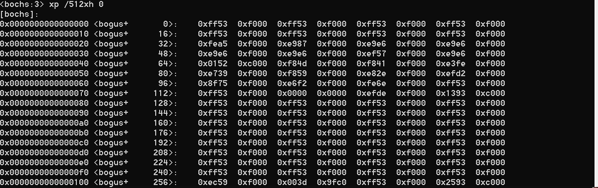

# 中断号，中断处理过程，实模式下的中断向量表

## 中断号

​	当中断发生时，如果中断没有被8259A屏蔽，而且按照优先级规则他能够被选中，则这个中断信号，就会被发往处理器，发到处理器的INTR引脚，在处理器 内部如果标志寄存器的标志位IF是1，允许中断，那么处理器在执行完当前的指令之后，会立即着手为硬件服务，处理这个中断，首先会响应中断，并告诉8259A芯片，准备着手处理这个中断，中断处理就是处理器要执行一段与该中断有关的程序(指令)。

​	为了区分不同的中断信号，每个中断都有一个编号，一个数字编号，叫做中断号，8259A芯片的每个中断输入引脚，都有一个中断号，这些中断号是可以改变的，可以对8259A编程来灵活设置，但是不能单独进行，只能以芯片为单位进行设置。

​	比如在计算机启动之后，基本输入输出系统BIOS会将主片的中断号，设置成从0x08开始，依次增加到0x0f，从片的中断号设置成从0x70开始，依次增加到0x77。

​	当处理器接收到8259A发来的中断请求信号时，如果它准备相应这个中断请求，则要求8259A芯片把中断号送过来，中断号来自哪个引脚，中断号是多少，8259A会将对应的中断号，通过数据总线发往处理器。



## 中断处理过程

对中断信号的处理，是通过执行一段代码来完成的，设备发出中断的原因无外乎设备的状态发生了改变，或者是有数据要传送，因此我们可以事先编写代码来解决，这些问题，这段代码叫做中断处理程序/中断处理过程，在实模式下，一旦处理器知道了中断号，他就用中断号访问中断向量表，从中取出中断处理程序的逻辑段地址与偏移地址，转到哪里去执行，去处理设备的事情，去处理中断。


## 中断向量表

处理器可以识别256个中断，理论上就需要256段程序， 在实模式下，处理器要求将它们的入口点，集中存放到内存中，从物理地址0开始，一直到0x003fff结束的，这段空间之内，这段空间共1024个字节，1kb大小，被称为IVT(中断向量表)：



假如知道是第几个中断？(中断号？)，用这个数字乘以4，就是存放该中断处理过程的偏移地址和段地址的物理内存地址，即这个物理地址处存放着处理过程的 偏移地址和段地址。

这个表是由输入输出系统BIOS在开机时创建的，供处理器使用。

很多中断发生时可以使用相同的方式处理，因此可以共用同一个中断处理程序，中断向量表中有一些中断处理程序的地址是相同的。

中断向量表：

```
b 0x7c00
c
xp /512xh 0
```



中断发生时，处理器如何转到中断处理程序，并最后返回？

1.保护断点的现场

将标志寄存器flags压栈

将代码段寄存器CS压栈

将指令指针寄存器IP压栈

以便将来返回

2.执行中断处理程序

由于处理器拿到了中断号，它将处理器乘以4，从中断向量表中取得中断处理程序的段地址和偏移地址，并分别传送到CS和IP，处理器就开始执行中断处理程序了。

3.在遇到iret指令时，返回到断点接着执行。

所有中断处理程序的最后一条指令必须是中断返回指令iret，在执行iret指令时，将导致处理器，依次从栈中弹出，恢复IP、CS、flags寄存器的原始内容，转到主程序接着执行。


