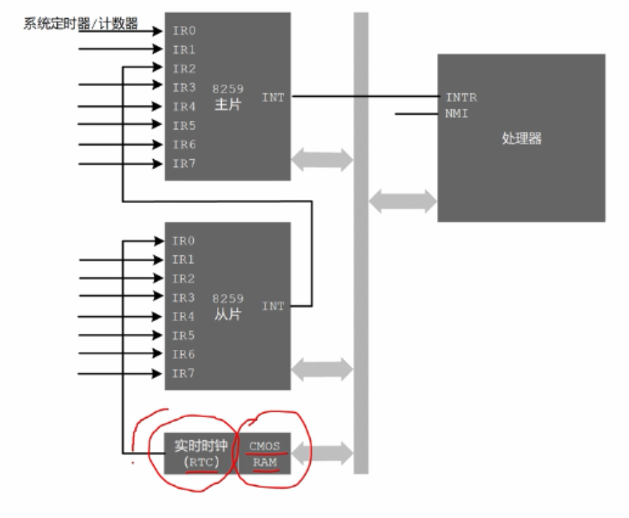
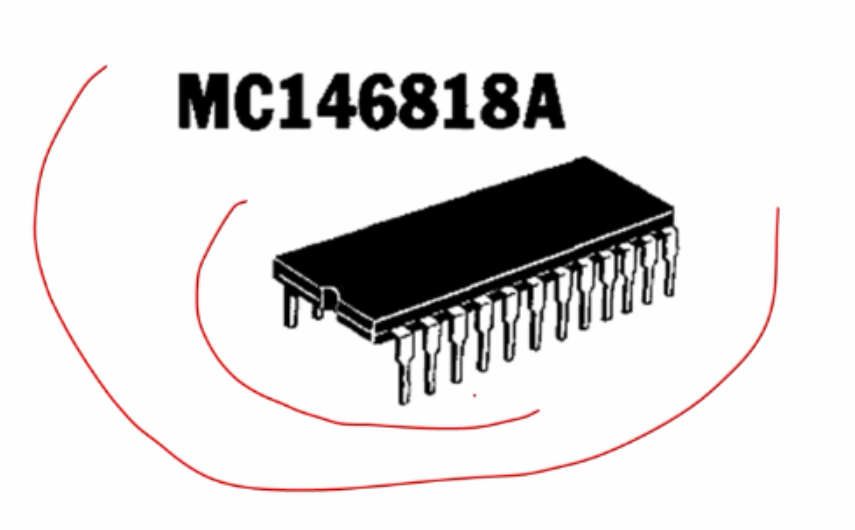
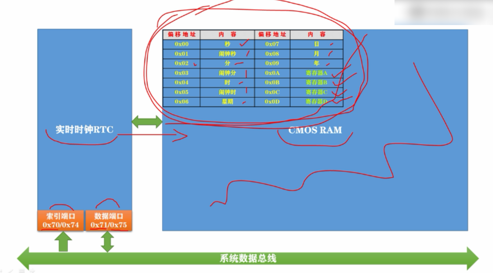
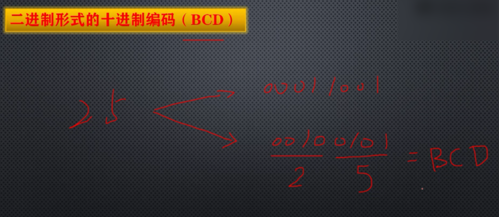

# 认识实时时钟CMOS RAM、日期和时间的存储以及BCD编码

在计算机内部有一个实时时钟RTC(Real Time Clock: RTC)，他用来提供日期和时间，是全天候跳动的，即使是在你关闭了计算机的电源之后，原因是它是由主板上一个小电池提供能量，他为整台计算机提供一个基准时间，为所有需要时间的 硬件和软件提供服务，实时时钟电路负责计时，而时间和日期的数值存储在另一块芯片中，这块芯片是一块静态存储器，由非易失性BIOS存储器或互补对称金属氧化物半导体制成，被称为CMOS RAM。

早期计算机没有大规模集成电路，RTC芯片是独立存在于计算机主板上的，典型的RTC芯片是MC146818A，这块芯片集成了实时时钟、日历、闹钟、和存储功能，可以存储日期和时间，并提供周期性的中断信号，这块芯片里面集成了RTC和COMS RAM，

随着数的进步和大规模集成电路的出现，现在RTC和COMS RAM 直接成在输入输出控制器ICH内 ，也就是南桥芯片内部。

RTC芯片由一个震荡频率为32.768千周的石英晶体振荡器驱动，经过分频之后，用于对COM进行每秒一次的时间刷新，除了日期和时间的保存功能之外，RTC芯片也可以提供闹钟和周期性的中断功能。

COMS RAM容量在64 - 256个字节之间，不同计算机之间不同，日期和时间信息只占了一小部分容量，剩余的容量用来保存时间信息，比如硬件的类型，工作参数，开机密码，辅助存储设备的启动顺序等。

如图所示，常规的时间和日期信息，占了COMS RAM的前10个字节，有年月日时分秒以及闹钟的时分秒，这个闹钟和平时的闹钟是一个意思可以定时，这些数据的宽度都是一个字节，可以根据他们在COMS RAM里面的位置/偏移地址来访问，

CMOS RAM中的日期和时间以BCD编码存储，即二进制形式的十进制编码。

例如：

使用低四位和高四位分别表示0-9

25 => 二进制形式是 0001 1001

25 => BCD编码形式是 0010 0101

