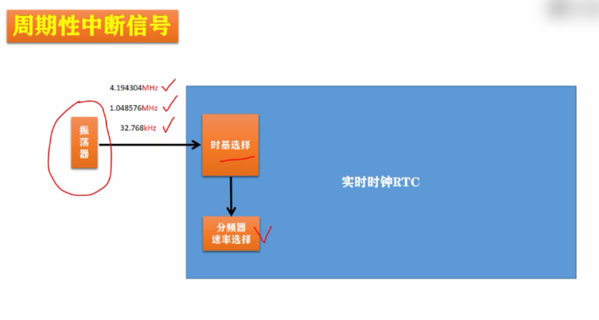
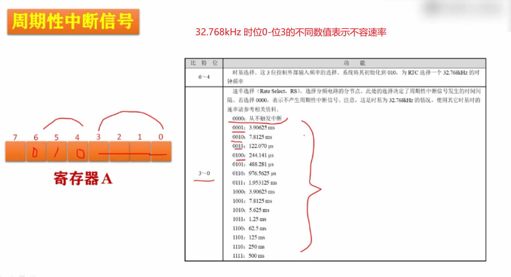
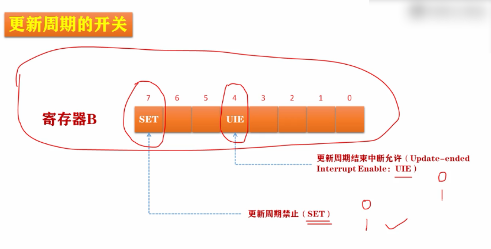
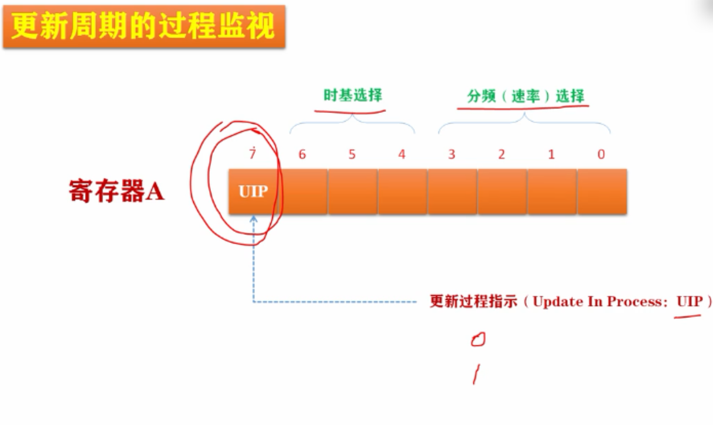

# 实时时钟芯片RTC中断信号有哪些

可以产生共**三种**中断信号：

## 周期性中断信号 (Periodic Interrupt: PF)

这种中断发生的速度**可以调节**，最慢可以500ms发生一次，最快30.517微秒发生一次。

如何修改？

CMOS RAM里面有4个寄存器ABCD，时基选择和速率选择主要靠寄存器A，寄存器A控制时基选择和周期性中断发生的速率。其中位4-位6是时基选择，控制外部输入频率的选择。在计算机加电启动之后，BIOS将其初始化到010，为RTC选择一个32.768kHz的时钟频率。

位0-位3是速率选择，选择分频电路的分节点，这个选择决定了，周期性中断信号，发生的时间间隔，若选择0000表示不产生中断信号，从不触发中断。

如果采用了其他时基，就要参考其他资料，摩托罗拉，MC146818的资料。

周期性中断是否允许发生，是由寄存器的位6控制，即周期性中断允许位(Periodic Interupt Enable: PIE)，如果这一位是0，表示不允许周期性中断发生，如果是1，表示允许发生周期性中断信号，如果寄存器A的位0-位3是0000时，寄存器B的PIE位被自动置0。

## 更新周期结束中断 (Update-ended Interrupt:UI)

每隔1s，实时时钟电路，将更新CMOS RAM里面的时间和日期，更新操作包括很多步骤，主要是读取和增加时间，检查数据是否因超出范围而溢出(比如31号之后是下月1号而不是32号)，还要检查是否到了闹钟时间，设置相关寄存器的状态，最后更新之后的数据还要写会原来的位置，这些步骤和这个过程叫更新周期，在每个更新周期结束时，如果允许的话，实时时钟电路可以发出一个中断信号，表示本次更新周期已经结束 - 更新周期结束中断。

更新周期时候会进行，是由寄存器B的最高位，位7来控制的，叫做SET，如果值为0，表示会正常更新，如果值为1，表示终止当前更新周期，并且此后不在产生更新周期。

**要想安全的初始化日历和时间，应当先将此位置1。**

更新中断是否会产生，取决于位4，叫做更新周期结束中断允许(Update-ended Interrupt Enable:UIE)。

更新周期是否开始是由寄存器A的最高位位7，来指示的，叫做(Update In Process:UIP)。

这一位可以作为一个状态，来进行监视，这一位是只读的，对寄存器A 的写入不会改变此位的状态，这一位是0，意味着，更新周期至少在488微秒内不会启动，即此时访问CMOS RAM中的日历和时间信息是安全的，如果这一位是1，意味着正处于更新周期，或者更新周期马上就要启动。

如果寄存器B的SET位是0，在分频电路已经正确配置的情况下，更新周期每秒发生一次，更新周期至少会在UIP位置1之后的488微秒内开始，而且整个周期的完成时间不会多于1984微秒。

在更新正在进行的时候，和日期、时间有关的存储单元，这10个存储单元会暂时和系统数据总线脱离，这是为了防止因外部访问而导致的冲突和数据破坏，因此要安全的访问这一部分日期和时间，需要避开更新周期。

有两个可以选择是时机：

1.当检测到，更新结束中断发生时，差不多有999毫秒的时间，用于读写有效的日期和时间数据。

2.如果检测到寄存器A的UIP为是0，意味着在更新周期开始之前，至少还有488微秒的时间。

## 闹钟中断 (Alarm Interrupt:AI)

当实时时钟到达指定的闹点时，如果允许的话将产生闹钟中断信号。

闹钟中断是否会产生，是由寄存器B的位5控制的，称为AIE，被称为闹钟中断允许(Alarm Interrupt Enable:UIE)，如果这一位是0，意味着不产生中断，如果是1，表示允许产生闹钟中断信号。

有三个中断信号，但是只有一个中断信号线，和一个中断号，0x70，当中断发生时，如何判断发生的是哪一种中断呢？

可以通过读寄存器C来进行判断，中断是否发生以及发生的是什么中断。

寄存器C的各个数位的作用：

位7：0 没有中断发生 1有中断发生

位6：周期性中断标志，0 不是周期性中断 1发生了周期性中断

位5：闹钟标志，0 不是闹钟中断 1发生了闹钟中断

位4：更新结束标志，0 不是更新周期结束中断 1发生了更新周期结束中断

对寄存器C的读操作将导致位7清0。

对寄存器C的读操作将导致位6清0。

对寄存器C的读操作将导致位5清0。

对寄存器C的读操作将导致位4清0。

位0到位3是保留位，始终是0。

寄存器C是只读的，不能写入，对读操作敏感，读操作将导致所有比特清0。

