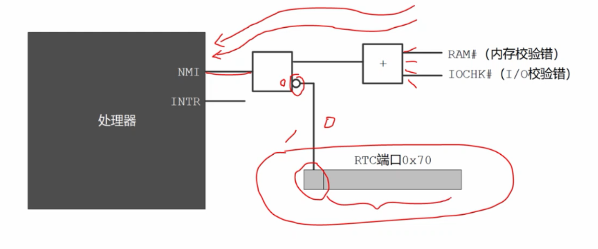
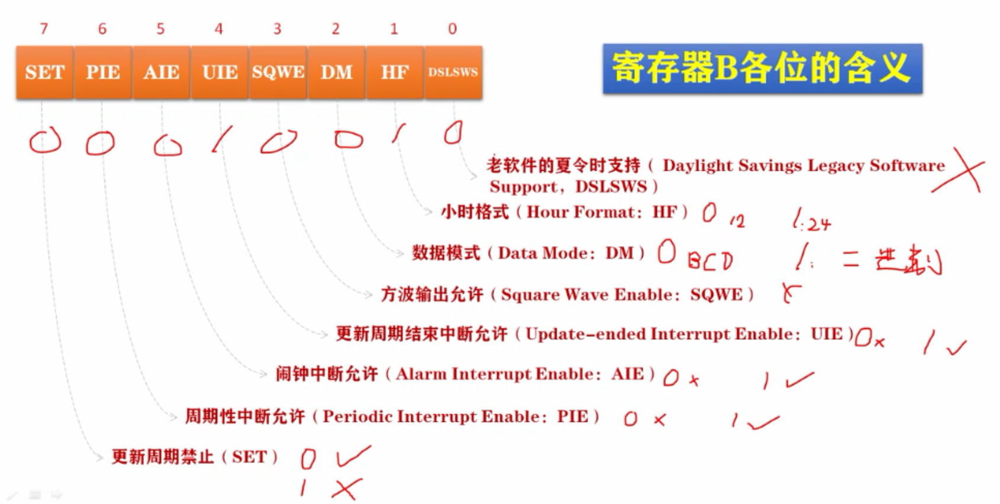
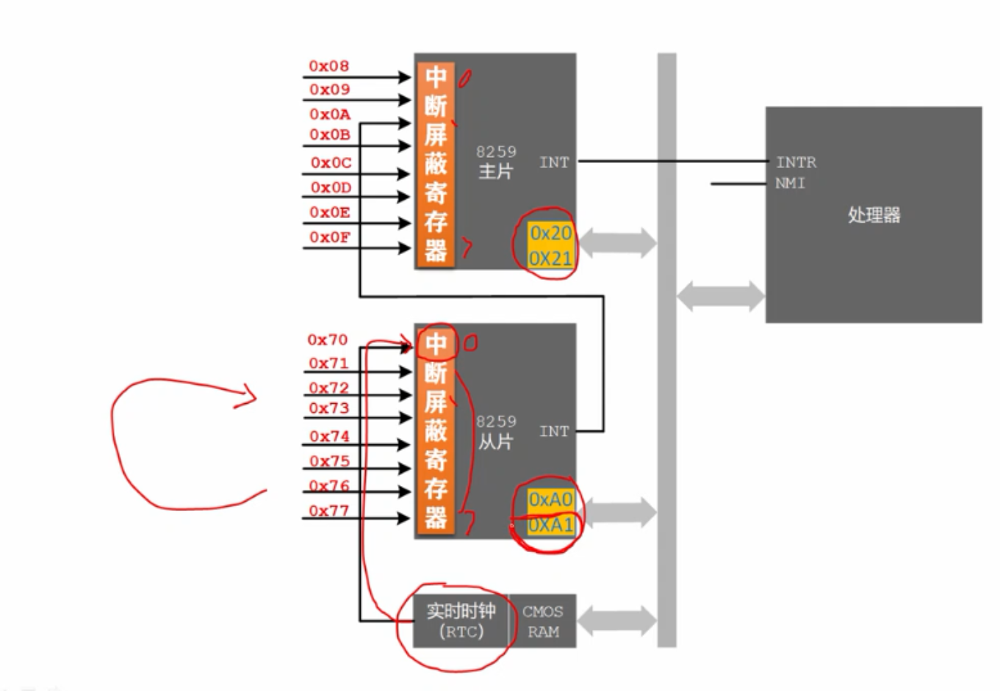

# 启用更新周期结束中断

## 如何设置RTC和8259A芯片以启用更新周期结束中断

**由于历史原因，端口0x70的最高位，位7是控制非屏蔽信号的开关。**

位7经反向之后，通过与门链接到处理器的NMI引脚，与门的另外一个引脚通过一个或门，集中了很多非屏蔽中断信号。

当位7是0的时候，经反向是1，这时候根据与门的规则，允许另一边的非屏蔽中断信号进入处理器。

相反如果位7是1的话，经反向是0，这时候根据与门的规则，禁止另一边的非屏蔽中断信号进入处理器，等于阻断了所有NMI信号。

**RTC端口的位0-位6，是用于指定CMOS RAM单元的索引号。**




在访问RTC期间最好阻断NMI中断信号。



```
mov al,0x12 ;00010010                 ;设置寄存器B，禁止周期性中断，开放更 
out 0x71,al ;将数据写入指定索引处
```

每次当中断实际发生时，寄存器C中的相应位置位，在程序中或者在中断处理过程中，读寄存器C的内容，查中断的原因，比如每当更新周期结束中断发生时，RTC就将它的位4置1，该寄存器还有一个特点，每次读取它之后所有位置自动清0，**如果不读取它的话，相应的位没有清0，同样的中断将不再产生**。

打通RTC到8259A的最后一道屏障，正常情况下，8259A芯片是不会允许RTC中断的，需要修改它内部的中断屏蔽寄存器IMR(8位寄存器)，主片、从片各有一个。

中断屏蔽寄存器的每一位对应着一个中断输入引脚。

对于中断屏蔽寄存器来说，0代表允许中断，1代表关掉中断，RTC芯片的中断信号对应着，从片中断屏蔽寄存器的位0，为了允许RTC中断，需要将从片中断屏蔽寄存器的位0，清0，由于我们不知道其他位的状态，不能擅自改变，需要先读出这个寄存器的内容，将他的位0，清0之后再写入。

**主片有两个端口分别是0x20和0x21**。

**从片有两个端口分别是0xa0和0xa1。**

在8259A正常工作的情况下，读端口0xa1读的是从片的中断屏蔽寄存器，写端口0xa1写的也是从片的中断屏蔽寄存器，



```
         ;代码清单9-1
         ;文件名：c09_1.asm
         ;文件说明：用户程序 
         ;创建日期：2011-4-16 22:03
         
;===============================================================================
SECTION header vstart=0                     ;定义用户程序头部段 
    program_length  dd program_end          ;程序总长度[0x00]
    
    ;用户程序入口点
    code_entry      dw start                ;偏移地址[0x04]
                    dd section.code.start   ;段地址[0x06] 
    
    realloc_tbl_len dw (header_end-realloc_begin)/4
                                            ;段重定位表项个数[0x0a]
    
    realloc_begin:
    ;段重定位表           
    code_segment    dd section.code.start   ;[0x0c]
    data_segment    dd section.data.start   ;[0x14]
    stack_segment   dd section.stack.start  ;[0x1c]
    
header_end:                
    
;===============================================================================
SECTION code align=16 vstart=0           ;定义代码段（16字节对齐） 
new_int_0x70: ;新的中断处理过程 - 实时时钟中断处理过程
      push ax
      push bx
      push cx
      push dx
      push es
      
  .w0:                                    
      mov al,0x0a                        ;阻断NMI。当然，通常是不必要的
      or al,0x80                          
      out 0x70,al
      in al,0x71                         ;读寄存器A
      test al,0x80                       ;测试第7位UIP 
      jnz .w0                            ;以上代码对于更新周期结束中断来说 
                                         ;是不必要的 
      xor al,al
      or al,0x80
      out 0x70,al
      in al,0x71                         ;读RTC当前时间(秒)
      push ax

      mov al,2
      or al,0x80
      out 0x70,al
      in al,0x71                         ;读RTC当前时间(分)
      push ax

      mov al,4
      or al,0x80
      out 0x70,al
      in al,0x71                         ;读RTC当前时间(时)
      push ax

      mov al,0x0c                        ;寄存器C的索引。且开放NMI 
      out 0x70,al
      in al,0x71                         ;读一下RTC的寄存器C，否则只发生一次中断
                                         ;此处不考虑闹钟和周期性中断的情况 
      mov ax,0xb800
      mov es,ax

      pop ax
      call bcd_to_ascii
      mov bx,12*160 + 36*2               ;从屏幕上的12行36列开始显示

      mov [es:bx],ah
      mov [es:bx+2],al                   ;显示两位小时数字

      mov al,':'
      mov [es:bx+4],al                   ;显示分隔符':'
      not byte [es:bx+5]                 ;反转显示属性 

      pop ax
      call bcd_to_ascii
      mov [es:bx+6],ah
      mov [es:bx+8],al                   ;显示两位分钟数字

      mov al,':'
      mov [es:bx+10],al                  ;显示分隔符':'
      not byte [es:bx+11]                ;反转显示属性

      pop ax
      call bcd_to_ascii
      mov [es:bx+12],ah
      mov [es:bx+14],al                  ;显示两位小时数字
      
      mov al,0x20                        ;中断结束命令EOI 
      out 0xa0,al                        ;向从片发送 
      out 0x20,al                        ;向主片发送 

      pop es
      pop dx
      pop cx
      pop bx
      pop ax

      iret

;-------------------------------------------------------------------------------
bcd_to_ascii:                            ;BCD码转ASCII
                                         ;输入：AL=bcd码
                                         ;输出：AX=ascii
      mov ah,al                          ;分拆成两个数字 
      and al,0x0f                        ;仅保留低4位 
      add al,0x30                        ;转换成ASCII 

      shr ah,4                           ;逻辑右移4位 
      and ah,0x0f                        
      add ah,0x30

      ret

;-------------------------------------------------------------------------------
start: ;初始化栈段和数据段
      mov ax,[stack_segment] ;将栈段的，段基地址传送给ax
      ;**当处理器执行任何一条改变栈段寄存器ss的指令时，它会在下一条指令执行完期间禁止中断。**
      mov ss,ax ;将栈段的，段基地址传送给ss 处理器发现修改的是栈段寄存器ss，所以从现在开始-
      ;-一直到下一条指令mov sp,ss_pointer执行完成之前，处理器禁止任何中断，不会处理任何中断。
      mov sp,ss_pointer ;传送栈顶地址到sp
      mov ax,[data_segment] ;将数据段的，段基地址传送给ax
      mov ds,ax ;将数据段的，段基地址传送给ds
      
      ;打印提示信息
      mov bx,init_msg                    ;显示初始信息 
      call put_string

      mov bx,inst_msg                    ;显示安装信息 
      call put_string
      
      mov al,0x70 ;RTC实时时钟中断号
      mov bl,4 ;将中断号乘以4，乘积就是0x70号中断登记项的物理地址
      mul bl ;被乘数al和乘数bl相乘，结果在ax里                             ;计算0x70号中断在IVT中的偏移
      mov bx,ax ;因为后面会用到ax，所有将值存到bx中                          

      ;修改中断向量表时，要先用cli清中断，0x70号中断的入口信息，
      ;需要好几条指令才能修改完成，
      ;在此期间，如果入口地址刚改了一半，就发生了0x70号中断，
      ;这个时候就会转到错误的地方去执行，后果就严重了。
      ;所以我们必须先关中断，
      cli ;将标志寄存器的中断标志IF清0，以禁止处理器响应中断                                ;防止改动期间发生新的0x70号中断

      ;接下来访问中断向量表所在的段，然后修改0x70中断所对应的表项，
      push es
      mov ax,0x0000
      mov es,ax ;将es修改为中断向量表所在的段地址，这个段中所有物理地址就是段内偏移地址
      mov word [es:bx],new_int_0x70      ;偏移地址。
      ;将中断向量表中的实时时钟中断处理过程换成code:new_int_0x70处                                    
      mov word [es:bx+2],cs              ;段地址
      pop es

      ;设置RTC的工作状态，使之能够产生中断信号，给8259A中断控制器，
      ;RTC到8259A的中断现只有一根，而RTC可以产生多种中断，我们应该选择哪一种中断呢？
      ;我们决定选择更新周期结束中断，每当RTC更新了COMS RAM中的日期和时间信息之后，将发出此中断，更新周期每秒进行一次，所以该中断也是每秒发生一次。
      ;要进制或者允许实时时钟的中断信号，必须通过实时时钟的端口0x70访问CMOS RAM的寄存器B
      ;将RTC寄存器B的索引号0x0b传送到al
      mov al,0x0b                        ;RTC寄存器B
      ;结果会将al的最高位置1，其他位不变，或操作的结果返回到al
      or al,0x80 ;进行或操作 由于历史原因，端口0x70的最高位，位7是控制非屏蔽信号的开关。;阻断NMI 非屏蔽中断
      out 0x70,al ;指定索引，写端口0x70 等于访问寄存器B的同时，进制可屏蔽中断信号进入处理器
      mov al,0x12 ;00010010                       ;设置寄存器B，禁止周期性中断，开放更 
      out 0x71,al ;将数据写入指定索引处                       ;新结束后中断，BCD码，24小时制 

      mov al,0x0c ;RTC寄存器C的位置
      out 0x70,al ;设置索引 注意：在向索引端口0x70写入的同时，也打开了NMI，因为此时0x70最高位是0
      in al,0x71  ;读取索引位置的内容到al，使之产生中断信号；如果不读取它的话，相应的位没有清0，同样的中断将不再产生                       ;读RTC寄存器C，复位未决的中断状态
      ;RTC芯片设置完毕

      ;打通RTC到8259A的最后一道屏障，正常情况下，8259A芯片是不会允许RTC中断的，需要修改它内部的中断屏蔽寄存器IMR
      in al,0xa1 ;读端口0xa1，得到从片的中断屏蔽寄存器                         ;读8259从片的IMR寄存器 
      and al,0xfe ;11111110                       ;清除bit 0(此位连接RTC)
      out 0xa1,al                        ;写回此寄存器 

      sti ;将标志寄存器的中断标志IF置1，开放设备中断，从这时候开始，中断随时发生，也随时都会被处理                                ;重新开放中断 

      mov bx,done_msg                    ;显示安装完成信息 
      call put_string

      mov bx,tips_msg                    ;显示提示信息
      call put_string
      
      mov cx,0xb800
      mov ds,cx
      mov byte [12*160 + 33*2],'@'       ;屏幕第12行，35列
       
 .idle:
      hlt                                ;使CPU进入低功耗状态，直到用中断唤醒
      not byte [12*160 + 33*2+1]         ;反转显示属性 
      jmp .idle

;-------------------------------------------------------------------------------
put_string:                              ;显示串(0结尾)。
                                         ;输入：DS:BX=串地址
         mov cl,[bx]
         or cl,cl                        ;cl=0 ?
         jz .exit                        ;是的，返回主程序 
         call put_char
         inc bx                          ;下一个字符 
         jmp put_string

   .exit:
         ret

;-------------------------------------------------------------------------------
put_char:                                ;显示一个字符
                                         ;输入：cl=字符ascii
         push ax
         push bx
         push cx
         push dx
         push ds
         push es

         ;以下取当前光标位置
         mov dx,0x3d4
         mov al,0x0e
         out dx,al
         mov dx,0x3d5
         in al,dx                        ;高8位 
         mov ah,al

         mov dx,0x3d4
         mov al,0x0f
         out dx,al
         mov dx,0x3d5
         in al,dx                        ;低8位 
         mov bx,ax                       ;BX=代表光标位置的16位数

         cmp cl,0x0d                     ;回车符？
         jnz .put_0a                     ;不是。看看是不是换行等字符 
         mov ax,bx                       ; 
         mov bl,80                       
         div bl
         mul bl
         mov bx,ax
         jmp .set_cursor

 .put_0a:
         cmp cl,0x0a                     ;换行符？
         jnz .put_other                  ;不是，那就正常显示字符 
         add bx,80
         jmp .roll_screen

 .put_other:                             ;正常显示字符
         mov ax,0xb800
         mov es,ax
         shl bx,1
         mov [es:bx],cl

         ;以下将光标位置推进一个字符
         shr bx,1
         add bx,1

 .roll_screen:
         cmp bx,2000                     ;光标超出屏幕？滚屏
         jl .set_cursor

         mov ax,0xb800
         mov ds,ax
         mov es,ax
         cld
         mov si,0xa0
         mov di,0x00
         mov cx,1920
         rep movsw
         mov bx,3840                     ;清除屏幕最底一行
         mov cx,80
 .cls:
         mov word[es:bx],0x0720
         add bx,2
         loop .cls

         mov bx,1920

 .set_cursor:
         mov dx,0x3d4
         mov al,0x0e
         out dx,al
         mov dx,0x3d5
         mov al,bh
         out dx,al
         mov dx,0x3d4
         mov al,0x0f
         out dx,al
         mov dx,0x3d5
         mov al,bl
         out dx,al

         pop es
         pop ds
         pop dx
         pop cx
         pop bx
         pop ax

         ret

;===============================================================================
SECTION data align=16 vstart=0

    init_msg       db 'Starting...',0x0d,0x0a,0
                   
    inst_msg       db 'Installing a new interrupt 70H...',0
    
    done_msg       db 'Done.',0x0d,0x0a,0

    tips_msg       db 'Clock is now working.',0
                   
;===============================================================================
SECTION stack align=16 vstart=0
           
                 resb 256
ss_pointer:
 
;===============================================================================
SECTION program_trail
program_end:
```

