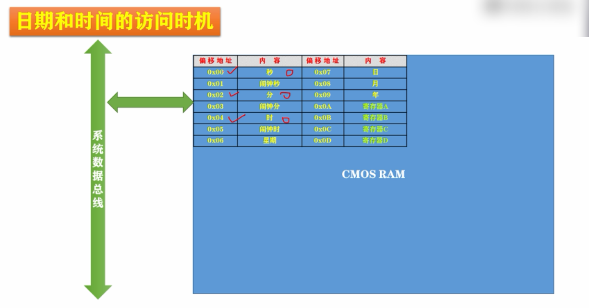
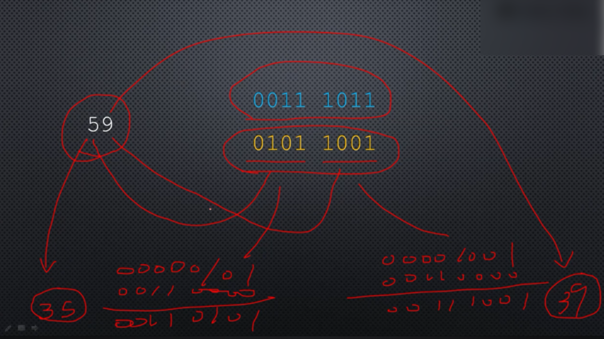
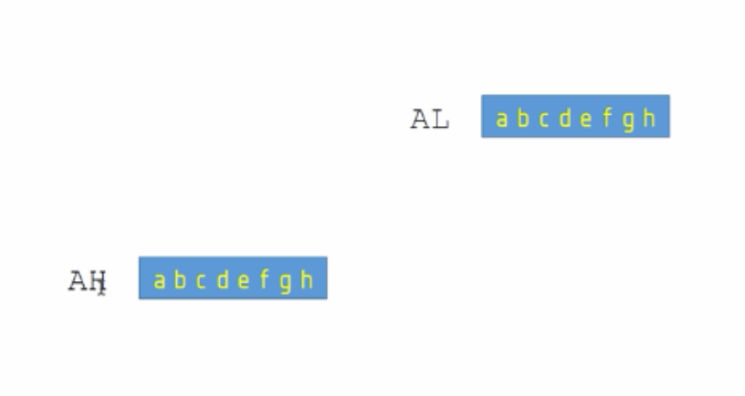
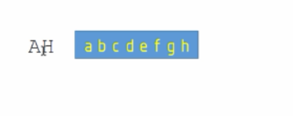
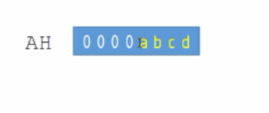

# 读BCD编码并在屏幕上显示

读取时间，在CMOS RAM中偏移地址0x00、0x02、0x04的地方。



采用BCD编码转换成ASCII编码



子调用

```
bcd_to_ascii:                            ;BCD码转ASCII
                                         ;输入：AL=bcd码
                                         ;输出：AX=ascii
      mov ah,al ;al的内容复制一份给ah                          ;分拆成两个数字 
      and al,0x0f                        ;仅保留低4位 
      add al,0x30                        ;转换成ASCII 

      shr ah,4                           ;逻辑右移4位 
      and ah,0x0f                        
      add ah,0x30

      ret
```


```
mov ah,al ;al的内容复制一份给ah                          ;分拆成两个数字 
```

结果如图所示：



```
and al,0x0f ;将al的高4位清零
```

结果如图所示：


```
shr ah,4                           ;逻辑右移4位
```

右移之前：



右移之后：



