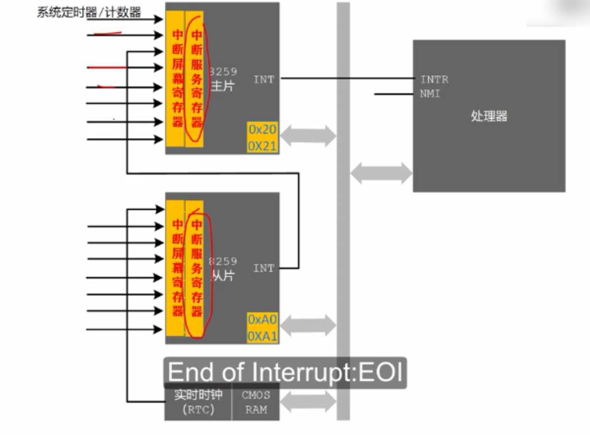
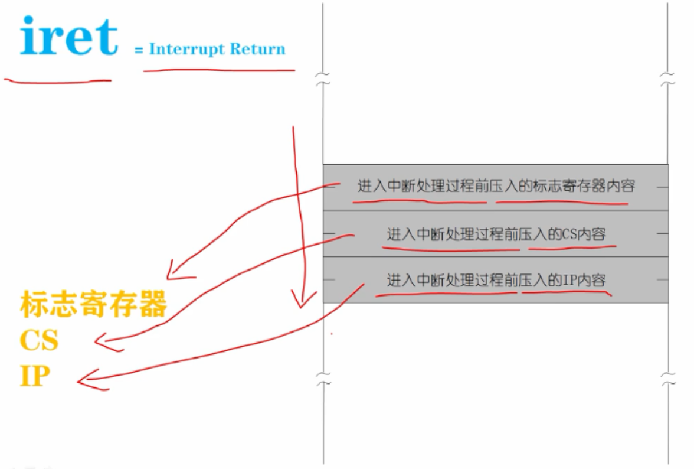

# 使用IRET指令从中断过程返回

在8259A内部有一个中断服务寄存器(Interrupt Service Register: ISR)，主片、从片各有一个。



这是一个8位寄存器，每一位都对应这一个中断输入引脚，如果处理器相应了某个中断，当中断处理过程开始时，8257A芯片会将相应的比特置1，表明正在服务从该引脚来的中断，一旦响应了中断，8259A控制器，无法知道这个中断什么时候会处理结束，同时如果不清楚相应的比特，下一次从同一个人引脚出现的中断将得不到处理，需要在中断处理过程的结尾，显示的对8259A芯片编程，来清除这个标志，这一位，方法是向中断处理器发送中断结束命令：End of Interrupt: EOI，中断结束命令的代码是0x20 。

```
mov al,0x20                        ;中断结束命令EOI 
out 0xa0,al                        ;向从片发送 
out 0x20,al                        ;向主片发送
```

中断返回指令iret，回到中断之前的地方继续执行。

Interrupt Return: iret

当中断发生时，在进入到中断处理过程之前，处理器回依次压入3个字，分别是：

1.进入中断处理过程前压入的，标志寄存器内容。

2.进入中断处理过程前压入的CS内容。

3.进入中断处理过程前压入的IP内容。

一旦执行iret指令，处理器将这3个字分别弹出到IP、CS、标志寄存器中。

弹出到IP、CS，导致处理器将回到中断打断的地方接着继续执行。

将栈中的数据弹到标志寄存器，会将标志寄存器的内容恢复到原来的状态。

在中断处理过程之内，保持栈的完整性和栈平衡是十分重要的，否则中断处理过程将无法返回，这是毫无疑问的。

当iret执行时，栈顶的数据必须是如下：

- 标志寄存器的内容

- CS的内容

- IP的内容 - 栈顶

这个顺序才可以正确返回到中断之前的代码中。



