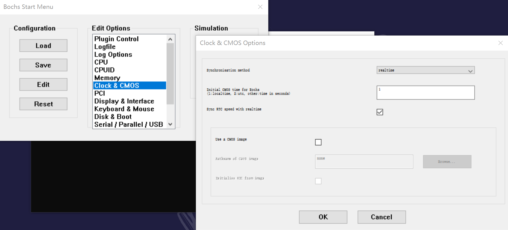

# 使用停机指令HLT使处理器进入低功耗状态

**RTC更新周期结束中断**的处理过程是一个独立的处理过程，是额外的执行流程，他随时都会发生但是和主程序互不相干。

在中断随时可能发生的同时，在主程序里。

```
 .idle:
      ;处于停机转态的处理器可以被外部的中断唤醒，并恢复执行，而且会继续执行hlt后面的指令。
      ;一开始是停机，然后某个外部中断使处理器恢复执行，当处理器从停机状态恢复执行之后，会执行hlt指令，后面的指令。
      hlt ;停机指令，处理器停止执行指令，并处于停机状态，这将降低处理器的功耗，                                ;使CPU进入低功耗状态，直到用中断唤醒
      jmp .idle
```


配置Bochs：



来解决时间不对的问题。

如果不使用hlt指令，会使CPU的占用率大幅提升。

