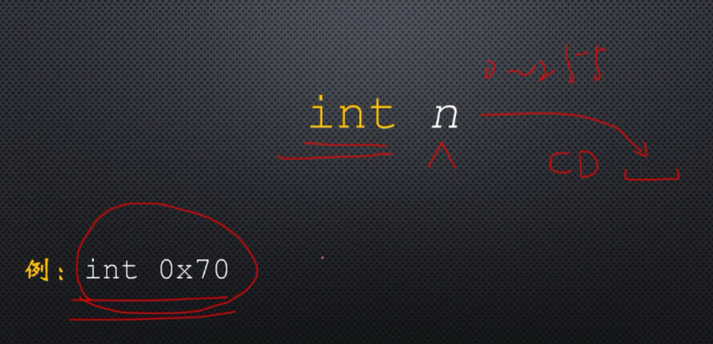
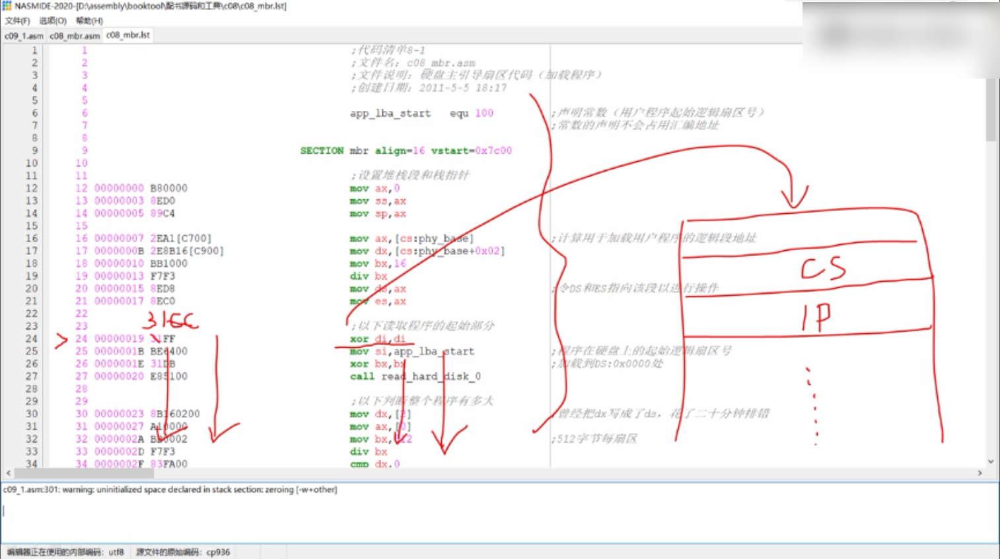
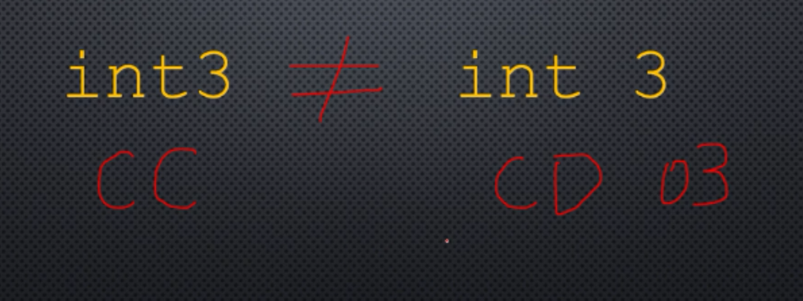

# 内部中断和软中断

## 硬件中断：

来自于处理器之外。

## 内部中断：

来自处理器内部。

是因为在执行指令过程中出现了问题，或者出现了故障引起的。

比如处理器检测到除法指令的除数为0时，或者除法的结果溢出时，将产生(中断0)0号中断，这就是除法错中断。

当处理器遇到非法的指令时，将产生中断6(6号中断)，**非法中断是指指令的操作码没有定义**(意味着这不是一条指令，无法译码和执行)，或者指令超过了指定的长度。

**内部中断不受标志寄存器的中断标志位IF的影响。**

处理器知道每个内部中断的中断号，可以立即转入中断处理过程去执行。

## 软中断

在编写程序时，我们可以随时用指令产生中断，这种类型中断被称为软中断。

可以用int指令来产生。

int 立即数(n:中断号，范围是0-255,8086只能识别256种中断)

int指令的操作码是16进制的CD后面跟一个字节的中断号。

例子：

int 0x70

执行时会产生0x70号中断，并执行中断处理过程，在前面的代码学习中我们知道，0x70号中断是由实时时钟芯片产生的，每当实时时钟芯片发出更新周期结束中断时，会调用我们的中断处理过程，在屏幕上显示当前时间，如果我们在程序中执行int 0x70这条指令，那么就算实时时钟芯片还未发出更新周期结束中断，处理器也会因为这条指令而产生这个中断，并执行我们的中断处理过程，在屏幕上显示当前时间。

即处理器执行这条指令和实时时钟芯片发出一个中断效果是一样的，都会执行中断处理过程。

int3

**断点中断指令**，这条指令是供调试器使用的，它就是像调试器故意设置的陷阱，所以又被称为**陷阱中断**。

这条指令的机器码是16进制的CC，这条指令在调试程序时很有用。调试程序可以单步执行指令，也允许我们设置断点，当程序执行到断点时就停止，方便查看寄存器，内存单元或者标志寄存器的内容。

这是如何做到的呢？

实际上断点指令int3就是为了这个目的而设置的。这是一个单字节指令，这是有意设置的。

调试器我们都用过，都有感性认识。

指令都是连续存放的，因此所谓的**断点就是某个指令的起始地址**，假定我们要设置一个断点。

中断处理程序是由调试器提供的，它的任务是将断点处的处理器状态保存起来，包括段寄存器、标志寄存器、通用寄存器的数值，同时中断处理过程提供一个交互过程，交互的界面，允许你用调试命令来查看断点前的机器状态，比如查看每一个寄存器的内容，以及内存里面的数值，包括栈的状态等等。

在调试过程中，我们通常需要从断点处继续往下执行，当中断处理过程接到继续执行的命令时，将恢复这条指令(添加断点处的命令)的第一个字节，然后修改栈中的返回地址，让这个地址执行原来的这条指令，而不是下一条指令，最后中断处理过程执行中断返回指令iret，重新返回到被中断的这条指令，接着往下执行。

需要注意的是：

int3 与 int 3并不是一回事，这是两条指令，他们是不同的指令。

into指令

溢出中断指令，单字节指令，16进制CE，当处理器运行这条指令时，如果标志寄存器的溢出标志OF是1，那么将产生4号中断，否则这条指令什么也不做。

