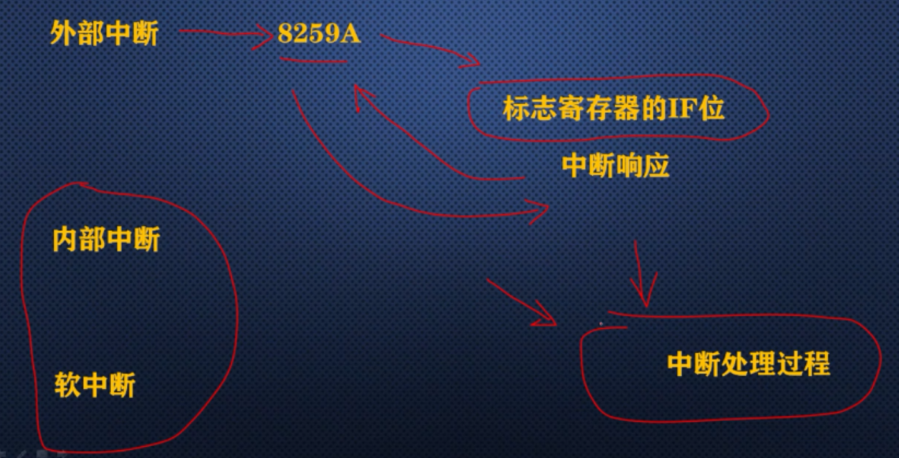
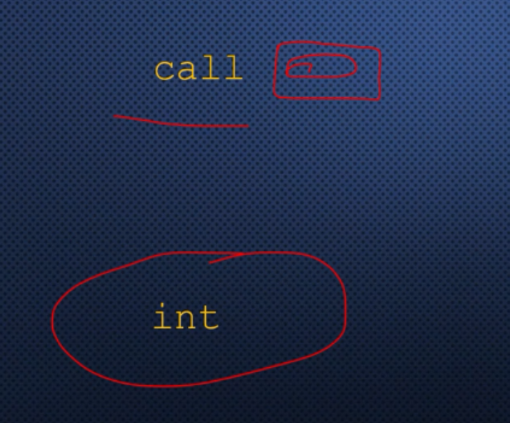
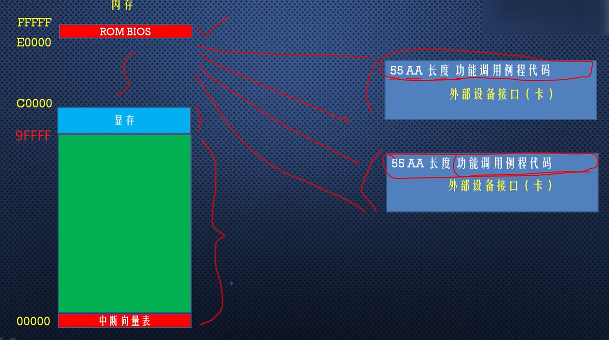
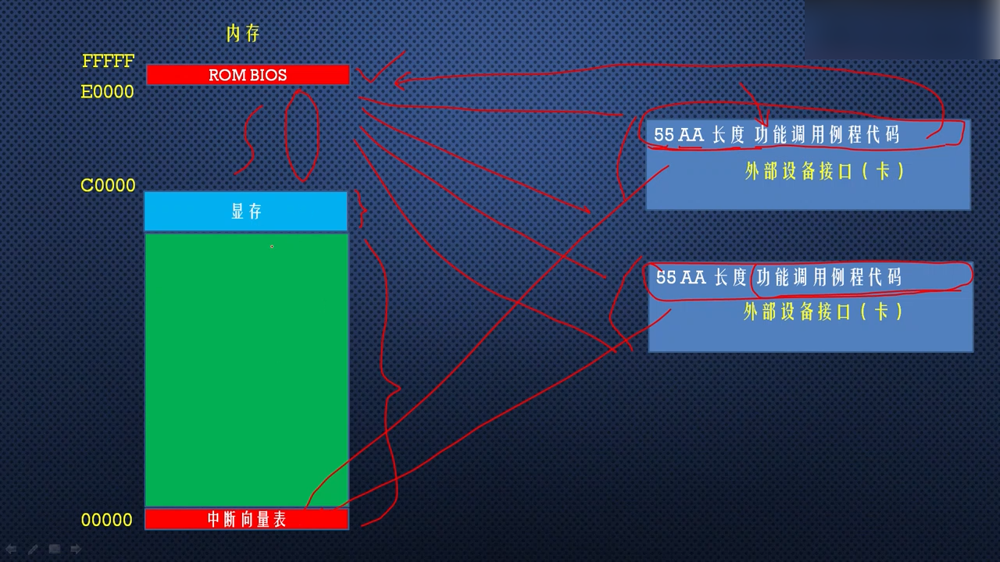
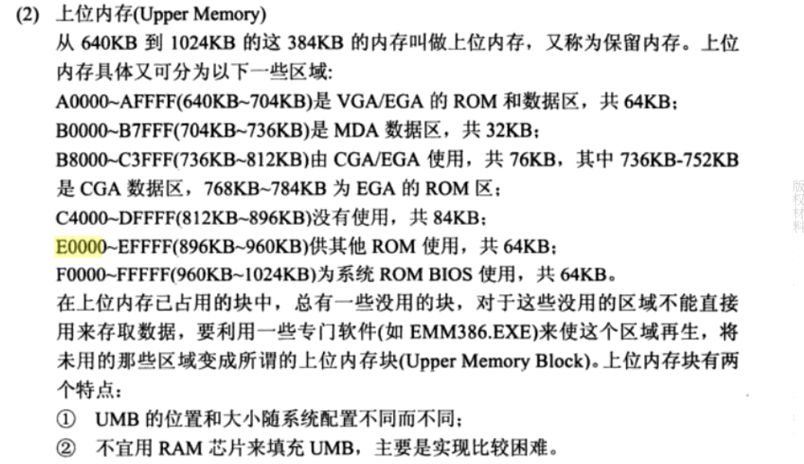

# BIOS中断概述

外部硬件中断是否能被处理，取决于中断控制器，是否允许这个中断信号到达处理器。

即使是中断信号能到达处理器，处理器是否响应这个中断，要看标志寄存器的中断标志位IF。

处理器响应中断的过程包括，向8259A芯片发送响应信号，然后要求8259A芯片送过来一个中断号。

对于内部中断和软中断，处理器并不理会标志寄存器的中断标志位IF，即标志寄存器的中断标志位只影响外部中断。

无论是什么中断，当中断发生时，处理器最主要的任务是根据中断号，找到中断处理过程，并执行这个过程，可以位所有中断类型编写我们自己的中断处理过程。

8086处理器支持256种中断，其中内部中断占比是2%，外部硬件中断主要是通过NMI引脚和8259A中断控制器芯片来提供的占比7%，剩余的部分可以由软件系统使用，占比是91%。

显然我们有这么多中断可以使用，所以计算机系统经常使用**中断代替过程调用**。

过程调用时，call指令必须指定目标位置的相对偏移量，或者绝对地址，在一个程序内部是很方便的，因为我们直接call标号就可以了。

但是这个标号是在我们的程序内部自己定义的，用起来非常方便，但是如果想调用别人的代码，比如操作系统的功能，call指令就很麻烦了！

举个例子，假如你想读硬盘上的一个文件，因为操作系统有这样的功能，就不必再写一套代码了，直接调用操作系统历程就可以了。

但是操作系统不会给出，硬盘读写历程的段地址和偏移地址，因为操作系统也是经常修改的，经常发布新的版本。

而且每次当我们开机之后，操作系统的内部历程的段地址和偏移地址是不固定的经常变化，这样一来历程的入口地址也会跟着变化。

因为有了软中断，这是一个利好条件，操作系统可以用软中断来提供各种服务功能，每次操作系统加载完自己之后，将它提供的每种服务功能，做成中断处理过程，并制定一个 中断号。

当然还要把服务历程的中断地址填写到中断向量表中，这样的话无论在什么时候，任何程序要调用某个服务功能时，直接发出一个软中断即可！不需要知道具体的地址，只需要知道中断号就行！

利用这个原理，在我们的计算机系统中，用软中断提供系统服务的著名例子是BIOS(中断功能)调用。

之所以称为BIOS中断，是因为这些中断功能，是在计算机加电之后，BIOS程序执行期间建立起来的。

换句话说，这些中断功能调用在加载和执行主引导扇区之前，就已经可以使用了，我们可以在我们的主引导扇区中或者用户程序中使用！

BIOS中断又称BIOS功能调用，主要是为了方便程序使用最基本的硬件访问功能，BIOS提供了很多硬件服务，这些服务按照类型划分为：

- 键盘输入服务。

- 磁盘读写服务。

- 文本和图形的显示服务。

每一种类型的服务都有一个中断号，比如键盘服务使用的中断号是0x16，但是每种服务又划分成很多功能，为了去跟不同的功能，通常是在发出一个软中断之前，用寄存器ah来指定功能号，比如：

这两条指令，用于从键盘读取一个按键，0号功能，是从键盘读字符，读取的字符在寄存器al中。

首先将0号功能传送到寄存器ah，紧接着发出一个软中断int 0x16，执行0x16之后，中断服务历程会监视键盘动作，当中断服务历程返回之后，会在寄存器al中，存放按键的ASCII编码！

BIOS功能调用很多，他们是在BIOS执行期间安装的，当主引导程序开始执行时，就可以使用了，BIOS是如何建立起着一套功能调用的呢？又是如何知道如何访问硬件的呢？

答案是BIOS并不知道，很多功能调用不是BIOS提供的，而是有我们访问的硬件自己提供的，是由外部设备接口自己建立的！

外部设备接口比如一些板卡，各种各样的板卡，比如网卡、显卡、键盘接口电路等等包括硬盘控制器。

这些接口都有自己的只读存储器ROM，类似于BIOS芯片，这些ROM中提供了它自己的功能调用历程，以及本设备的初始化代码。

按照规范，在每一块板卡内部的ROM中，前2个单元的内容是0x55和0xaa两个字节(两个标志)，第3个单元是长度，是本ROM中，以512字节为单位的代码长度，从第4个单元开始，一直向后就是实际功能调用历程代码，每个板卡都相同。

其次，我们知道在内存的顶端，是ROM BIOS，在往下这部分内存空间是留给外围设备的，外部设备都有自己的ROM，每一个外部设备的ROM都映射到这部分空间。

再往下是640kB常规内存，包括1kb的中断向量表(每个中断包括中断处理过程的段地址和段内偏移地址，一共占4个字节)，这一部分是由操作系统和用户程序使用。

在计算机启动期间BIOS会启动执行，BIOS程序会以2000byte为单位，搜索C0000 - E0000 这个区域，我们知道这个区域是空的，是由外部设备映射的，因此实际上搜索的是外部设备的ROM，如果ROM BIOS 发现某个区域的头两个字节是0x55和0aa，就意味着这个区域有设备的ROM存在，是有效的，于是ROM BIOS从这个单元进入，执行设备的ROM代码。

设备的ROM代码用来初始化设备本身，并提供功能调用，它将自己的中断调用地址填写到中断向量表中，各自填写，建立起一套中断调用，然后再返回到ROM BIOS，接着再搜索再执行，再返回，一直到所有设备的ROM都初始化完成，包括中断向量表建立完成，这个时候再加载主引导扇区，执行主引导扇区程序，是这么一个过程。

其中找到一些资料：

E0000 - EFFFF 供其他ROM使用 64kb

F0000 - FFFFF 系统ROM BIOS 64kb

ROM read-only memory 只读存储器

RAM Random access memory 随机存储器

**DRAM**
从上表可见，内存地址0x00000~0x9FFFF这最低的640KB的地址空间范围，对应DRAM，也就是通常意义上的内存。

**BIOS ROM**
最高地址0xF0000~0xFFFFF这64KB的内存对应的就是ROM BIOS。BIOS的主要工作就是检测和初始化硬件，在最低1KB的内存处建立实模式下的中断向量表。

