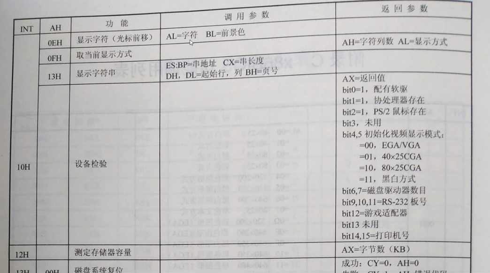
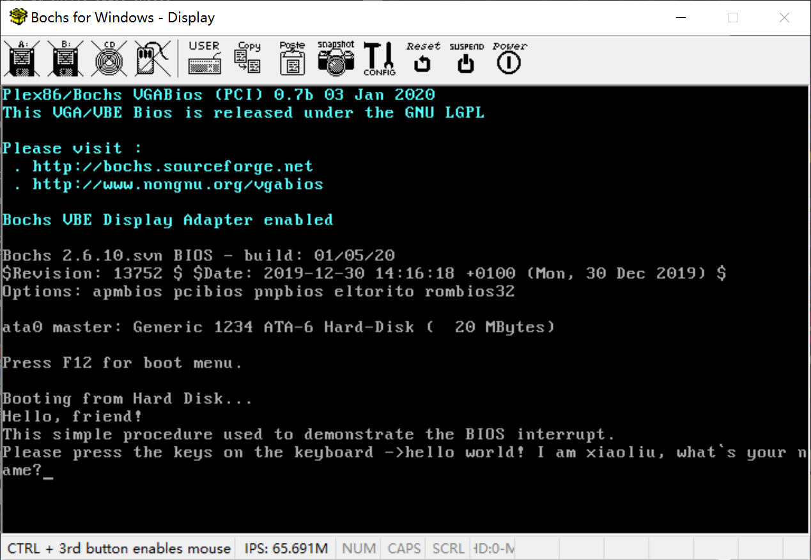

# BIOS功能调用之接收并显示键盘输入



[BIOS功能调用表 权威资料](http://www.ablmcc.edu.hk/~scy/CIT/8086_bios_and_dos_interrupts.htm)

[BIOS功能调用表 权威资料 本地](./8086_bios_and_dos_interrupts_(IBM_PC).html)

运行结果：



代码：

```
         ;代码清单9-2
         ;文件名：c09_2.asm
         ;文件说明：用于演示BIOS中断的用户程序，用BIOS功能调用从键盘接收一个按键的字符编码，并把它原样的显示在屏幕上 
         ;创建日期：2012-3-28 20:35
         
;===============================================================================
SECTION header vstart=0                     ;定义用户程序头部段 
    program_length  dd program_end          ;程序总长度[0x00]
    
    ;用户程序入口点
    code_entry      dw start                ;偏移地址[0x04]
                    dd section.code.start   ;段地址[0x06] ;用户程序的入口点
    
    realloc_tbl_len dw (header_end-realloc_begin)/4
                                            ;段重定位表项个数[0x0a]
    
    realloc_begin:
    ;段重定位表           
    code_segment    dd section.code.start   ;[0x0c]
    data_segment    dd section.data.start   ;[0x14]
    stack_segment   dd section.stack.start  ;[0x1c]
    
header_end:                
    
;===============================================================================
SECTION code align=16 vstart=0           ;定义代码段（16字节对齐） 
start: ;用户程序的入口点
      ;初始化各个寄存器 - 开始
      mov ax,[stack_segment]
      mov ss,ax
      mov sp,ss_pointer
      mov ax,[data_segment]
      mov ds,ax
      ;初始化各个寄存器 - 结束

      ;显示字符串 - 开始 没有自己写代码 用的是BIOS的功能调用。中断0x10下面的0x0e号功能。
      mov cx,msg_end - message ;计算字符串的长度，并传送到寄存器cx中
      mov bx,message ;ds段内字符串的首地址(偏移地址传)送到bx
      
 .putc:
      mov ah,0x0e ;子功能号0x0e 功能时显示单个字符，在屏幕上写一个字符，并推进光标的位置
      mov al,[bx]
      int 0x10 ;中断0x10
      inc bx ;bx中的字符偏移地址，增加一个字节byte，指向下一个字符在数据段中的位置。
      loop .putc ;因为我们是要显示字符串，是一串字符，所以我们在程序中采用的是循环的方法。
      ;显示字符串 - 结束

 .reps:
      ;用软中断0x16从键盘读字符
      mov ah,0x00
      int 0x16 ;执行软中断0x16，中断返回之后，键盘输入的ASCII码在al中。
      
      mov ah,0x0e ;0x0e号功能
      mov bl,0x07
      int 0x10 ;使用中断0x10
      ;把键盘输入的字符，显示在屏幕上。

      jmp .reps ;执行一个无条件转移指令，重新从键盘读取一个新的字符，并予以显示。

;===============================================================================
SECTION data align=16 vstart=0

    message       db 'Hello, friend!',0x0d,0x0a
                  db 'This simple procedure used to demonstrate '
                  db 'the BIOS interrupt.',0x0d,0x0a
                  db 'Please press the keys on the keyboard ->'
    msg_end:
                   
;===============================================================================
SECTION stack align=16 vstart=0
           
                 resb 256
ss_pointer:
 
;===============================================================================
SECTION program_trail
program_end:
```

