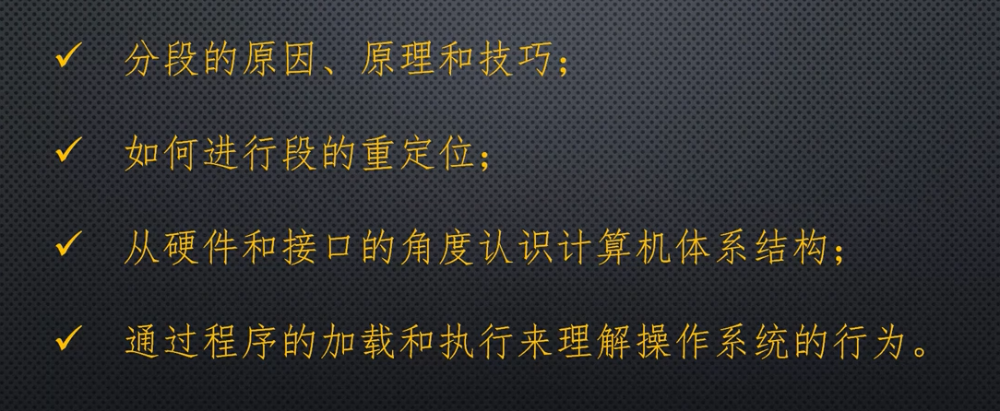
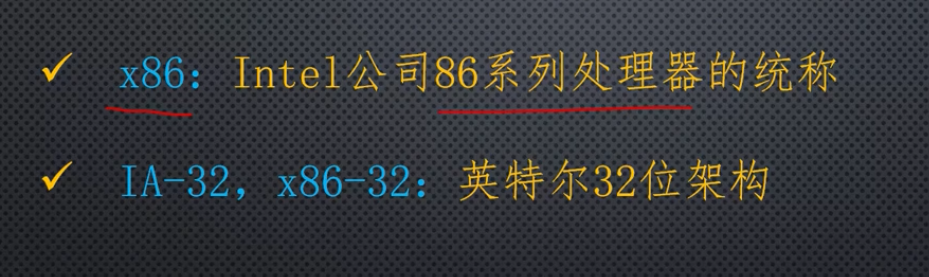

# 了解IA-32架构和保护模式的背景知识

这节课开始转入32位处理器和保护模式的学习。

**保护模式非常重要，现如今的程序大多都跑在保护模式下。**

32位处理器起源于，1985年10月推出的80386处理器，这是一款非常成功的产品，同样是一款划时代的产品，它的架构和工作模式深刻影响的后续产品的研发，80386是32位的处理器，这是因为它的寄存器、数据总线、和算数逻辑单元都是32位的，支持32位的数据操作，和数据传送。

为了访问更大的内存，它提供的32位的地址线，可以访问4G字节的内存，现在看来也是不小。

另外80386支持多任务，是面向需要超高速计算性能领域设计的，极适合多任务处理的操作系统，80368在指令上兼容8086，可以按照8086的方式工作，这时候可以看做一个快速的8086，但是要想发挥80386的全部性能，就必须工作在保护模式下。

保护模式并不是80386引入的，实际上在80386之前，因特尔公司开发过80286处理器，80286第一次引入了保护模式这个概念。但是遗憾的是这款处理器在市场方面并不成功。

保护模式是一种全新的处理器工作模式，顾名思义它将内存里的每个程序都加以保护和隔离，免得它们互相影响，保证它们不会受到有益或无益的破坏。

在进入保护模式之前，还有一件事需要说明，你可能通过其他渠道学习了基于8086处理器的汇编语言课程。

本课程的特点：

一定要从前往后读。

## IA32处理器架构

名词介绍：

### x86：因特尔公司86系列处理器的统称

从开始的8086、8088、80286、80386、80486这是一条线，虽然说 后来的处理器改变了名称，不在用数字来作为名称，但是他们在体系结构上，是保持一致的。

所谓处理器架构，或者处理器编程架构，是指一整套的硬件结构，以及与之相适应的工作状态，这其中的灵魂部分就是一种设计理念，决定了处理器的应用环境和工作模式，也决定了软件开发人员如何在这种模式下解决实际问题。

架构内的资源对于程序员来说，是可见的可访问的，受程序的控制以改变处理器的运行状态，非架构的资源取决于具体的硬件实现，处理器架构实际上是不能扩展的，新处理器必须沿用就得思路，并保持兼容性和一致性，同时还会有扩充和增强。

### IA-32，后来又叫x86-32：因特尔32位架构

是以1978年的8086处理器为基础发展起来的。

一开始没有这个概念，只是因为80386的成功，然后逐渐形成了一个系列和一种体系结构，于是才有了这个概念。

