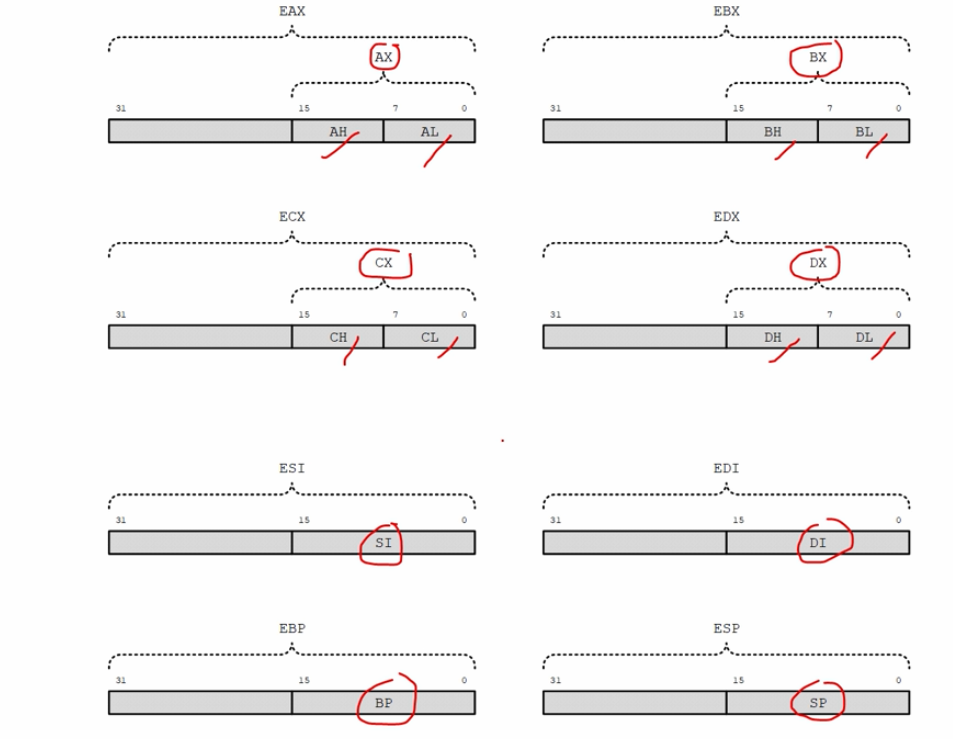
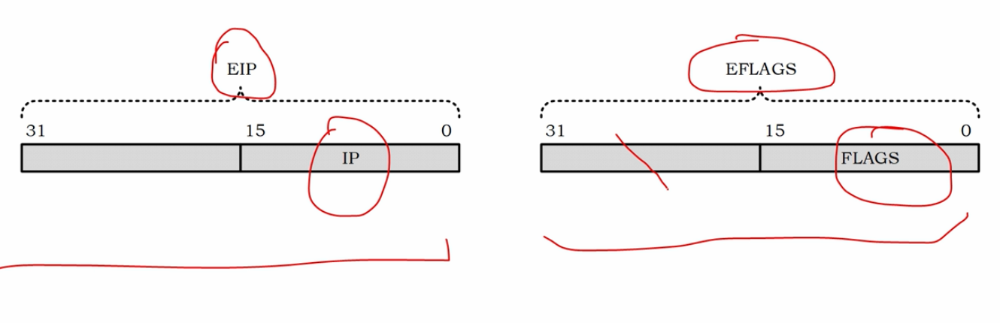

# 寄存器的扩展和扩充



在16位的8086和80286处理器内有**8个通用寄存器**，分别为：

**ax => ah | al**

**bx => bh | bl**

**cx => ch | cl**

**dx => dh | dl**

**si**

**di**

**bp**

**sp**

其中前4个还可以拆分成两个独立的8位寄存器来用！

32位处理器在16位处理器的基础上，扩展了这8个通用寄存器的长度，使之达到32位，为了在汇编语言中使用经过扩展的32位寄存器，需要给他们命名，它们的名字分别是：

**eax**

**ebx**

**ecx**

**edx**

**esi**

**edi**

**edp**

**esp**

**需要注意的是32位寄存器的高16位是不尅独立使用的！**

低16位使用方法和以前一样！

例子：混合使用了16位与32位的寄存器

```
mov edx, 0xf000c000
mov dx, 0 ;dx与edx是一体的，是它的低16位，改变了dx，edx也会随之改变：EDX = 0xf0000000
add edx,0xcccc ;EDX = 0xf000cccc
```


自从引入了保护模式，保护模式之前的操作模式被称为**实地址模式**简称**实模式**！

在这种模式下编写程序，你只和真实的内存、内存地址打交道，你在脑海里面构建的内存布局，就是真实的内存布局。

而在保护模式下，你脑子里面的内存布局，和真实的内存布局，可能不太一样，中间可能有一个抽象和装换的步骤，或者说一个抽象和转换的层面！

实模式是和保护模式相对的，8086处理器工作模式就是典型的实模式，但是反过来，实模式不是特指8086的工作模式，也不是专指8086，实际上现今的x86处理器，都支持实模式。

要想如保护模式并不太容易，需要一些列的步骤和准备工作！

因为进入保护模式不太容易，所以如今的x86处理器默认是工作在实模式下，这样的话便于我们做准备工作。


32位处理器扩展了，指令指针寄存器IP，使之达到32位，叫做EIP，但是实模式下，取指令时用的是它的低16位ip，全部32位eip只有在保护模式下才会使用。

32位处理器还扩展了标志寄存器，flags使之达到32位叫做eflags，但是实模式下，用的是它的低16位flags，全部32位eip只有在保护模式下才会使用。



在32位处理器内部，以前的段寄存器，cs、ds、es、ss依然存在，同时新增加了两个寄存器，fs与gs，段寄存器多了，在段之间操作会更方便，**在实模式下，这些寄存器用法和以前一样，用来提供逻辑段地址，但是在保护模式下，这些寄存器的用户和从前不一样，被改变了！**

在32位处理器内部还新增加的寄存器：

他们都有特定用途，后续讲解！
