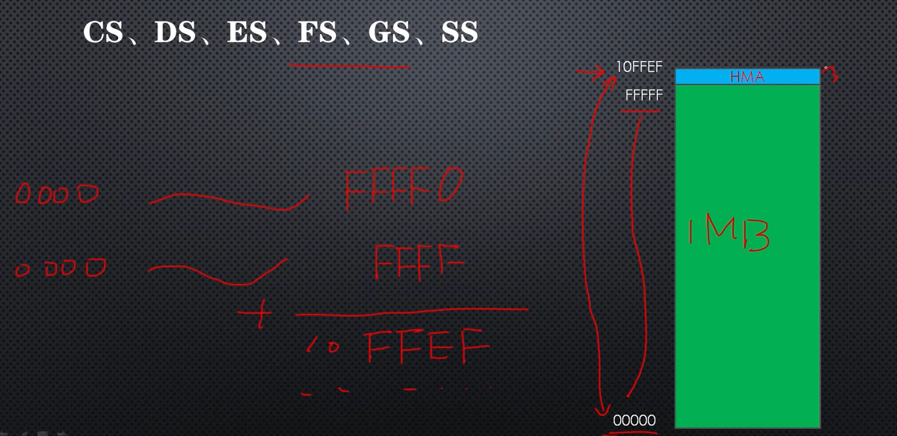
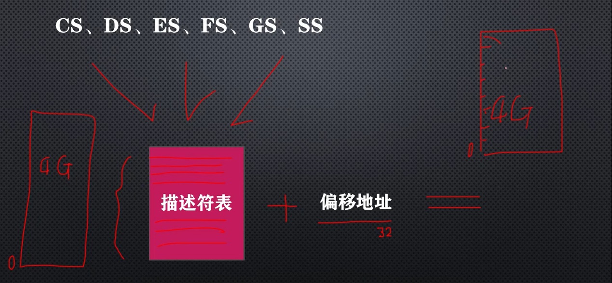

# 32位处理器的内存访问概况

32位处理器新增加了两个段寄存器：

fs、gs

段寄存器的总数达到了6个，段寄存器的**长度没有增加**，还是16位。

用法：要看处理器的工作模式，有两种基本的工作模式，实模式和保护模式，两种不同的模式下，它们的用法是不一样的。

在实模式下，这些段寄存器的用法和以前一样，还是用来保存逻辑段地址，处理器访问内存是依然是将段寄存器的内容左移4位，加上段内偏移地址，得到20位物理地址。

根据以上计算，理论上可以访问到0xffff0 + 0xffff = 0x10ffef，受限于20根地址线，超出0xfffff地址都无法访问到，所以只能访问到0x00000 - 0xfffff之间的空间即1Mb字节。

80286,有24根地址线，80386有32根地址线，后面处理器有更多的地址线，这么多地址线，地址0x10ffef，是完全可以表示的，这些处理器都支持实模式，因此在实模式下，这些处理器可以访问的范围是0x00000 - 0x10ffef。

这个范围只比1Mb字节多一点点0xffff - 0x10ffef，多出来的这部分叫高位内存区(Height Memory Area: HMA)，

显然在实模式下，无论计算机配备了多少内存，处理器也只能访问1Mb字节左右，比如80386来说，它有32根地址线，理论上可以访问4G字节的内存，但是在实模式下，超出1Mb字节的绝大多数空间，他是访问不到的。

要想访问全部的内存，只能是在保护模式下才可以。

在保护模式下，程序所使用的的段，需要提前分配，并登记在一个表中，叫做描述符表，描述符表中登记了每个段的起始地址以及段的长度等基本信息。

段的长度没有限制，可以将整个内存空间都划归一个段，举个例子：

对于80386处理器，描述符内的段起始地址可以是任意的32位内存地址，段的长度最大可以是4G字节，假如段的起始地址是0的话，长度是4G，将整个4G，都划归一个段，段大小是4G。

在保护模式下，段寄存器不再用来保存逻辑段地址，而是描述符的选择子，用来从描述符表中选择一个描述符，一旦选择了一个描述符，处理器取出描述符中的段基地址，在加上程序中给出的段内偏移地址，行成完整的内存地址，在这里偏移地址也是没有限制的。

对80386来说，偏移地址可以是32位，如果段的基地址是0，段长度是4G字节的话，那么32位的偏移地址，可以用来访问4G字节空间的任何一个位置。

