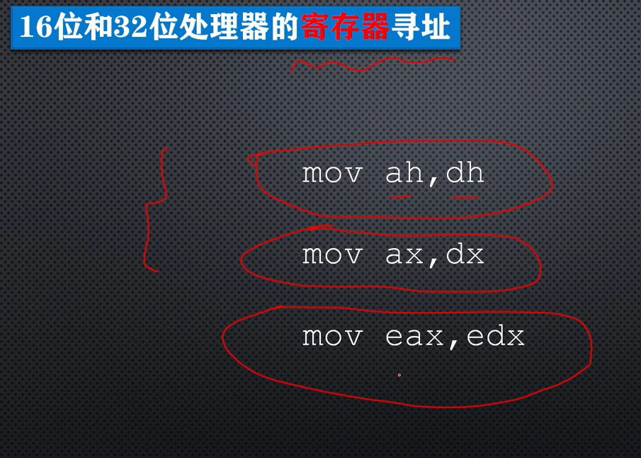
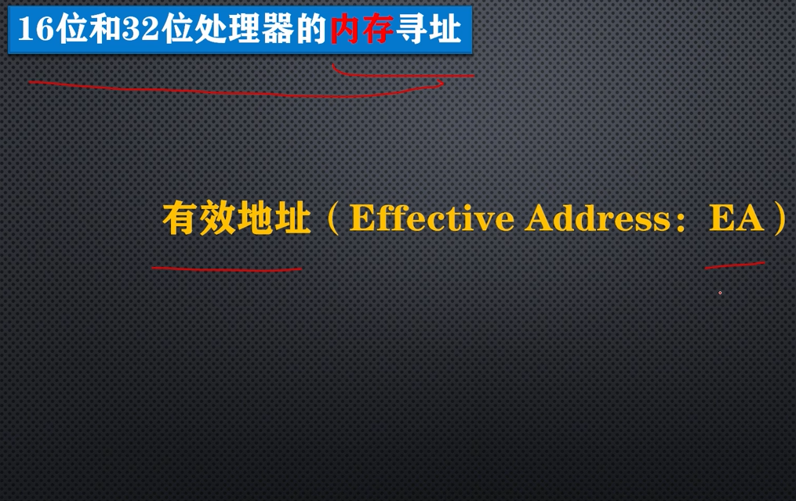
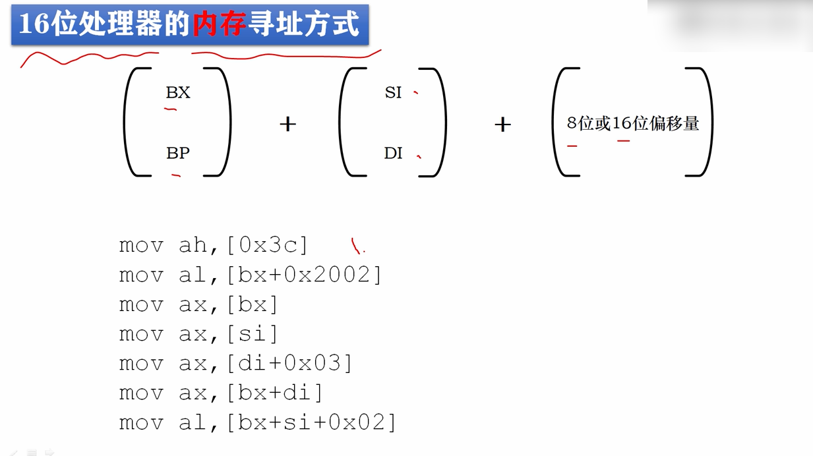
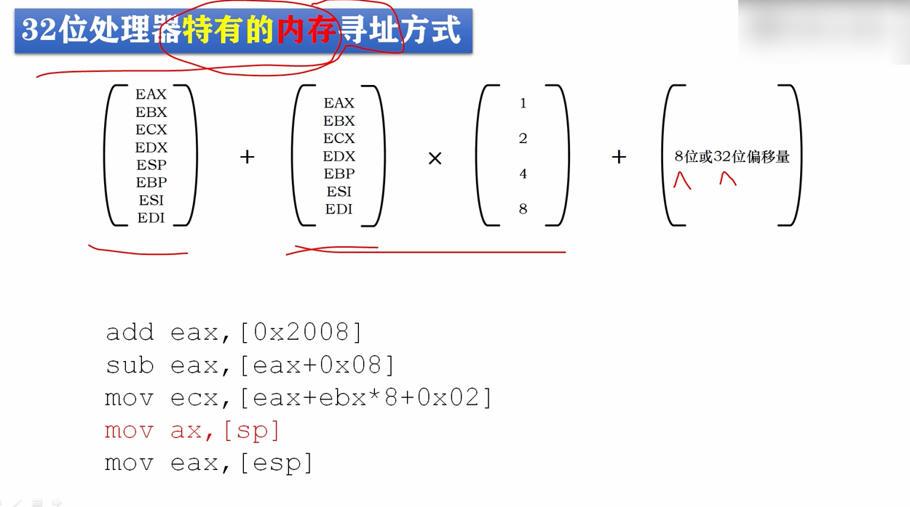
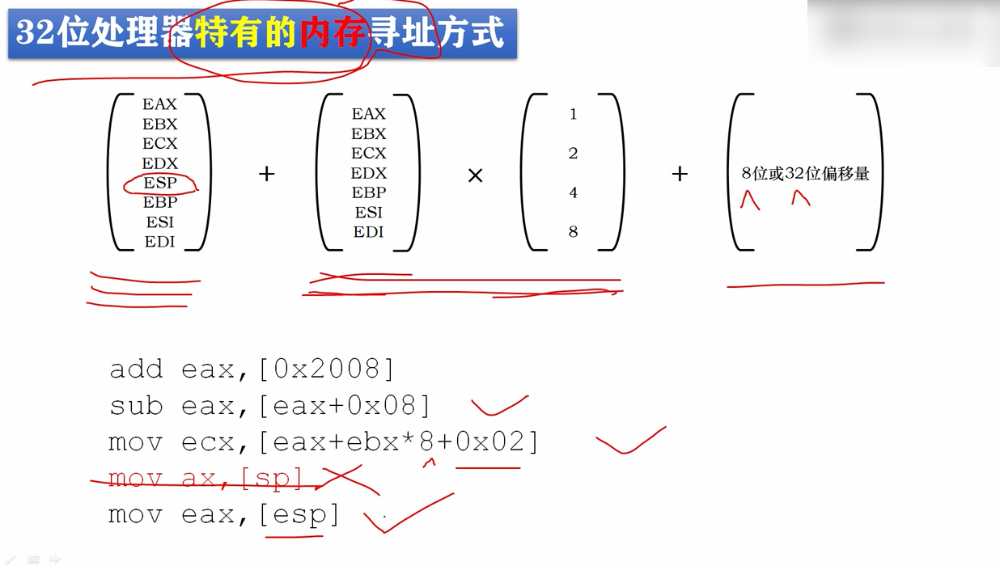

# 了解32位处理器寻址方式概况

**寻址：**

**如何找到要操作的数据，以及如何找到存放操作结果的地方。**


## 寄存器寻址

在16位处理器上，如果采用寄存器寻址，可以使用8位的寄存器，16位寄存器，当然，在32位处理器上也可以使用。



## 内存寻址

16/32位处理器支持内存寻址：

如果指令中，包含了内存地址，那么它必然是一个段内偏移地址，我们称之为有效地址，简称(Effective Address)EA，通过有效地址，可以从内存中间接取得实际的操作数。



### 16位处理器寻址方式

bx、bp基址寄存器

si、di变址寄存器

目的操作数是一个内存地址，使用的是内内存寻址方式。

```
;格式
mov 目的操作数(写入),源操作数(读取)
```



### 32位处理器内存寻址方式



32位处理器支持实模式，也支持上面的寻址方式，但是32位处理器有自己**特有的寻址方式**，有效地址可以使用全部的32位通用寄存器作为基址寄存器，

ebx... => 基址寄存器

除了esp的其他通用寄存器 => 变址寄存器

1、2、4、8 => 比例因子


add eax,[0x2008] => 内存寻址方式 只保留了第3部分

add eax,[eax+0x08] => 内存寻址方式 保留了第1部分和第3部分

mov ecx,[eax+ebx*8+0x02] => 内存寻址方式 完全的3个部分

x mov eax,[esp] => 非法

**无论是在16位处理器上或者32位处理器上，都不允许使用栈指针寄存器sp来提供有效地址。**

mov eax,[esp] =>  内存寻址方式 可以使用esp来提供有效地址



例子：

```
mov ax,0xb000
mov ds,ax ;传送给段地址

mov bx,0x8000 ;传送给基址寄存器
mov byte [bx+0x00],';'
mov byte [bx+0x01],0x07
mov byte [bx+0x02],')'
mov byte [bx+0x03],0x07

jmp $
	times 510 - ($ - $$) db 0
	db 0x55,0xaa
```

修改一下：

```
mov ax,0xb000
mov ds,ax ;传送给段地址

mov eax,0x8000 ;传送给基址寄存器
mov byte [eax+0x00],';'
mov byte [eax+0x01],0x07
mov byte [eax+0x02],')'
mov byte [eax+0x03],0x07

jmp $
	times 510 - ($ - $$) db 0
	db 0x55,0xaa
```

