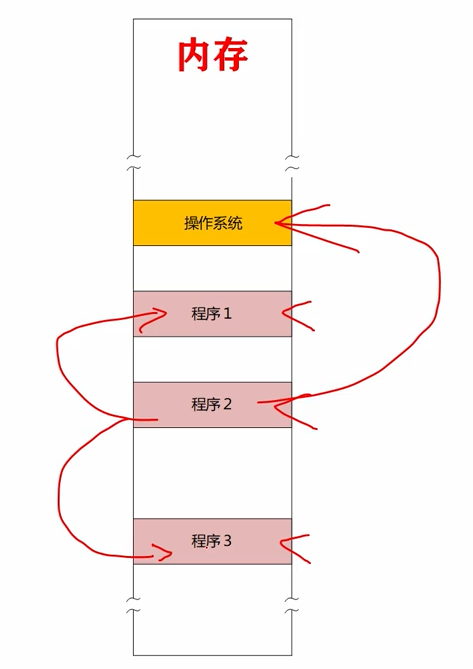
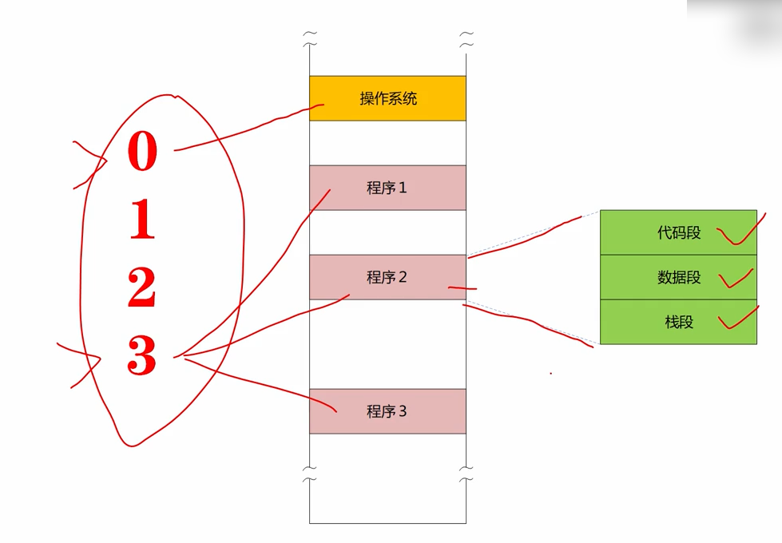
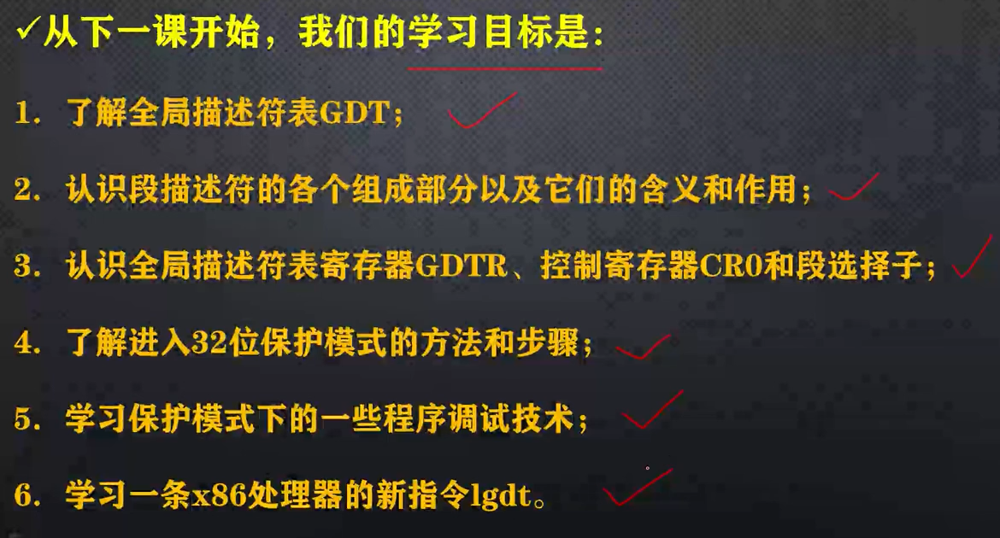

# 保护模式是要保护什么

在实模式下，程序是可以为所欲为的，想访问内存的那部分，都可以通过设置段地址和段内偏移地址来轻松办到。

在现代计算机中，这种为所欲为的能力是很可怕的，会造成破坏，必须加以限制。

在现代算计中，可以同时运行多个程序，这很正常。

操作同管理整个计算机，在这幅图中，内存里有操作系统，同时还运行着三个程序，这三个程序是由操作系统负责加载的，程序的执行也需要操作系统的调度。

在实模式下，程序对内存的访问非常自由，没有任何限制，随随便便就可以修改内存中的数据。

比如一些程序甚至可以修改操作系统所在的内存，或者可以修改其他程序内存，这种修改可能是无意的，也可能是有意的，比如一个木马程序，无论是否有意，后果都是不堪设想的。

在多用户，多任务时代，内存中会有多个用户程序在同时运行，为了使他们彼此隔离，防止影响到其他程序，使用保护模式，是非常有必要的。

在保护模式下，每个程序都有一个特权级，特权机使用数字来表示的，一共有4个特权级别：0、1、2、3，0级最高，3级最低，一般来说，操作系统的特权级最高为0，用户程序的特权机最低，为3。

特权级位0的程序具有最高的权限，可以读写任意内存位置，可以读写任意端口，可以执行特权指令，特权指令是一些，非常重要的处理器指令，用来控制处理器的工作模式和运行状态。

因为操作系统具有最高权限，最高特权，所以它可以分配内存，加载用户程序，设置用户程序的特权级别，调度用户程序的执行等。

相反的，用户程序是由操作系统负责加载的，操作系统会将用户程序的特权级别设置为最低，除非使用特定的方法，否则特权机不同的程序之间不能随意访问。

程序是由段组成的，一个程序可能包含很多段，比如代码段、数据段、栈段等，操作系统会登记每个程序所使用的段，包括段的起始位置，段的长度等信息。

如果一个用户程序的特权级很低，那么他只能访问它自己的段，无法访问其他程序的段，更不用说，操作系统的段了。

以上是保护模式下，如何实现程序之间的隔离和保护！

