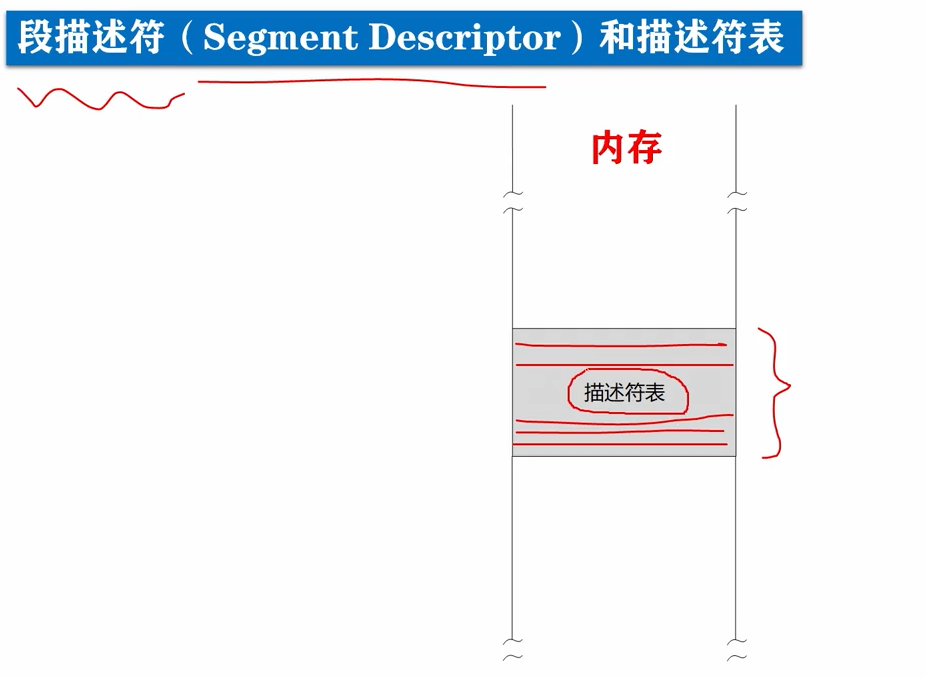
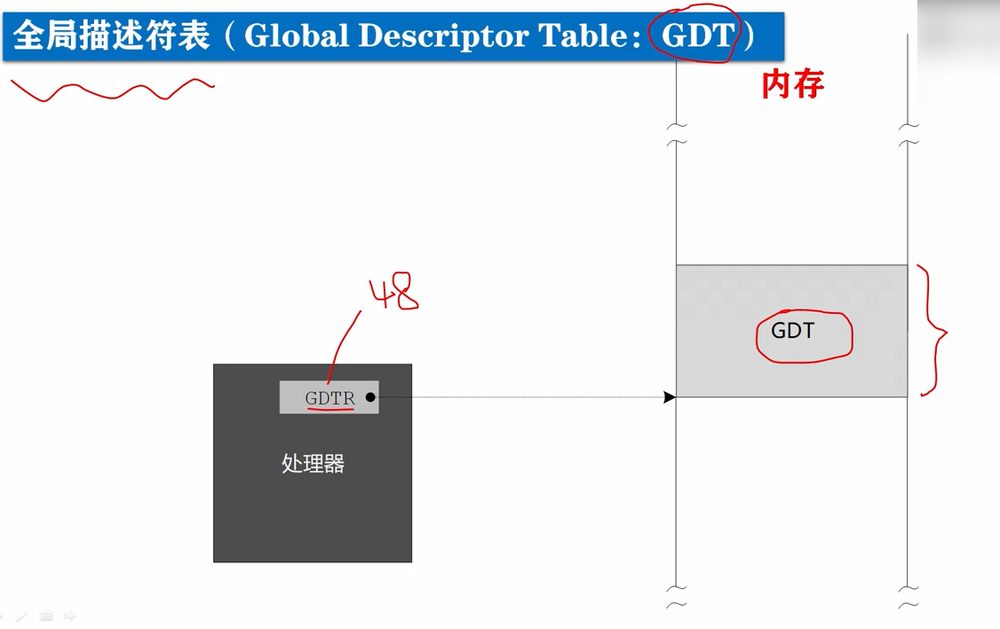
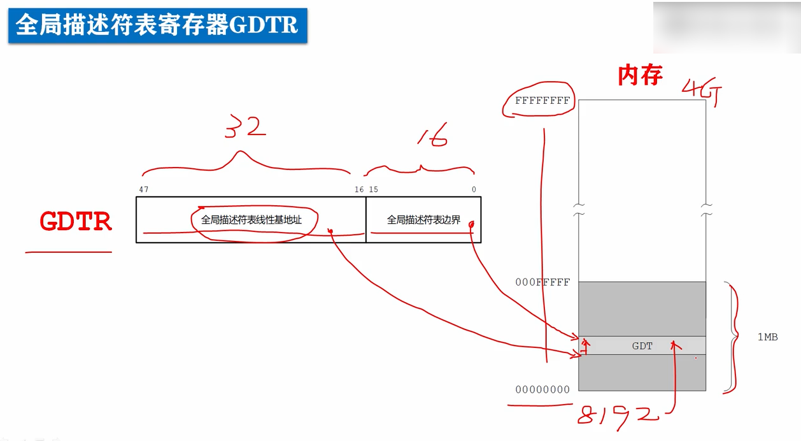

# 全局描述附表GDT和全局描述符表寄存器GDTR

为了让程序在内存中能自由浮动而不影响它的正常执行，处理器将内存划分成逻辑上的段，并在指令中使用段内偏移地址。

在保护模式下，对内存的访问仍然使用段地址和偏移地址，但是在每个段能够访问之前，**必须先进行登记**。

这种情况好比是开公司做生意，在实模式下，开公司不需要进行登记，卖什么都没有人管，随时可以开张，但在保护模式下就不行了。

开公司之前必须登记，登记信息包括住址和经营项目等。

每当你做的买卖和你的注册项目不符时，就会被阻止。

**同样在保护模式下，必须登记每个段的起始地址、段的界限等各种访问属性。**

**这样，当你访问的偏移地址超出段的界限时，处理器就会阻止这种访问，并产生一个叫做*内部异常的中断*。**

## 段描述符

和一个段有关的信息，**需要8个字节来描述**，所以我们称之为段描述符(Segment Descriptor)，每个段都需要一个描述符，为了存放这些描述符，需要在内存中开辟一片空间。

在这一段空间里，所有的描述符，都是挨在一起集中存放的，当所有的描述符集中存放时，就形成了一个表格，叫做描述符表。

最主要的描述符表是全局描述符表(Global Descriptor Table: GDT)，所谓全局意味着，该表是为整个软硬件系统服务的，即为整个计算机系统服务的，服务于全局，因此通常是由操作系统来定义这个表，并且这个表用来管理所有用户程序。

**在进入保护模式之前，必须要先定义全局描述符表。**

为了跟踪全局描述符表，在处理内部有一个**48位的寄存器**，**称为全局描述符表寄存器GDTR**，这个寄存器保存了GDT的起始线性地址，以及GDT的界限值。

**线性地址**：内存可以看做一个连续的字节序列，内存地址也是连续的，呈线性递增，所以内存地址也叫线性地址，通常情况下，线性地址也是物理地址，但是并不总是这样，有时候线性地址并不是物理地址，它们是由区别的。

32位处理器具有32根地址线，地址的范围是0x00000000 - 0xffffffff总共4G字节的内存空间。

## GDT

全局描述附表寄存器GDTR分成两个部分，分别是一个32位的部分(下标16-47)，以及一个16位的部分(下标0-15)。

2位的部分保存着，全局描述符表线性基地址，即GDT的起始地址，

16位的部分保存着，全局描述符表的边界界限值，所谓边界指表内最后一个字节相对于这个表起始处的偏移量，在数值上等于表的大小减1，或者说总子节数减1。

因为GDT的界限是16位的，所以这个表最大是2^16字节即64kb字节，有因为一个描述符占8个字节，所以在这里最多可以定义8192(64 * 1024 / 8)个描述符，实际上并不需要这么多，到底需要多少，根据需要而定。

理论上全局描述表，可以位于内存任何地方，但是由于在进入保护模式之前必须先定义GDT，而实模式下只能访问1Mb字节的内存，只有在进入保护模式之后，才能访问4Gb字节的内存，所以GDT一般都定义在1Mb以下的这部分空间。

当然也允许，在进入保护模式之后，换个位置重新定义GDT。

作业：

全局描述符表寄存器中32位部分是0x00007e0016位部分是0x0200请问全局描述表，在全局中的起始地址是多少？在这个表内存放了几个描述符？

起始地址: 0x00007e0016

描述符个数: 0x0200 / 8 = 64

