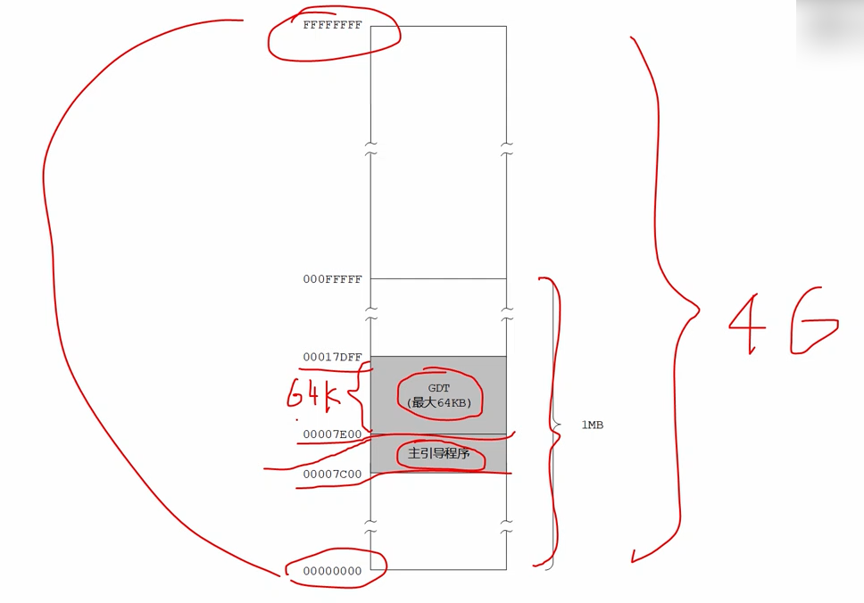
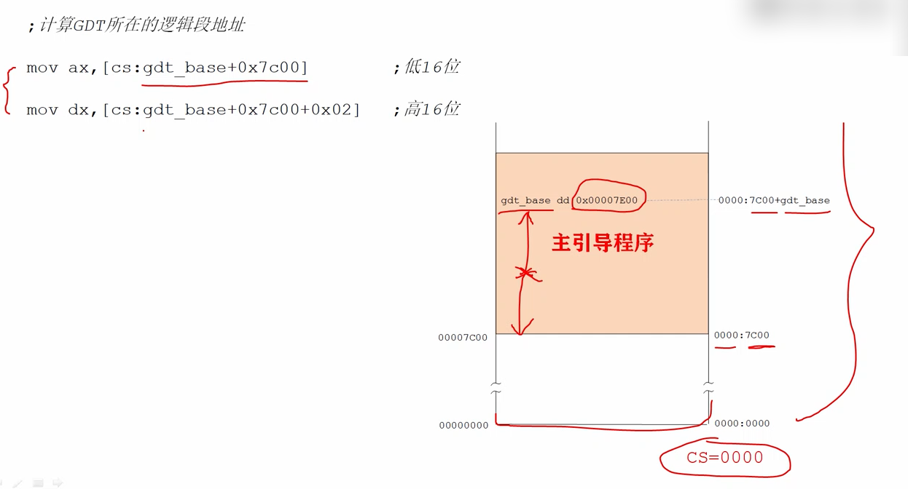

# 准备创建全局描述符表

## 编写程序，初始化相关环境，为创建全局描述符表GDT做前期准备工作。


你可以改变这个地址(GDT的起始地址)，也可以将GDT放在别的地方。
这个地址只能是1Mb以下的地址(1Mb以内)(低端字节序)。

这个地址是32位地址！因为我们用的是32位处理器。




如果我们要用事先设置好的GDT地址，来创建GDT，必须先从GDT地址标号处取出地址，然后将它转成段地址偏移地址的形式。


在主引导程序执行时，段寄存器CS的值是0x0000指向第一个段**(刚开始只有cs明确知道是从哪里开始的，其他段寄存器，如果不设置将是随机地址，不能拿来用，需要明确地址**)，从内存最低端开始的一个段，因此主引导程序的段地址是0x0000偏移地址是0x7c00。



```
         ;代码清单11-1
         ;文件名：c11_mbr.asm
         ;文件说明：硬盘主引导扇区代码 
         ;创建日期：2011-5-16 19:54
         ;功能：计算机启动之后，BIOS加载此程序到物理地址0x7c00处后，就开始执行，程序执行时，从实模式进入保护模式，然后在屏幕上显示一行文本。

         ;设置堆栈段和栈指针 
         ;mov ax,cs      
         ;mov ss,ax
         ;mov sp,0x7c00

         ;按照处理器要求，进入保护模式之前，必须先创建全局描述符表GDT
         ;把表放在那里呢？为了灵活性，允许程序员自由决定把GDT放在那里！
         ;为此我们在程序的尾部定义了一个双字32位
         ;计算GDT所在的逻辑段地址 
         mov ax,[cs:gdt_base+0x7c00]        ;低16位 
         mov dx,[cs:gdt_base+0x7c00+0x02]   ;高16位
         ;得到32位的GDT地址
         mov bx,16        
         div bx ;除以16得到段地址和偏移地址 商在ax余数在dx。段地址在寄存器ax中
         mov ds,ax                          ;令DS指向该段以进行操作
         mov bx,dx                          ;段内起始偏移地址 
      
         ;创建0#描述符，它是空描述符，这是处理器的要求
         mov dword [bx+0x00],0x00
         mov dword [bx+0x04],0x00  

         ;创建#1描述符，保护模式下的代码段描述符
         mov dword [bx+0x08],0x7c0001ff     
         mov dword [bx+0x0c],0x00409800     

         ;创建#2描述符，保护模式下的数据段描述符（文本模式下的显示缓冲区） 
         mov dword [bx+0x10],0x8000ffff     
         mov dword [bx+0x14],0x0040920b     

         ;创建#3描述符，保护模式下的堆栈段描述符
         mov dword [bx+0x18],0x00007a00
         mov dword [bx+0x1c],0x00409600

         ;初始化描述符表寄存器GDTR
         mov word [cs: gdt_size+0x7c00],31  ;描述符表的界限（总字节数减一）   
                                             
         lgdt [cs: gdt_size+0x7c00]
      
         in al,0x92                         ;南桥芯片内的端口 
         or al,0000_0010B
         out 0x92,al                        ;打开A20

         cli                                ;保护模式下中断机制尚未建立，应 
                                            ;禁止中断 
         mov eax,cr0
         or eax,1
         mov cr0,eax                        ;设置PE位
      
         ;以下进入保护模式... ...
         jmp dword 0x0008:flush             ;16位的描述符选择子：32位偏移
                                            ;清流水线并串行化处理器 
         [bits 32] 

    flush:
         mov cx,00000000000_10_000B         ;加载数据段选择子(0x10)
         mov ds,cx

         ;以下在屏幕上显示"Protect mode OK." 
         mov byte [0x00],'P'  
         mov byte [0x02],'r'
         mov byte [0x04],'o'
         mov byte [0x06],'t'
         mov byte [0x08],'e'
         mov byte [0x0a],'c'
         mov byte [0x0c],'t'
         mov byte [0x0e],' '
         mov byte [0x10],'m'
         mov byte [0x12],'o'
         mov byte [0x14],'d'
         mov byte [0x16],'e'
         mov byte [0x18],' '
         mov byte [0x1a],'O'
         mov byte [0x1c],'K'

         ;以下用简单的示例来帮助阐述32位保护模式下的堆栈操作 
         mov cx,00000000000_11_000B         ;加载堆栈段选择子
         mov ss,cx
         mov esp,0x7c00

         mov ebp,esp                        ;保存堆栈指针 
         push byte '.'                      ;压入立即数（字节）
         
         sub ebp,4
         cmp ebp,esp                        ;判断压入立即数时，ESP是否减4 
         jnz ghalt                          
         pop eax
         mov [0x1e],al                      ;显示句点 
      
  ghalt:     
         hlt                                ;已经禁止中断，将不会被唤醒 

;-------------------------------------------------------------------------------
     
         gdt_size         dw 0
         gdt_base         dd 0x00007e00     ;GDT的物理地址 定义了一个双字 用来指定GDT的起始地址 这里给出的是0x00007e00，当然，你可以改变这个地址，也可以将GDT放在别的地方。
         ;这个地址只能是1Mb以下的地址(1Mb以内)(低端字节序) 这个地址是32位地址！因为我们用的是32位处理器
         times 510-($-$$) db 0
                          db 0x55,0xaa
```

