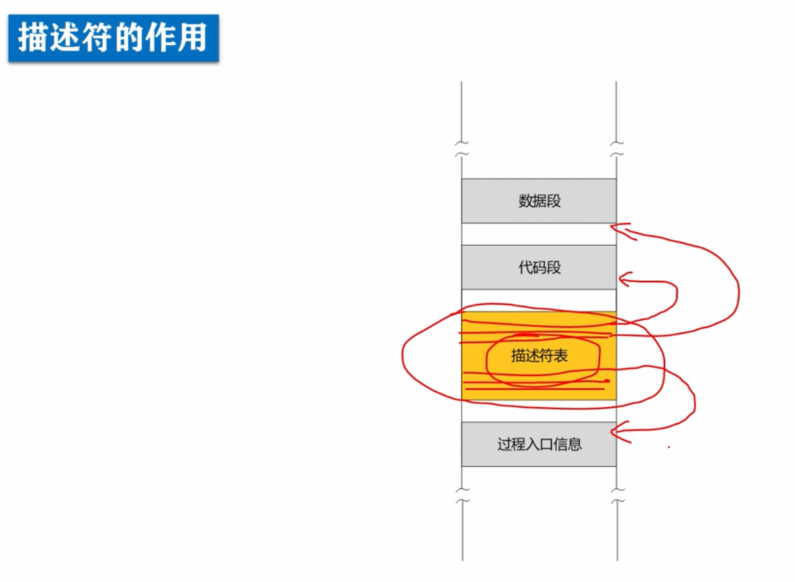
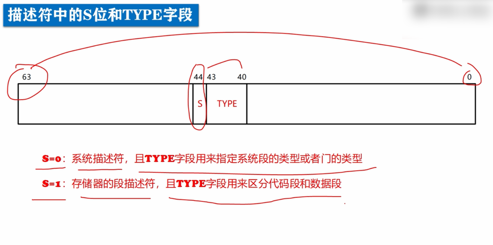
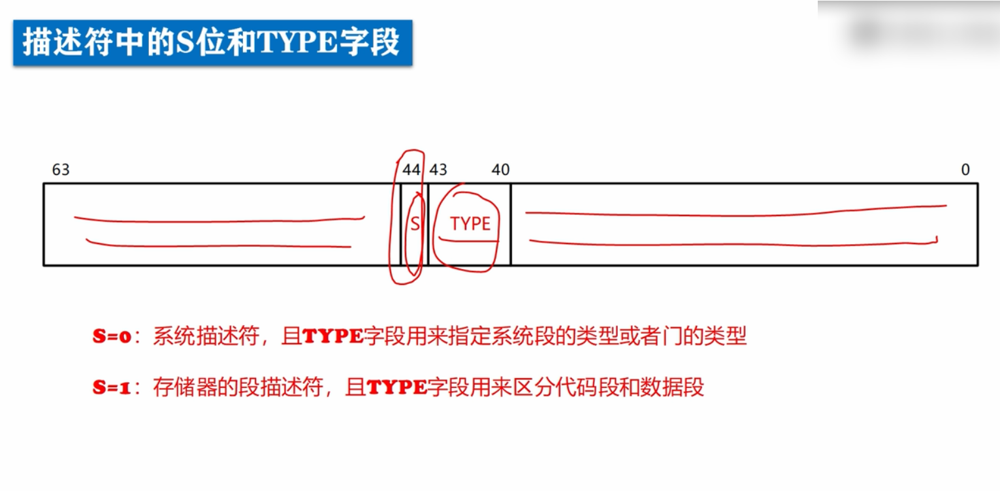

# 介绍描述符的分类

描述符是存储在描述符表中的。

所谓表或者表格只是一个形象化的称谓，因为描述符都集中存在内存中的某个区域，一条挨着一条，很像一个表格，所以就形象化的称为描述符表。

在描述符表中，每个描述符，都用来描述一个东西，比如用来描述一个代码段，或者描述一个数据段，又或者描述一个过程的入口信息等。

描述符好比这些东西的索引或者标签，通过描述符可以找到这些东西，这就是描述符的作用。

描述符的分类：

基本上分为两大类，一类是存储器的段 描述符用来描述一般的代码段和数据段，栈段等。另一类是系统描述符，用来描述与系统运行和控制相关的内容，包括系统的段 描述符，门描述符（用来描述一些与程序执行有关的逻辑结构，比如过程调用和中断处理的逻辑结构等等）

在32位系统里，每一个描述符占8个字节(一个字节8位)，或者说64位，比特编号从0-63其中位44叫做s位，位40-43组成type字段。

**如果s位为0**，表示这个描述符是**系统描述符**，此时type字段用来指定系统段的类型或者门的类型。

**如果s位为1**，表示描述符是**存储器的段 描述符**，此时type字段用来区分代码段和数据段以及与代码段和数据段相关的信息。

除了s位和type字段，描述符的其他部分也是不一样的。

当处理器拿到一个描述符之后，先根据s位判断描述符分类，然后根据type字段决定类型，于是就可以知道描述符的其他部分是什么内容了。

