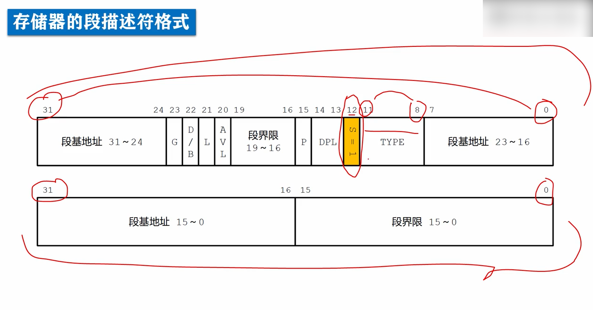
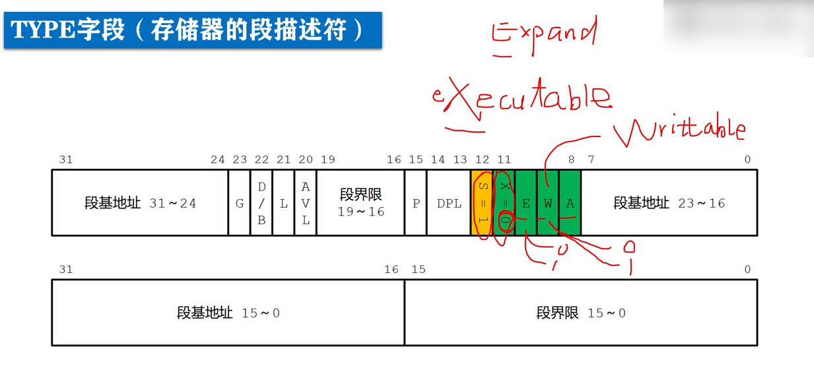
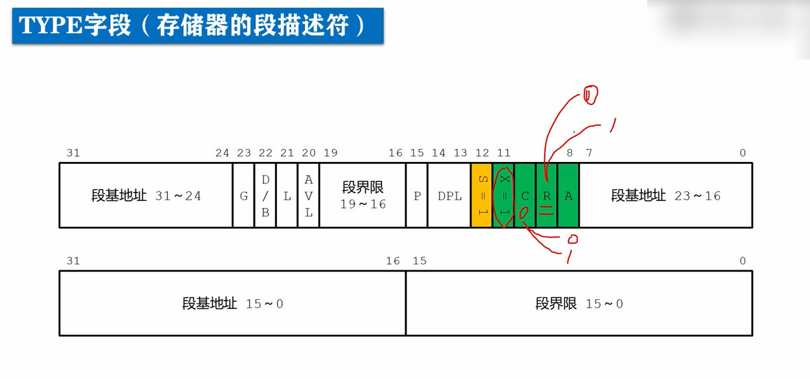
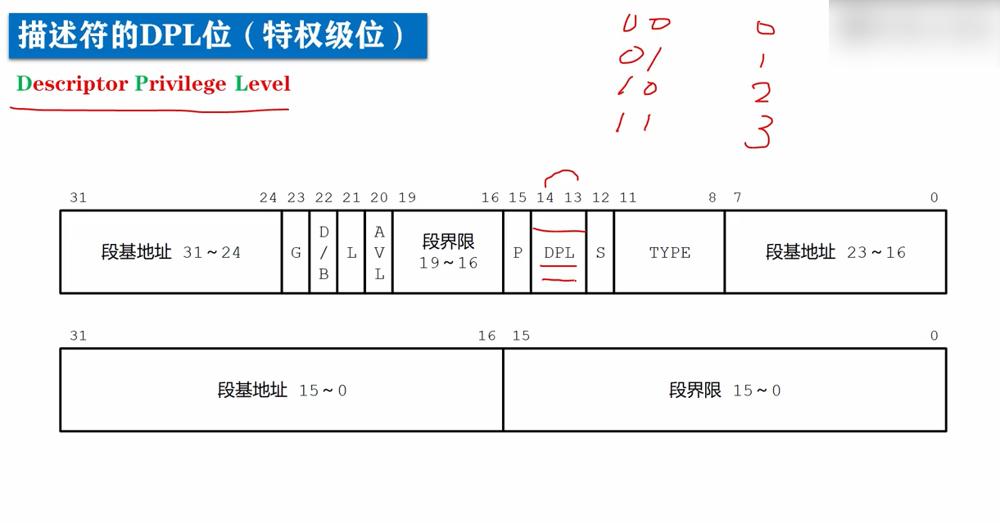
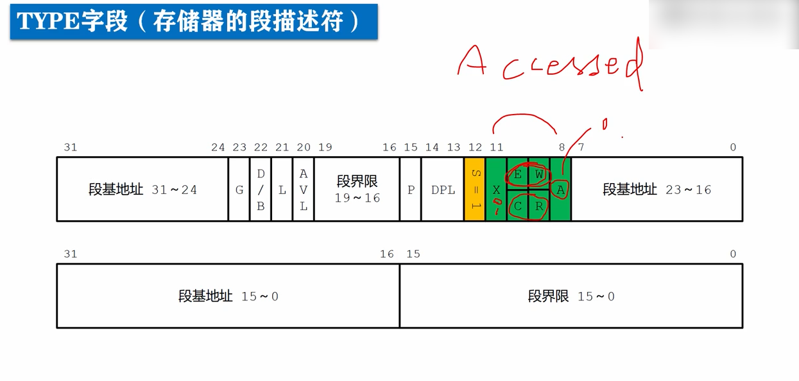

# 存储器的段描述符-段的类型和段的特权级

每个描述符占8个字节，即两个双字，或者说64位，我们将这个64位拆成两个32位部分进行分析，下面是低32位，比特编号从0-31，上面试高32位，比特编号也是从0-31。

在这种情况下，**s位是高32位的位12**，**type段是高32位的位8-11**，

高双字(高32位)

在s位是1的情况下，高双字的位11是执行位x(**executable是否可以执行，取第二个字母**)，**如果x位是0，表示该描述符描述的段不可执行，因此他是一个数据段**，在这种情况下，**type段另外3位叫做e w a位**。

e: 

> expand指示数据段的扩展方向。
>
> 为0表示段是向上扩展的[读写数据时，是从低地址方向连续的向高地址方向进行的]。
>
> 为1表示意味着段是向下扩展的，即从高地址方向，向低地址方向扩展，通常是栈段。

w:

> writable
>
> 短的读写属性，或者说是段是否可写。
>
> 为0表示段不允许写入，只能读取，向这样的段写入，会引发处理器异常中断。
>
> 为1表示段可以正常写入。

**如果s位是1，x位是1**，**意味着描述符描述的段是可执行的段，即代码段**，在这种情况下，**type段，另外3位叫做c r a位。**

c:

> 用来指示是否是特权级依从的段。
>
> 
>
> > 这个话题和段的特权级有关：
> >
> > 描述符的**高双字，位13-14这两位是DPL(Descriptor Privilege Level)字段，表示段的特权级**，所有组合为0b00(0) 0b01(1) 0b10(2) 0b11(3)四种，**一共有4种特权级别，分别是0 1 2 3**，其中，**0是最高特权级别，3是最低特权级别**，**不同级别的程序是互相隔离的，它们的互访是严格限制的**，而且**为了安全，有些处理器指令属于特权指令，只能由0特权级的程序来执行**。
> >
> > **DPL字段，用来对改段的访问实施管控，用来限制谁能访问这个段，通过特权级来实施管控。**
>
> c位是0，表示是非依从的代码段，只有特权级相同的程序，才能转移到这个段内执行。
>
> c位是1，表示段是依从的段，特权级低的程序可以直接转移到这个程序执行。
>
> 后续会学到，代码段的依从性，如果没有特殊要求，这一位通常要清0。

r:

指示代码段是否允许读出，代码段总是可以执行的，但是为了防止程序被破坏，它时不能够写入的，至于说是否可以像数据段那样可以读出内容，右r位指定。

r位为0，表示代码段不能读出，如果去读一个r位为0的代码段，会引发处理器异常中断。

r位为1，表示代码段可以读出。

a:

在type字段中还有一个a位，Accessed，是否已访问过，无论x是0还是1，这个段是数据段还是代码段，都有一个a位，表示该描述符描述的段，最近是否访问过，或者说，是否被使用过，在描述符创建的时候，这一位清0，每当该段被访问时，处理器自动将该位置1，对该位的清0，是由软件，特别是操作系统负责的，通过定期监视这一位的状态，就可以统计出该段的使用频率，当内存空间紧张时，操作系统可以把不经常使用的段，退避到磁盘上，从而实现虚拟内存管理。

